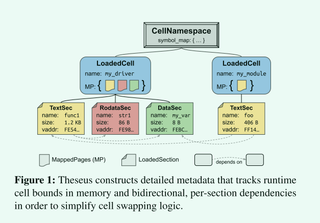

# Theseus阅读

使用Rust语言设计和实现了一种新的OS结构用于更好地管理操作系统中的各类状态，并且讨论了如何利用Rust的语言特性维护操作系统的状态。

本文的两个主要贡献：

1. 一种操作系统结构，使用明确定义，无状态交互的组件构成 
   1. 实时更新
   2. 故障恢复
2. 使用语言级机制管理操作系统内部的资源
   1. 操作系统的运行环境与语言的运行时环境匹配
   2. 将错误由运行时提到编译时

本工作的主要出发点：

现有的操作系统中存在着大量state spill的问题，即一个组件A与另一组件B交互时，会更新组件B的内部状态，并且组件A的后续正确性依赖于组件B中的相关状态。例如一个进程可能将自身虚拟地址映射相关的状态存储在内存管理模块中，进程的正确执行依赖于内存管理模块中该进程相关状态的正确性。State spill会产生多种不利影响，例如一个组件出现错误后影响其它组件的状态，导致无法恢复，再比如live update一个组件时难以处理存储在其中的其它组件状态。为了解决state spill的问题，Theseus尽量将各个组件的状态存储在本地，并在调用其它组件服务时将同时传递所需的状态。

为什么选择Rust:

首先是利用Rust中变量的ownership模型维护状态的转移，并且由于ownership及其它一些内存安全问题会在编译时解决，因此在运行时不会带来明显开销。在此基础上，Theseus充分利用了Rust语言和编译器的部分特性用于维护系统相关状态的不变量，用于尽可能确保操作系统的正确性。

Rust语言提供的有用的抽象:

1. 包管理机制用于模块化
2. 所有权机制
3. 借用检查器
4. trait

## Theseus的设计

核心组件：Cell

- 特征：自由组合与交换

运行环境：SAS与SPL

遵循三个原则:

- cell需要运行时-持久的边界 
- 最大化语言和编译器的能力
- 最小化状态溢出 

### what is Cell ?

考虑如何定义Theseus中各个组件的边界，如何维护组件间的调用关系。Theseus定义系统中的一个组件为cell，一个cell不仅包含了相关代码，还包含了cell间的依赖关系等元数据。整个操作系统包含了多个cell，并且是按需装载的，当如下图所示。cell在装载时还会按照依赖关系同时装载相关的其它cell，并且将自己的symbol填入全局的symbol_map中便于其它cell使用

1. Cell在实现时作为一个Rust板条箱存在

2. 在编译时作为单个对象文件存在
3. 在运行时作为一组具有每节边界和依赖元数据的加载内存区域存在

### how to use Rust ?

如何充分利用Rust语言及编译器的特性维护操作系统相关的状态正确性。首先，为了充分利用Rust的特性，需要将所有应用和操作系统都运行在统一特权级和统一地址空间内，并且使用全局统一的allocator。在这基础上，Theseus进一步讨论了哪些操作系统的功能或不变量可以使用Rust语言特性进程保护。例如使用Rust的unwind机制用于资源回收。此外本文还讨论了内存管理和task管理中应当如何使用语言相关的特性，例如为了避免建立好映射的虚拟地址被多次unmap或资源回收时忘记unmap，虚拟地址对象的drop方法被定义为unmap该虚拟地址，达到该对象没有被引用后自动unmap的效果

### how to decrease state spill?

如何尽量减少state spill。Theseus使用了opaque exportation的方法，如下图所示。左边传统的方法cell之间的调用会导致server端存储client相关的状态，产生state spill，右图是Theseus的cell间的调用，所有调用都是无状态的，client需要在调用时将server执行所需的状态同时传递至server。这种模式依赖于Rust的两个特性：1. Type & memory safe，client拥有server执行需要的状态，但是状态被转移至server中，而client不能修改该状态；2. Unwinding，用于资源回收，因此server没有必要记录某部分资源属于哪个client的，避免了state spill。

场景

- Live Evolution
- Fault Recovery

