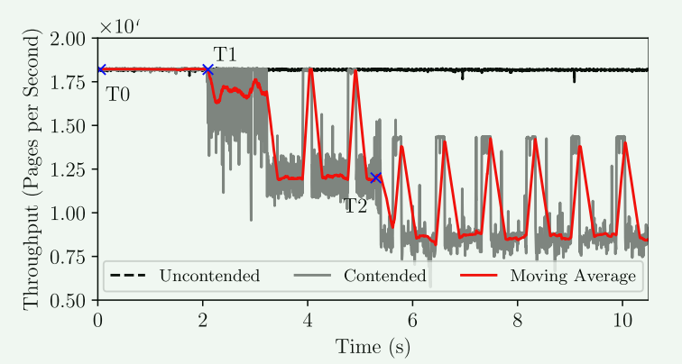
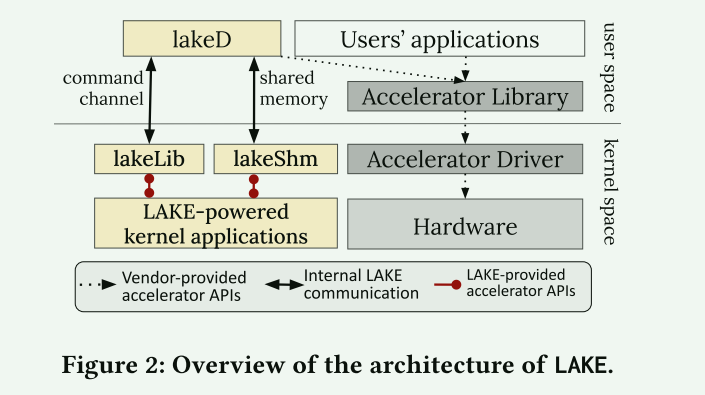
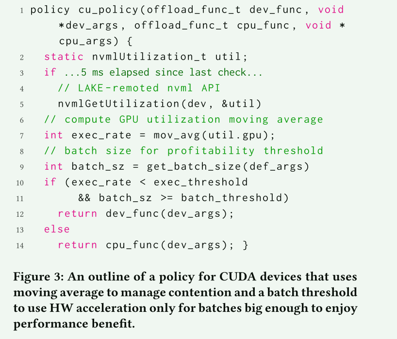
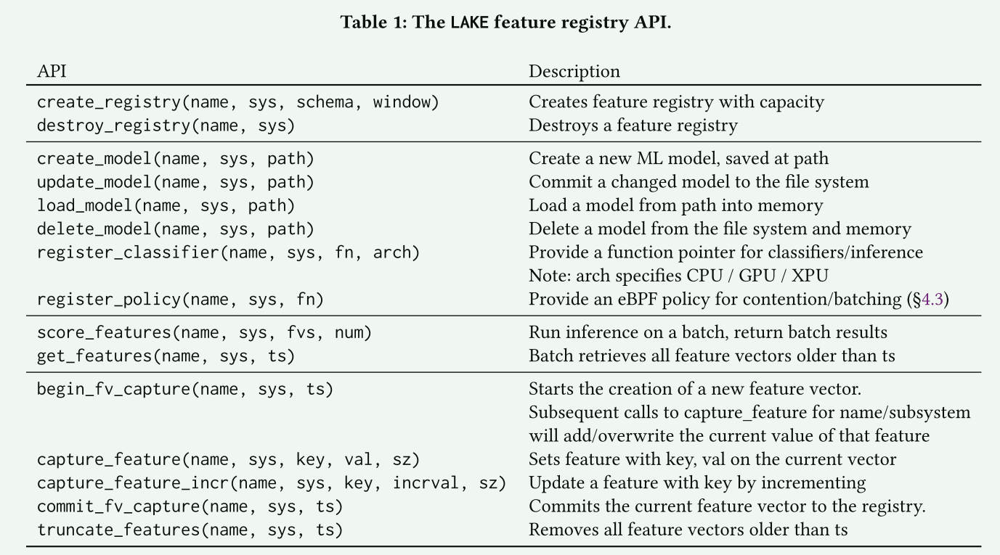
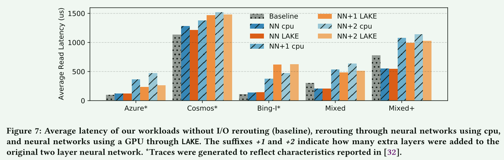
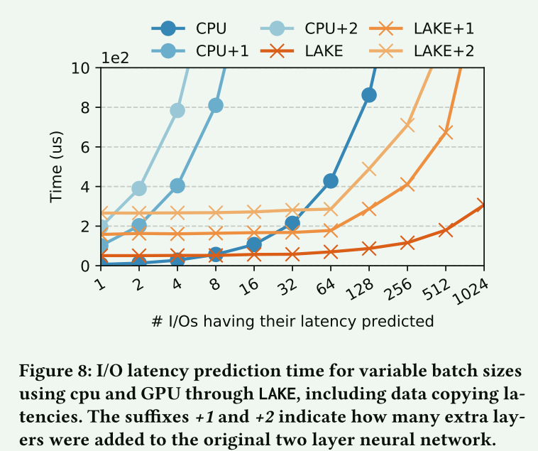
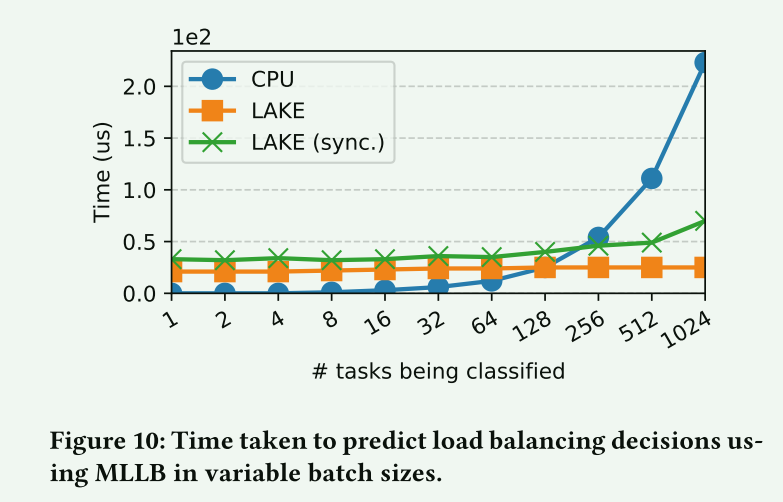
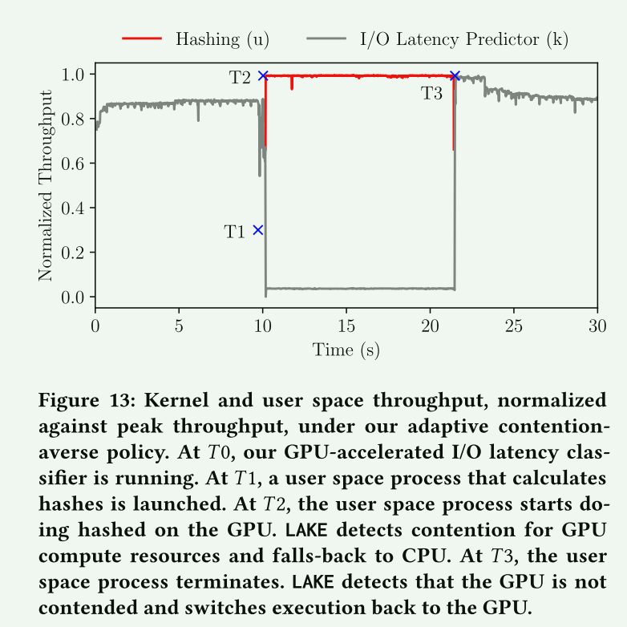
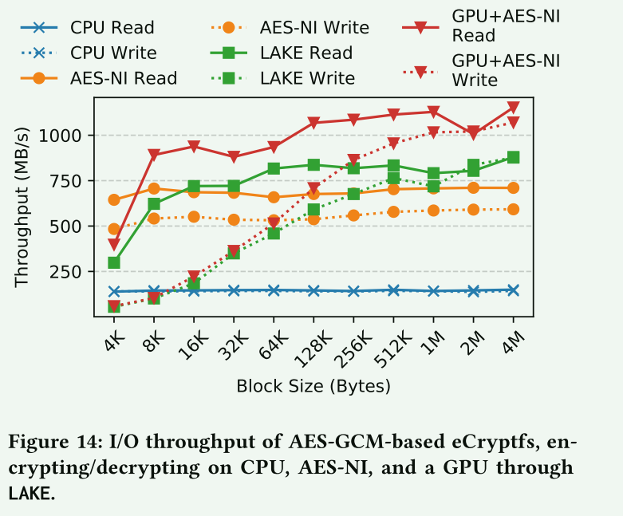

# Towards a Machine Learning-Assisted Kernel with LAKE

## 概述

操作系统内核包含子系统来管理硬件资源，例如内存管理器、I/O 和进程调度以及文件系统，并且目前**依靠启发式方法来处理对性能至关重要的复杂权衡空间**。 这种启发式方法是通过观察系统行为、结合内核开发人员的经验而开发的，旨在提供合理的平均情况性能。

随着硬件和软件复杂性不断增加，机器学习已成为一种有吸引力的替代方案，有可能更好地指导由启发式处理的操作系统权衡空间。 用机器学习代替启发式方法可以使用真实的、动态的、观察到的行为来训练特定于系统的解决方案。

本文关注将ML引入内核的挑战：

1. 使用 GPU/TPU 等专用硬件对于降低 ML 算法的性能影响至关重要，但内核空间中加速器的可访问性较差是采用的障碍。 当加速器连接 I/O 时，加速器卸载会带来额外的开销，并可能在用户和内核空间之间为使用加速器而产生新形式的争用
2. ML 加速的好处取决于子系统、工作负载和硬件，因为硬件加速必须分摊数据传输的成本
3. 抽象层边界与跨层数据共享以公开训练和推理特征的需求之间存在根本性的紧张关系

实验表明，LAKE 为内核空间中 ML 支持的子系统提供了高效的硬件加速，可以降低内核的 CPU 利用率，并通过争用管理避免用户空间应用程序的性能下降。

**贡献：**

1. 用于在内核空间公开以ML为中心的硬件加速的框架，其具有管理加速器争用
2. 简化不同内核子系统中特征收集和管理的框架和高效应用程序接口
3. 评估现有内核子系统在 LAKE 基础架构支持下的 CPU 利用率降低和性能提升情况 

## 背景

内核：内核的大多数算法都是启发式的，针对的是平均情况，在某些负载下可能表现不佳

加速器：快速发展的加速器可以提高计算密集型负载的性能和效率，但是通常在用户态，缺乏内核程序的用例

## 动机

- 当用户态的依赖加速器的计算密集型程序与内核的ML发生争用时，将会导致严重的性能下降

### 讨论

**为什么不直接使用加速器API？**

1. 在内核中虽然可以直接支持加速器API，但是这些加速器API是频繁变动的，同时这些API并不可能被公开
2. 内核的ML支持可以通过TensorFlow得到更好的服务，这意味着系统需要对upcall (上行调用：内核调用用户态的功能)具有更通用的支持

**硬件设备可以直接管理争用吗？**

1. 硬件供应商已表示愿意在硬件中启用某些争用管理，然而，基于硬件的解决方案往往不灵活，并非每个加速器都支持硬件中的细粒度争用管理策略。
2. 操作系统内核开发人员可能希望动态地在不同的争用管理策略之间进行选择。 复杂且不断发展的争用管理策略更容易在软件中表达

**隔离是否受到影响？**

1. 所有加速器都支持某种类型的地址空间隔离

## LAKE

lakelib: 提供内核端的API

lakeshm：内核-用户态批量数据传输通道

lakeD: 实现API的用户端守护进程

 LakeLib 中的每个函数都执行三件事：将 API 标识符和所有 API 参数序列化为命令，通过某些通信通道传输命令以在用户空间中远程执行，最后等待响应。

LakeD 是一个用户空间守护进程，它监听来自 LakeLib 的命令，反序列化它们并执行请求的 API。 该守护进程必须能够访问供应商的库（例如cudart.so）才能实现lakeLib请求的API

lakeShm 是一个内核模块，为 LakeLib 和 LAKE 支持的应用程序提供内存分配。 通过lakeShm的API分配的内存针对内核空间应用程序和用户空间lakeD之间的数据传输进行了优化。 LakeShm 的工作原理是从 Linux 内核请求并映射一个大的连续内存区域。 当lakeD启动时，相同的区域被映射到它的进程。 虽然仍然需要主机到设备的传输，但这允许在内核空间模块和 LakeD 之间进行零拷贝内存移动

### 工作流程

LAKE 的应用程序可以执行的操作分为三类：本地操作、API 远程操作和可复制内存分配

**本地操作**：这些操作包括现有的内核函数和内核空间中的内存分配。例如，常规内存分配可以通过调用内核的内存分配器来满足，例如 vmalloc。

**API远程调用**：当应用程序调用加速器API时，执行流程切换到lakeLib模块。 创建足够大的命令缓冲区以容纳 API 函数标识符（例如数字）和所有函数参数。 然后该命令通过类似套接字的通道发送到 LakeD。 一旦进入用户空间，命令就会被反序列化，并在加速器上执行请求的 API。 完成后，将使用返回值构建返回命令并将其发送回。 执行 API 时引起的错误将转发到应用程序，应用程序必须执行自己的错误检查。

**可复制的内存分配**：

 LakeShm 分配的内存区域是共享的，避免了内核和用户空间之间的内存复制。

### 灵活的策略和争用管理

为了向内核 ML 应用程序提供最佳性能，LAKE 允许以函数调用粒度在 CPU 执行和加速器执行之间进行动态切换。 这是通过自定义执行策略来完成的，LAKE 允许开发人员使用 eBPF  编写和安装此类策略。

用于调节加速器利用率的相同策略可用于管理争用。也就是用eBPF来定制加速器的使用策略。

### 高级API支持

LAKE的API远程处理系统足够通用，可以支持手动添加API。 这是允许内核空间应用程序使用更高级别的 API 而无需将它们移植到内核空间所必需的。

用户态的机器学习库提供了高级API来使用加速器，但是将这些库移到内核中是不太可能的。

向内核空间提供高级 API 需要两件事：在 LakeLib 中添加函数原型并在 LakeD 中实现其功能。 手动添加API需要开发人员设计内核中原始数据与库期望之间的数据转换。

## 特征收集

LAKE 支持在内核特征注册表中管理 ML 模型和特征向量捕获。

1. 最小化性能开销：API 通过操作内核并使用细致的数据结构和 API 设计来满足第一个目标
2. 异步的特征捕获
3. 批量特征向量获取：`get_feature` `truncate_features`

## 评估

- 以不同方式对设备施加压力的混合工作负载，LinnOS(NN cpu) 和 LAKE 的平均延迟都低于基准
- 使用 LAKE 进行 GPU 加速时，ML 的优势得以保留
- 使用简单模型，由于动态批处理形成和数据传输的延迟开销，相对于 LinnOS 执行，LAKE 的优势较低
- 在 Azure 等高 IOPS 工作负载下，LAKE 的性能会更好，因为批处理量增加了。随着模型复杂度的增加，我们发现在所有情况下，卸载到 GPU 的性能都比 CPU 有利

- 只有当批次大于一定的数量，采用GPU才有利可图

- 只有当批次输入大于 128 个时，使用 GPU 才有利可图

- 通过自定义加速器使用策略，可以有效避免加速器争用带来的开销

- 将可并行的算法卸载到加速器上有助于提高并行算法是性能瓶颈的应用