# TreeSLS

在本文中，我们注意到基于微内核的系统的分散状态可用于简化和优化状态检查点。为此，我们提出了 TreeSLS，一种全系统持久性微内核，将全系统状态维护简化为能力树和故障恢复检查点管理器。 TreeSLS 进一步利用新兴的非易失性内存，通过消除DRAM和持久设备之间的区别来最大限度地减少检查点暂停时间。通过高效的状态维护，TreeSLS 进一步提出延迟的外部可见性，以很少的开销提供透明的外部同步。

### 贡献

- 第一个基于 NVM 的单层 SLS，在微内核架构下以能力树和检查点管理器组织整个系统状态
- 高效的全系统检查点，包括面向NVM的检查点方法，其可以减少stop-the-world checkpointing time，混合复制(hybrid copy)可以减少运行时开销
- 基于 TreeSLS 启用的高检查点频率，提供透明外部同步

## 背景

### 操作系统持久性 (Persistence)

操作系统持久性是指操作系统在重启或断电后能够保持其状态的特性。这意味着在关机前运行或存储在系统中的程序和数据在重新启动后仍然可用和可访问。操作系统持久性可以通过不同的技术实现，例如系统镜像或日志。

系统镜像是整个系统状态的快照，包括内存、磁盘和处理器寄存器。它可以保存到一个文件或一个单独的存储设备，并在需要时恢复。这种技术简单快速，但是需要足够的RAM来容纳整个系统状态，并且无法捕捉最后一次保存镜像后的任何变化。日志是应用到系统的事件的记录，例如文件操作、网络请求或用户输入。日志可以存储在一个持久的存储设备中，并在启动时回放以恢复系统状态。这种技术更可靠和一致，但是可能很慢并且消耗大量的磁盘空间。

- 内存-存储二级架构
  - 传统的操作系统运行在主存上，通过文件将数据存储在持久性设备上。这导致数据的移动开销很大，并且容易出错。
  - 数据在移动的过程中还会因为数据结构的序列化和反序列化带来更多的开销。
- SLS 单级存储
  - Single-Level Store (SLS) 为应用提供了另一种透明的持久化手段。SLS将内存向下拓展至存储器，并移除了文件系统层。由此，**对应用而言，整个系统只有一级大的持久化内存**
  - 现有的 SLS 通过软件检查点在运行时内存 (DRAM) 和存储（磁盘）之上提供单级存储的假象，从而消除了编写持久性应用程序的复杂性。尽管这种错觉隐藏了运行时内存和存储在访问速度和访问粒度（字节与块）方面的显着差异，但它加剧了写放大引起的性能开销，并增加了由于检查点频率有限而导致数据丢失的风险。
  - 虽然NVM的出现可以促进SLS的实现，但是更加高效的方法仍然面对挑战，因为机器上的一些数据仍然回在断电时丢失，所以还是需要checkpoint这样的软件技术来保证系统状态的一致性。

## 动机

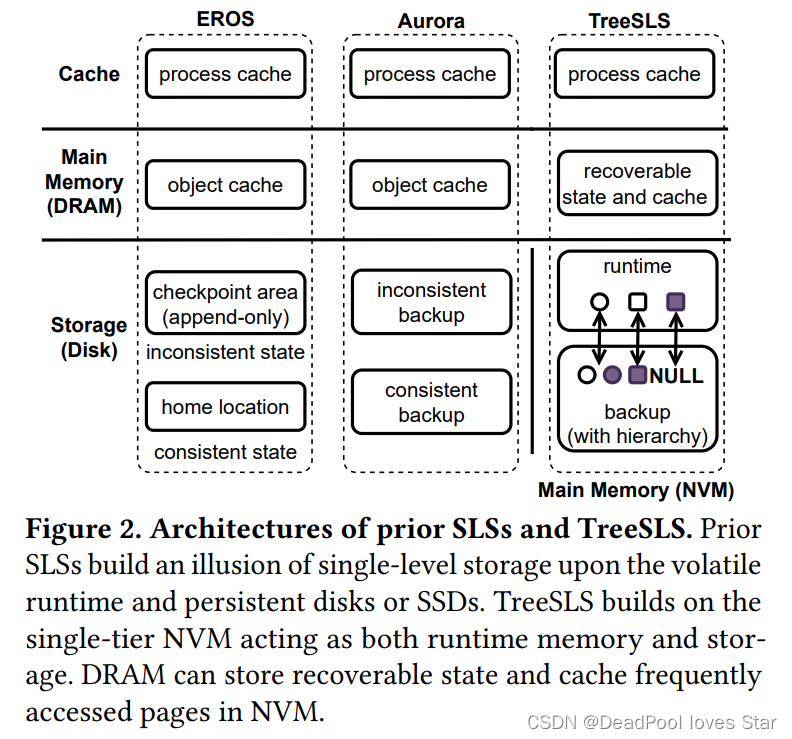

以往的的SLS基于二级内存-存储架构进行构建，通过软件Checkpoint对易失数据进行持久化从而为应用提供透明的持久性。这些系统（EROS和Aurora）都存在一个共性问题：运行时内存访问接口与持久化存储器访问接口的不匹配，这带来两点性能开销：

- **写放大**。内存访问按字节进行，但是数据的持久化常常以Block为单位进行，这会带来写放大开销
- **受限的Checkpoint频率**。以往的SLS通过Stop-the-World (STW) 来将易失状态拷贝至专用内存Buffer，这些Buffer中的数据进而被后台线程异步刷回持久化存储介质中。这种异步方式避免了缓慢的STW开销，但是导致Checkpoint的频率受限，这是因为在所有脏数据被持久化之前Checkpoint都不会被创建。受限的Checkpoint频率导致数据丢失更容易发生。

> 同时，已有的系统难以支持**External Synchrony（外部同步性：指对外部系统的同步，简单来说就是向外界系统响应时，要保证自身系统的状态都已经持久化）**

对于SLS来说就是Checkpoint完成后，即可向外界响应。以往的SLS的Checkpoint频率过大，对于以往的应用可以接受，但对于现代数据中心来说，SLS系统的响应应该是实时的（例如，当数据库向用户回应已提交请求时，其必须保证数据已经持久化），因此仅凭过去的Checkpoint技术难以做到External Synchrony。

通常，过去的系统会提供额外的API为应用提供这个保证，但是，这与简化应用对持久化的依赖的初衷相悖。

持久化内存NVM的出现，使得SLS能够很好地利用其低延迟、字节级寻址以及非易失性，最小化Checkpoint的开销：SLS可以将NVM设备当作内存与存储，快速直接操作NVM上的数据（从而避免数据移动）。

需要说明的是，NVM虽然原生地适配SLS的语义，但是直接将DRAM替换为NVM并不能直接做到SLS，这是因为CPU寄存器、设备寄存器、Cache内的内容仍然会在掉电后丢失。基于NVM构建SLS存在以下挑战：

- **在NVM设备上仍然需要Checkpoint**。仍然需要通过Checkpoint保证寄存器等除内存外易失数据的持久化
- **运行时数据与持久化数据的一致性**。可以利用NVM的运行时特性以及存储特性避免数据移动以及写放大问题，然而如何保证NVM上运行时数据以及持久化数据的一致性仍然是一大挑战，这是因为同一个NVMpage可以既被用于运行时，亦被用于持久化（Checkpoint）
- **实现透明的External Synchrony是一大挑战**。以往的方案都使用定制API，但是为External Synchrony编写正确的持久化代码（例如Journal）仍然非常困难

## 设计和实现

为了高效的全系统持久化，TreeSLS需要解决两个问题：

1. 如何高效捕获全系统状态； 
2. 如何有效地检查整个系统的状态。

 TreeSLS 利用能力树和检查点管理器来相应地解决它们。

TreeSLS发现微内核（microkernel）架构有利于构建SLS，一方面微内核架构将大多数系统服务（如：IPC，调度等）部署在用户态，内核功能较为简单；另一方面，**微内核架构常常会维护一颗Capability Tree，这个Tree能够实时反映系统的运行状态**。这样一来，TreeSLS可以通过Capability Tree快速高效地对系统进行Checkpoint。TreeSLS还可以通过Capability Tree的运行时状态做高效的增量Checkpoint操作。

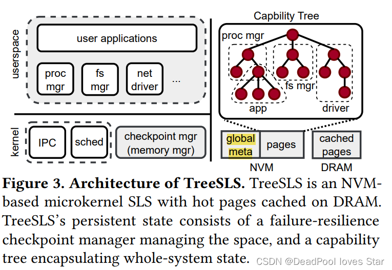

### 能力树

每个**用户态进程**由Capability Tree的一颗**子树**构成（大概就是一个进程可由多个Objects和对应的Capabilities构成），所有的系统资源都可以通过树的根：Root Cap Group获取。

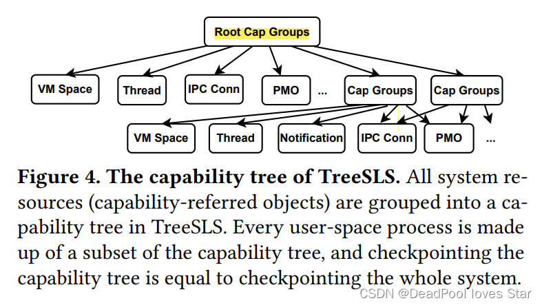

### 检查点管理器

**Checkpoint Manager用于进行Checkpoint以及管理NVM的运行时对象和持久化对象(Checkpoints)**. Checkpoint Manager被部署在PM中，其不会为自己Checkpoint，因此TreeSLS通过Journaling的方法保证Checkpoint Manager的崩溃一致性

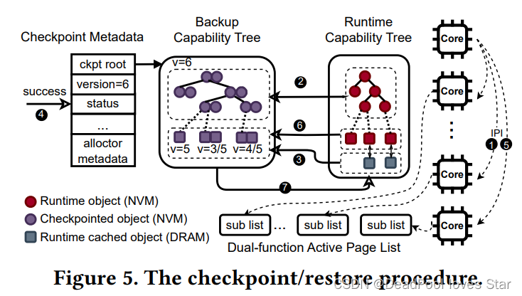

备份流程：

1.  当前CPU（Leader）发送IPI（Inter-Process Interrupt）至其他CPU是他们进入暂停状态。TreeSLS关闭了内核中断，因此IPI不会使正在修改内核态对象的CPU暂停，即，只会在用户态暂停，并陷入内核态。
2.  Leader检查当前的Runtime Capability Tree，并据此生成一颗Backup Capability Tree。在该过程中，TreeSLS不会拷贝应用的物理页面，而是将这些页面对应的权限置为**只读**。
3. 同时，其他CPU进行内存内热页面（Hot Page）的拷贝
4. TreeSLS将该Checkpoint标记为有效，并且增加全局版本号（global version）。这些元数据信息一并维护在global meta中
5. Leader接下来再次发送IPI使其他CPU恢复执行
6. 在运行时，会触发Page Fault（因为所有页面都被标记为只读），TreeSLS通过COW将页面复制给Backup Capability Tree。这个过程的本质**是以降低Runtime性能换取更快的Checkpoint性能**

#### Backup Capability Tree

- TreeSLS通过复制Capability Tree中的所有对象以生成Backup Tree
- 为了避免一些被共享的对象被多次备份，TreeSLS为每个对象定义了ORoot结构，该结构为每个对象记录了其在Runtime Tree对象以及在Backup Tree对象中的地址。所有的对象包含一个**反向指针**指向ORoot。
- 针对不同的对象，提供不同的备份方式
  - 直接拷贝(Cap Group/Thread/IPC, 其它必要数据)
  - 只拷贝部分数据，并用这些数据重建其它数据(VMSpace PMO)

#### 崩溃一致性

以往的方法将运行时页面置于易失内存，因此**需要至少两个持久化页面作为备份**。 （不知道为什么）

TreeSLS在面对一些大型对象时，会有特殊处理：TreeSLS 将Runtime Page视为一个Backup，最多额外分配一个Backup用于Checkpoint。对于其他的对象，除了运行时Backup外，TreeSLS还会在Checkpoint过程中维护两个Backup。

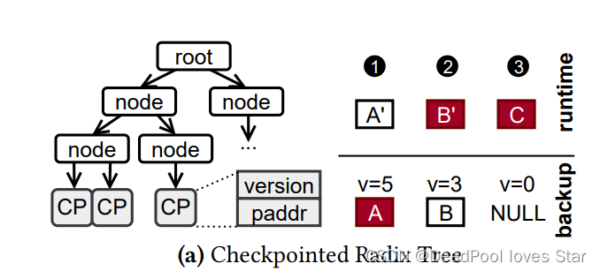

如上图所示，对于每个Backup的PMO而言，Radix Tree的叶子节点由Checkpointed Page（CP）表示，每个CP包含了Version以及Backup PM页面的地址（paddr）。在恢复过程中，TreeSLS比对Backup Radix Tree与Runtime Radix Tree已选择一致的物理页面。假设全局版本号为5。那么会存在三种情况：

1.  Backup的页面版本 = 全局版本：说明页面已经被Backup了，选择Backup页面

2. Backup的页面版本 < 全局版本：说明Runtime Page还没有Checkpoint（Backup），选择Runtime页面

3.  Backup的页面版本为空：说明页面没有被Checkpoint，选择Runtime页面。为空是因为这个页面一直没有被修改（没有脏），所以不会被Backup。

#### Hybrid Copy 

基于上面的措施，TreeSLS实现了轻量的Checkpoint。TreeSLS还需要进一步减少Runtime的开销，当频率足够高时（1ms），Runtime开销非常大，大多数开销来源于处理Page Fault以及对应的页面拷贝。

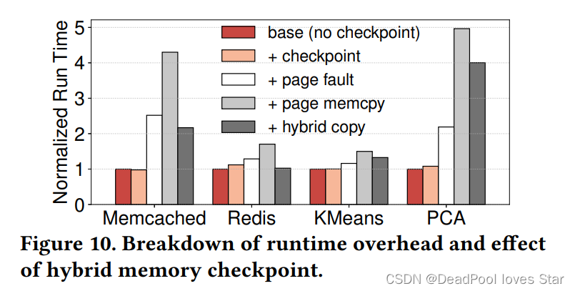

- Stop-and-Copy：在Checkpoint的过程中拷贝页面，避免Page Fault。
- Speculative Stop-and-Copy：在Runtime过程中（Checkpoint之前）预测可能会被拷贝的页面，并提前拷贝，减少Checkpoint开销。
- Copy-on-Write：在Runtime过程中触发Page Fault，拷贝页面。
- Speculative Copy-on-Write：在触发Page Fault前预测可能会触发COW的页面，并提前拷贝，减少Page Fault开销。但错误的预取可能反而降低系统性能。

考虑到**应用具有访问的空间局部性**，并且**Stop-and-Copy的过程可以与Checkpoint的过程并行执行**。 TreeSLS使用**Hybrid Copy**（Stop-and-Copy与Speculative Copy-on-Write）进行页面的备份。

恢复流程：

在崩溃恢复过程中，TreeSLS通过Backup Capability Tree恢复Runtime Capability Tree。Checkpoint Manager自身的状态通过Journal进行恢复

### 外部同步

为了支持外部同步性，**SLS需要确保在响应外部系统前，请求状态的更改需要被持久化（而不是异步的）**。得益于TreeSLS的高频Checkpoint，TreeSLS将External Visible操作（例如发送网络包）延迟到下一次Checkpoint完成时

## 评估

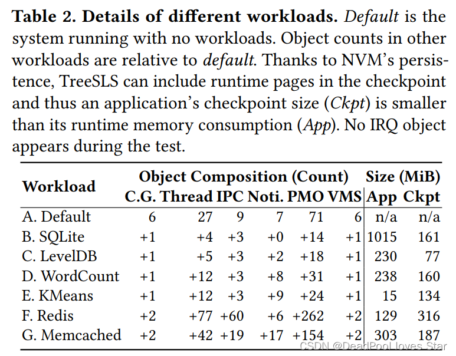

- 在大多数情况下，Checkpoint的大小比运行时App大小消耗要小。
- 

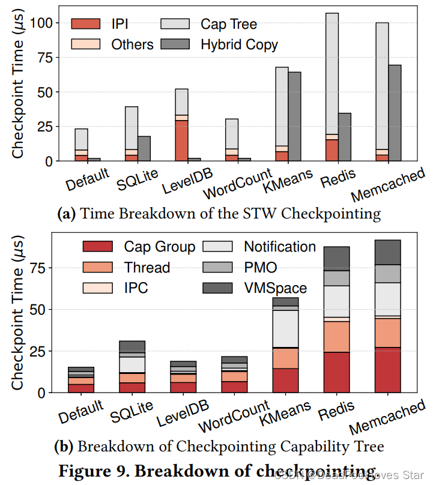

- 大多数对象可以在 STW checkpointint 期间快速复制，因为它们很小。
- 开销主要在Thread和Cap Group上，因为他们的数量很多

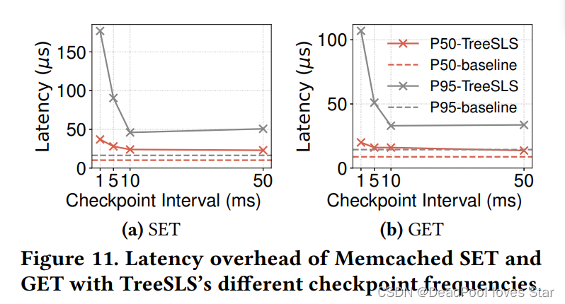

- 检查点频率会影响 SET/GET 操作的延迟，检查点间隔越低，延迟就会增加。

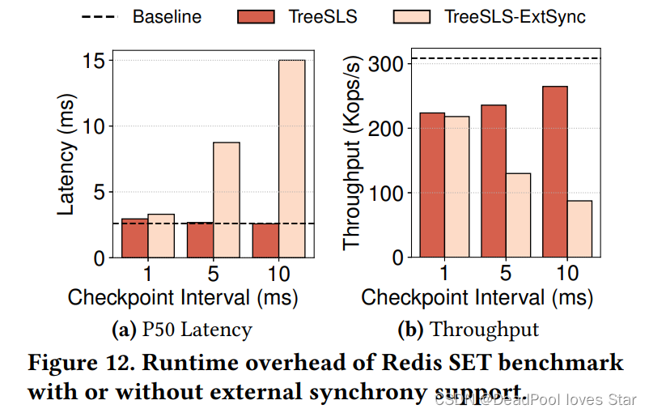

- 很明显开启External Synchrony后，系统的延迟上升，带宽下降（客户端阻塞并等待回复会影响整体吞吐量）

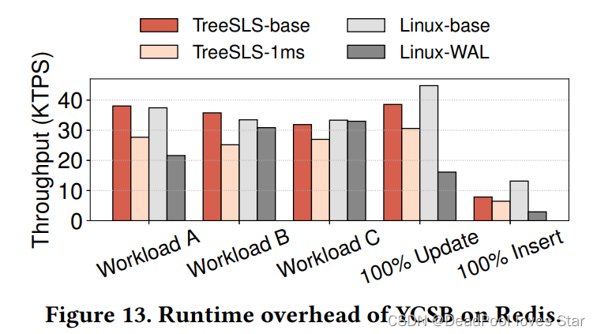

- TreeSLS带来的下降比WAL（崩溃一致性机制）带来的下降要少得多。
  - 因为Linux-WAL会为每个写操作在WAL中写入操作日志，在关键路径上进行这样的额外写操作会降低性能。相比之下，在TreeSLS的检查点中，新创建的页面被标记为写时复制(copy-on-write)，而不进行实际的页面复制，检查点之间重复更改的页面只被复制一次。
  - 因为Linux-WAL不记录读操作，而TreeSLS仍然需要创建系统级检查

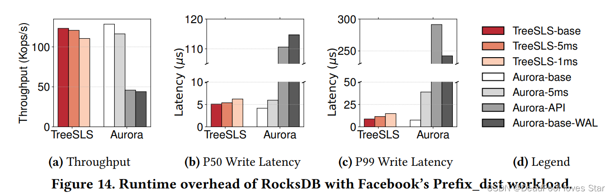

文章链接：https://dl.acm.org/doi/10.1145/3600006.3613160

阅读：https://blog.csdn.net/weixin_44465434/article/details/133611164

https://blog.csdn.net/pumawave/article/details/134894404

https://zhuanlan.zhihu.com/p/675743834