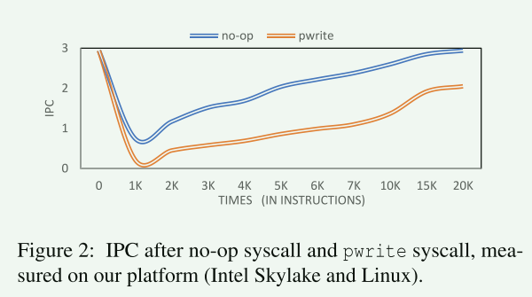
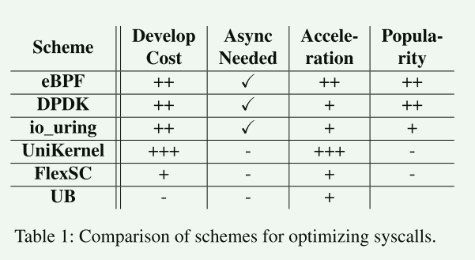
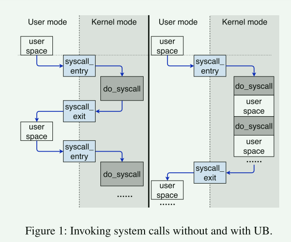
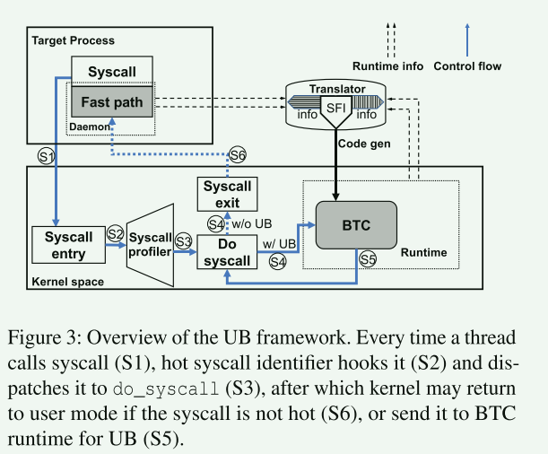
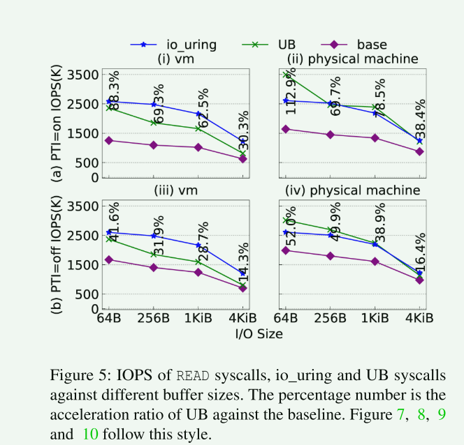
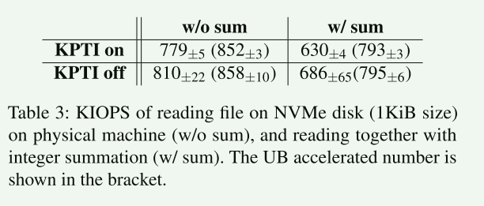
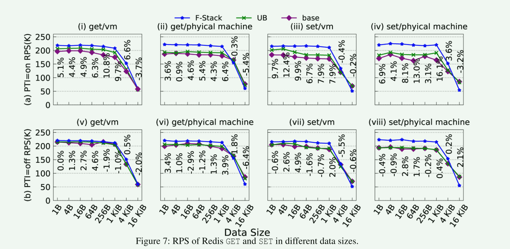
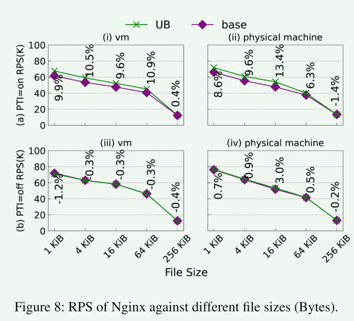
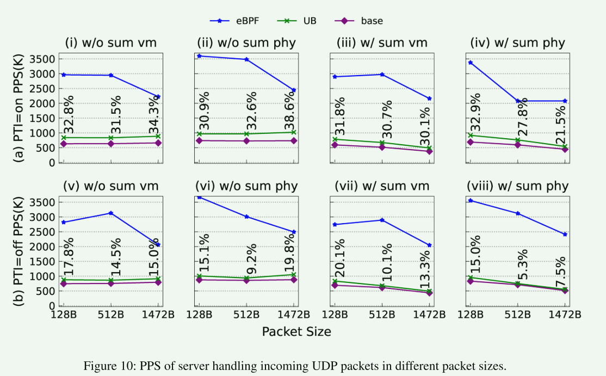

# Userspace Bypass: Accelerating Syscall-intensive Applications

## 概述

本篇文章的研究背景是关于系统调用（syscall）对于高I/O需求的应用程序所带来的性能开销。在现代操作系统中，应用程序通过系统调用来访问操作系统提供的资源，特别是在进行I/O操作时。然而，当一些安全机制如Linux内核的页表隔离（KPTI）被启用时，系统调用可能会引起显著的性能开销。因此，系统调用成为追求高I/O请求每秒（IOPS）的应用程序的主要性能瓶颈之一。

为了解决这个问题，已经有许多研究工作致力于从I/O路径中移除系统调用，主要通过将驱动程序和应用程序集成在同一地址空间中，或者批处理系统调用来实现。然而，这些解决方案需要开发人员修改他们的代码，这通常是一项非常困难的任务，限制了它们的广泛应用。

因此，本文提出了一种新的方法，称为用户空间绕过（userspace bypass，UB），用于加速系统调用密集型应用程序。UB通过将用户空间指令透明地移动到内核中来实现加速，而无需修改用户空间的二进制代码，同时实现完全的二进制兼容性。具体而言，为了避免频繁系统调用引起的开销，内核识别连续系统调用之间的短用户空间执行路径，并将路径中的指令转换为具有软件故障隔离（SFI）保证的代码块。通过评估，当应用程序在启用KPTI的虚拟化环境中执行时，I/O微基准测试的加速可以达到30.3%至88.3%，Redis GET请求每秒（RPS）在1B至4KiB数据大小下可以提高4.4%至10.8%。当关闭KPTI时，性能提升将会减少。

## 背景

系统调用是用户程序与内核进行交互的接口。先前的许多研究表明了系统调用会给不同场景下的应用程序带来开销，对于I/O密集型的开销可能会更大。这些开销主要分为两个部分：

1. 直接开销

   地址空间切换导致的寄存器保存恢复以及异常处理

2. 间接开销

   CPU缓存失效、CPU无序执行被中断等造成的

针对这个问题，许多研究和社区工作都在致力于减小系统调用带来的开销，这些工作主要分为几个类别。

1. 异步系统调用
2. 批次化
   1. 连续的系统调用(前一个系统调用的结果直接作为下一个输入)
   2. io_uring 批次化处理I/O请求
3. unikernel
4. 内核沙盒
   1. eBPF：内核特定的触发点
   2. 直接在内核执行应用程序
5. 内核旁路
   1. DPDK
   2. RDMA

这些工作很多都带来了性能上的巨大提升，但是这些工作的缺点是 大多需要额外的开发工作，这可能是将原有的同步系统调用变更为异步系统调用，或者需要额外的驱动支持 。因此这篇文章的主要目标就是：

1. 最大限度减少开发者的工作
2. 最小化对系统结构的修改：对比用户空间驱动/unikernel
3. 与重构系统调用相当的性能: 对比io_uring

## 方法

文章主要针对的是I/O密集型的任务，所以其首先对Redis/Nginx做了比较详细的分析和观察，得到了两个有用的特征：

1. I/O 事件之间的计算工作负载通常是轻量级的

   通常的表现是两个I/O事件之间只包含了少量代码

2. 系统调用带来的开销在I/O密集型任务中被放大

基于这个观察，本文提出了UB方法，其核心的想法如图所示:

这个系统可以检测到系统调用的发生，并通过二进制转换将连续系统调用之间的用户代码提升到内核来执行。这个方法主要面对的困难有两个：

1. 应用程序代码可信度较低，移至内核需要进行隔离，但识别不受信任的区域并使用正确的策略对其进行管理并非易事
2. 将用户代码进行隔离会产生额外的成本，因此转换用户空间的指令并不都是可取的，但是，何时执行转换以及如何减少其开销尚不清楚

为了解决这两个问题，UB使用了三个关键的组件：

1. Hot syscall identifier
2. a Just-in-Time (JIT) translator
3. a kernel BTC runtime

### Hot syscall identifier

这个模块会分析运行时统计数据，识别热系统调用，并将位于两个连续热系统调用之间的用户空间指令提升到内核执行。

- 这个模块需要有选择地提升用户空间指令，通过实证研究，文章发现当用户空间指令的长度较大时，将这些指令放到内核执行带来的增益会小于BTC翻译器的翻译和检测开销，一个适合的长度时1000条指令。

- 为了减少这个模块对系统调用的影响，其只会对频繁进行系统调用的线程进行采样分析，而且只会分析大概10%的系统调用

### BTC Runtime and Translator

BTC 翻译器遵循动态二进制翻译（DBT）的步骤。一般来说，给定一个包含二进制基本块的路径以及触发事件，DBT 会对其进行反编译，使用 SFI 规则对其进行翻译，并将其编译为 BTC 以供将来执行。有了SFI规则的指导，翻译后的代码的恶意或不需要的行为可以被遏制，并由 BTC 运行时安全地运行。

BTC可以访问用户空间内存，因此其对内存和寄存器的改变都会被更新到用户空间上下文，这确保了方法不会导致多线程程序出现错误，

翻译器还与运行时进行配合，来扩展快速路径 ( 连续的多个系统调用都被加速 )

为了在内核安全地执行用户空间代码，翻译器会对一些可能对内核造成攻击的代码进行消毒(筛选)，主要的技术包含:

1. 跳转指令消毒
2. 寄存器重映射
3. 特权指令消毒
4. 访存指令消毒

有了这些技术加持，UB方法可以保证**内核执行流的完整性**、**内核数据完整性**、**BTC中无特权指令**、**无死循环代码**

## 评估

- 相比基准来说，UB确实加速了系统调用，获得了更高的IOPS
- 在不开启KPTI的情况下，加速比下降，因为此时系统调用的开销已经被很大程度上减少
- 与虚拟化环境相比，物理机的加速比会更高，因为物理机的速度更快，执行的系统调用更多，从而获得了更大的加速比
- 从作者的描述来看，这里物理机上（开启KPTI）的情况下UB比io_uring的效果更好可能只是偶然情况，一般情况下，io_uring的性能将总是优于UB

- 对磁盘读取来说，UB同样可以加速，只是加速比比较小(9%),在关闭KPTI的情况下将会更小
- 在I/O事件之间执行一些计算可能会导致IOPS下降加剧，右列显示了UB可以减缓这种现象，因为这些计算被移动到内核执行

- 在1-4kb，UB会带来一定的提升，在16kb时反而会导致下降，首先较小的提升是因为在这种情况下，系统调用的开销不再是主要原因
- F-Stack比UB表现更好，其利用的是DBDK，但在16kb是F-Stack比UB差的原因在于其没有从多核中收益

- 在Nginx上，UB的表现与Redis类似，但是对在关闭KPTI的情况下，基本没有加速。

- 相比eBPF，UB带来的加速比较小，这种原因是显而易见的，eBPF可以绕过整个网络协议栈

## 评语

- 文章针对I/O密集型任务做了详细的分析和关系，得到了有用的应用特征，从而产生了本文的工作
- 虽然文章方法的组成部分都是一些常见的技术，比如BTC，但是将已有的技术进行改造组合从而产生新的改进也是很重要的
- 文章对UB的测试很完善，虽然性能不见得非常好
- UB确实可以加速一部分I/O密集型任务，但是相比现在的技术来说，其加速比较小，如果用户进行选择，可能会更愿意对程序进行修改适配以获取更好的性能