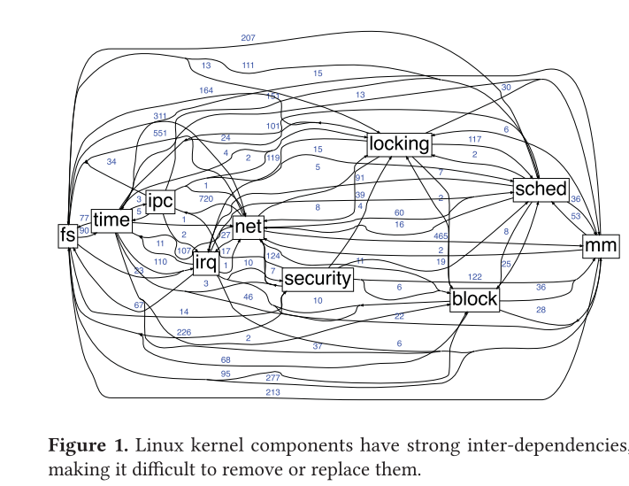

# Unikraft论文

## 背景

单内核是使用库操作系统构造的专用单地址空间计算机映像。开发人员从模块化堆栈中选择与应用程序运行所需的操作系统构造相对应的最小库集。然后，这些库与应用程序和配置代码一起编译，以构建密封的固定用途映像（单内核），这些映像直接在虚拟机管理程序或硬件上运行，而无需干预操作系统。

与传统的操作系统设计相比，库操作系统架构有几个优点和缺点。其中一个优点是，由于只有一个地址空间，因此无需重复的权限转换即可在用户空间和内核空间之间移动数据。因此，库操作系统可以通过允许直接访问硬件来提供更高的性能，而不必在用户模式和内核模式之间转换（在传统内核上，这种转换由单个TRAP指令组成，并且与上下文开关不同）。通过消除在用户空间和内核空间之间复制数据的需要，可以提高性能，尽管传统操作系统中的零拷贝设备驱动程序也可以实现这一点。

缺点是，尝试在库操作系统中并排运行多个应用程序，由于没有进行资源隔离，这可能会变得复杂。 此外，运行库操作系统的特定硬件需要设备驱动程序。由于硬件正在迅速变化，这带来了定期重写驱动程序以保持最新状态的负担。

高度专业化意味着单核不适合传统操作系统所用于的通用多用户计算。添加附加功能或更改已编译的单内核通常是不可能的，相反，方法是编译和部署具有所需更改的新单内核

==Unikernel的愿景：当你看到云客户端时就像看到单应用硬件一样。==

## 论文阅读

### 摘要

**解决单一内核提升性能困难和耗时的问题**

 Unikraft，一个新颖的微库操作系统：（1）完全模块化的操作系统基元，因此很容易定制幺内核并只包括相关的组件；（2）暴露了一套可组合的、面向性能的 API，以便使开发者容易获得高性能。我们使用现成的应用程序（如 nginx、SQLite 和 Redis）进行的评估表明，在 Unikraft 上运行它们，与 Linux 虚拟机相比，性能提高了 1.7-2.7 倍。此外，这些应用的 Unikraft 镜像约为 1MB，运行时需要不到 10MB 的内存，在 VMM 时间之外，启动时间约为 1ms（总启动时间为 3-40 ms）

### 引言

专用化是实现卓越性能的关键。

虚拟化领域unikernel是黄金标准。

**存在的缺点：**

- 它们需要大量的专业工作来构建并优化出高性能；在大多数情况下，这种工作必须为每个目标应用重新进行。
- 它们通常不符合 POSIX 标准，需要移植应用程序和语言环境

现有的unikernel项目，甚至是那些基于库架构的项目，往往是由小型但单一的内核组成，这些内核的组件具有复杂的、交织在一起的、有时不透明的 API。这意味着开发者不仅要经常将应用程序移植到这样的系统中，而且优化它们的性能需要深入研究代码和（幺）内核的具体情况，以了解如何最好地获得性能提升

这类系统通常依赖于面向尺寸的专用化：去除所有不必要的组件以实现最小的镜像。虽然这种策略已经提供了很大的好处，但我们认为，基于库架构的幺内核应该便于获得真正的专用化，允许用户为特定的应用、环境约束和关键性能指标选择最佳的系统组件。

### Unikraft 的两个关键原则

- 内核应该是完全模块化的，以便使unikernel能够完全和容易地定制。在 Unikraft 中，诸如内存分配器、调度器、网络堆栈和早期启动代码等操作系统基元是独立的微库。
- 内核应该提供注重性能的、定义明确的 API，这些 API 可以很容易地被选择和组成，以满足应用程序的性能需求。在 Unikraft 中，这样的 API 本身就是微库，这意味着它们可以很容易地被加入或从构建中移除，而且它们的功能可以通过提供额外的这种微库来扩展。

简而言之，Unikraft 的关键概念创新是为操作系统核心组件定义了一套小的 API，当不需要的时候可以很容易地替换掉一个组件，面对不同性能需求可以从同一个组件的多个实现中挑选。构建 API 时考虑了性能（例如，通过设计支持批处理）和最小化（没有不需要的功能）。

为了支持广泛的应用，我们移植了 musl libc 库，并提供了一个系统调用 shim 层微库。因此，在 Unikraft 上运行一个应用程序可以像用其本地构建系统构建它一样简单，并将产生的对象文件链接回 Unikraft。此外，Unikraft 支持许多已经移植的应用程序（如 SQLite、nginx、Redis）、编程语言和运行环境，如 C/C++、Go、Python、Ruby、Web Assembly 和 Lua，以及一些不同的 Hypervisor/VMM

### 设计理念和方案空间

- 应用程序和内核之间的保护域切换在虚拟化环境下可能是多余的，因为隔离是由 Hypervisor 程序保证的，而且会导致可观的性能下降。
- 多个地址空间在单个应用域中可能是无用的，但在标准操作系统中取消这种支持需要大量工作来重新实现。
- 对于 RPC 风格的服务器应用，线程是不需要的，一个单一的、运行到完成的事件循环就足以实现高性能。这将消除对虚拟机内的调度器及其相关开销的需求，以及虚拟机和 Hypervisor 调度器之间的不匹配[19]。
- 对于以性能为导向的基于 UDP 的应用程序，操作系统网络协议栈的大部分都是无用的：应用程序可以简单地使用驱动 API，就像 DPDK 风格的应用程序已经做的那样。目前还没有办法从标准的操作系统中轻松删除网络协议栈而不是整个网络子系统。
- 应用程序直接访问 NVMe 存储，消除了对文件描述符、VFS 层和文件系统的需求，但从现有的操作系统中移除这种支持，包括围绕着存储 API 的多层结构，是非常困难的。
- 内存分配器对应用程序的性能有很大的影响，而通用分配器已经被证明对许多应用程序来说不是最优的[66]。因此，如果每个应用程序可以选择自己的分配器，那将是最理想的；然而，这在今天的操作系统中很难做到，因为内核所使用的分配器是内置的。

#### unikraft的解决方案

- 单一地址空间：以单一应用场景为目标，可能有不同的应用通过网络通信交流。
- 完全模块化的系统：所有组件，包括操作系统基元、驱动程序、平台代码和库，都应该易于根据需要添加和删除；甚至 API 也应该是模块化的。
- 单一的特权级：不应该有用户/内核空间的分离，以避免昂贵的处理器模式切换。这并不排斥区隔化（例如微库），这可以以合理的开销实现[69]。
- 静态链接：启用编译器功能，例如死代码消除（DCE）和链接时优化（LTO），以自动摆脱不需要的代码。
- 支持 POSIX：为了支持现有的或遗留的应用程序和编程语言，同时仍允许在该 API 下实现专用化。
- 平台抽象化：为一系列不同的 Hypervisor/VMM 无缝生成镜像。

#### 现有的方案

1. 现有的工作在解决这个问题方面有三个方向。第一个方向是采用现有的操作系统并增加或删除功能

linux内核中的依赖非常复杂

2. 第二个方向是完全绕过操作系统（OS）

即便如此，也需要进行移植工作，因为应用程序必须针对新的网络（DPDK、netmap [64]或 Linux 的 io_uring [11]子系统）或存储（SPDK）API 进行编码

3. 第三个方向是为每个目标应用从头开始添加所需的操作系统功能，可能通过复用现有操作系统的代码。

### unikraft架构和API

Unikraft 由两个主要部分组成：

1. 微库。微库是实现 Unikraft 核心 API 之一的软件组件；我们将它们与库区分开来，因为它们具有最小的依赖性，可以是任意小的，例如一个调度器。所有实现相同 API 的微库都是可以互换的。

2. 构建系统。它提供了一个基于 Kconfig 的菜单，让用户选择在应用程序构建中使用哪些微库，让他们选择目标平台和 CPU 架构，甚至在需要时配置单个微库。然后，构建系统对所有的微库进行编译，将它们链接起来，并为每个选定的平台生成一个二进制文件

## 提供的API接口

- uknetdev

  将驱动与网络堆栈实现分离

  提供轮询/中断/混合处理机制

- ukalloc 

- uksched and uklock 

## 参考链接

[技术|到底什么是 Unikernel？ (linux.cn)](https://linux.cn/article-6667-1.html)

[Unikernel - Wikipedia](https://en.wikipedia.org/wiki/Unikernel)