# Unishyper

目标：构建面向嵌入式系统的unikernel。


## 概述

### 嵌入式unikernel面临的挑战

1. 嵌入式应用程序需要运行多个复杂的应用程序。大多数unikernels通常采用SAS系统，这意味着所有任务、线程和进程共享相同的内存地址，用户代码和内核代码之间缺乏隔离机制，不同用户应用程序之间缺乏隔离。
2. 大多数unikernels主要是为云计算环境设计的，并不适合嵌入式系统的高可靠性要求。
   1. unikernel本身必须提供故障跟踪和处理机制，以确保unikernels能够快速识别错误并在故障线程上执行后续处理，这在现有的unikernels中支持得很差。
3. 为了适应具有不同资源约束的嵌入式设备，unikernel需要保持较小的映像大小。
   1. unikernels必须是高度可配置的，使开发人员能够根据特定需求仔细选择要包含在映像中的组件和功能

### 解决方案

问题1/2

Unishyper旨在通过多线程（任务）方法支持SAS中的多个应用程序。**本文的目标是从两个角度来增强这种单进程，多线程系统中的任务之间的隔离：内存访问和故障影响，确保一个任务的崩溃不会对整个系统的稳定运行产生不利影响**。为了在用户和内核代码之间提供内存隔离支持，以及在线程级别上不同用户应用程序之间的隔离，Unishyper设计了基于英特尔MPK 的Zone机制，以将代码隔离到线程组中。Unishyper进一步设计了运行时错误处理的线程级展开策略，包括转储错误调用链、资源清理和线程重启尝试。

问题3

为了有效地减少映像大小，Unishyper不仅提供了可配置的功能以支持模块化，还引入了Unilib设计，将某些功能卸载到同一虚拟机管理程序中另一个虚拟机上运行的全功能操作系统（例如Linux）。

> 文章设计了一个基于unilib接口的文件系统，使Unishyper能够从另一个VM重用Linux提供的文件系统服务。

> 这种设计需要确保unikernel运行在虚拟机当中，同时存在另一个虚拟机运行完整的操作系统。


### 贡献

1. 提出了Unishyper，第一个在用户代码和内核代码实现线程级别的内存隔离的嵌入式unikernel，同时基于MPK在不同的用户程序之间实现隔离。
2. Unishyper设计了用于故障跟踪和处理的线程级展开策略，以防止单个线程的内部故障影响整个unikernel的可靠性
3. 我们对Unishyper进行了全面的评估，结果表明，它可以提供强大的可靠性支持，而不牺牲性能


## 系统设计

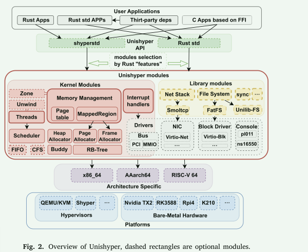

```rust
// A range of mapped addresses, owned by thread.
pub struct MappedRegion {
    // Represents a range of allocated virtual pages.
    pages: AllocatedPages,
    // Represents a range of allocated physical frames.
    frames: AllocatedFrames,
    // Memory flags for establishing mappings (READ/WRITE/EXEC/e.g.).
    attribute: EntryAttribute,
}
```


- 系统的设计中感觉有些在Theseus OS中也有体现
  - 物理页由线程独自进行管理，相当于把资源的管理下沉到线程当中
  - 线程的unwind机制


## 高可靠性设计

> 一般而言，如果操作系统在执行过程中始终提供预期服务，则认为该操作系统是可靠的[49，50]

- 用户代码只能为内核函数调用Unishyper-API公开的方法，安全的Rust代码不允许通过原始指针解引用访问任意地址，Rust的vector提供编译时和运行时数组边界检查以防止缓冲区溢出漏洞
- Unishyper引入了硬件辅助的Zone内存隔离机制和线程级展开策略来进行故障处理


### 基于Zone的内存隔离

在单地址空间的unikernel架构下，实现内存隔离需要解决的问题：

1. 如何在硬件支持下实现SAS下程序的内存访问控制？
2. 如何在不打破unikernel的SPL和SAS约束的情况下，合理区分隔离域？
3. 如何为用户程序提供透明的隔离框架？
4. 隔离后如何实现不同隔离域之间的通信？


#### 威胁模型

本文假设rust的核心库(core/alloc)是可行的。文章区分了kernel侧和用户侧的代码，在kernel初始化完毕，跳转到用户主函数后，接下来发生的事情都是用户开发的代码。 本文假设用户开发或引入的不可信代码包含缓冲区溢出等内存漏洞，可能被用来篡改内核或其他加密线程的敏感数据或劫持Unishyper的控制流使系统崩溃。

这些不可信代码的来源包含：

1. 开发人员编写的代码（可能包含不安全的 Rust）
2. Rust FFI  引入的 C 语言用户程序
3. 开发者导入的第三方依赖项。


#### Zone Design

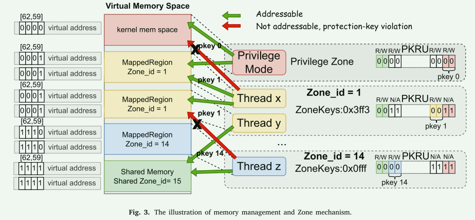

- 每个区域代表一组具有相同内存访问权限的线程（这回答了问题p2）。 属于不同Zone的线程不能访问不属于相应Zone的内存区域
- Zone由Zone ID唯一标识，Zone ID对应各种硬件支持的页粒度内存隔离机制的保护密钥
- 基于Zone和Zone ID的划分，特权Zone用于保护特权变量和unikernel内核代码。 共享Zone用于共享内存区域，存储在.data节或.bss节中的不敏感全局变量可以映射到共享Zone中，用于不同Zone之间的通信（这回答了问题p4）
- ZoneKeys对应的是访问由特定保护密钥标记的内存页的权限。 ZoneKeys 由线程控制块保存。 初始化时，ZoneKeys默认只持有所属Zone和共享Zone ID对应Zone的访问权限
- Zone机制规定，只有属于一个Zone的线程才能同时持有有权访问加密Zone（Zone ID = 1）的ZoneKey
- 上下文切换时，内核根据线程持有的ZoneKey来更新权限控制对应的寄存器（MPK[36]中的PKRU）或内存区域（SealPK[51]中的PKR）的值，从而更新线程的内存 访问权限。 这个过程对于用户线程的让出是透明的，解决了问题p3。


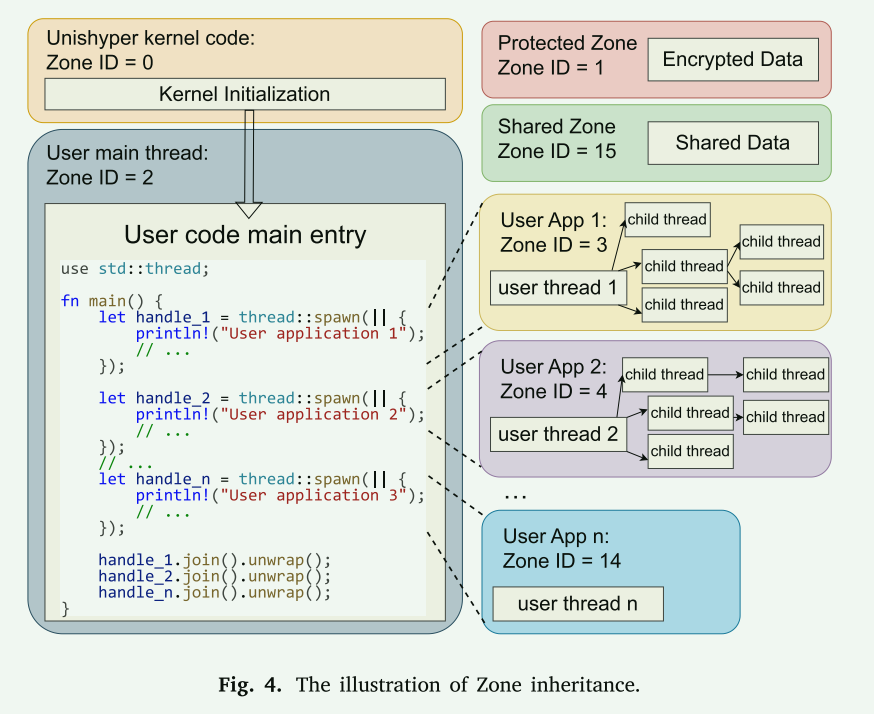

- 每个子线程与其祖先一级线程共享相同的区域和区域 ID


**内核代码域用户代码的隔离：**

在SAS和SPL下，用户应用程序和内核代码之间的界限很明确：用户应用程序只能调用Unishyper提供的标准接口

对于涉及修改关键内核数据（例如 thread_yield 或 allocate）的 API，可以拦截这些API并完成Zone权限的切换


### 故障处理

Rust语言不仅提供编译时安全保证，还能在运行时检测软件问题。硬件本身可以检测故障。 处理器产生页面错误、非法指令等同步异常来指示当前软件操作失败。

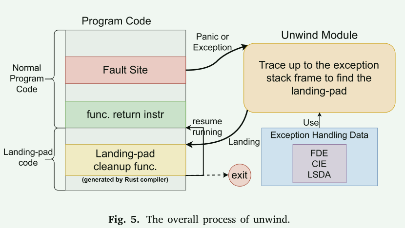


## 高定制性设计

1. 通过rust的feature来进行配置
2. 通过支持no_std和std来减小用户程序开发的难度
3. 通过unilib接口将功能卸载到功能丰富的系统中


#### unilib

以需要文件系统支持的应用程序为例。 对于单个unikernel实例，它必须包含文件系统及其相应的块设备驱动程序。 如果 MCS 需要运行多个 unikernel 实例，则需要多个具有重复文件系统和驱动程序实现的实例。 在MCS内部，有时会有一个成熟且功能更丰富的通用操作系统（如Linux）运行在另一个VM中。

通过将通用的功能卸载到功能丰富的系统中，可以进一步减小unikernel的结构和大小。

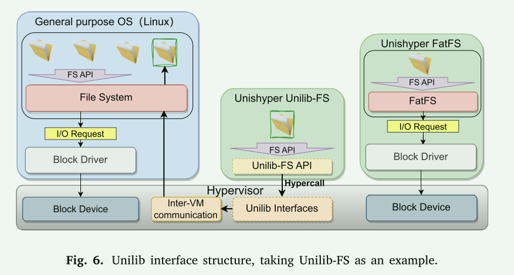


## 评估

平台：QEMU/KVM (x86) 裸机平台(ARM)

优点：

1. 相比其它os，许多方面具有较大的优势
2. 对与嵌入式平台来说，相关的性能指标都比较好 **找准应用场景，比如这里针对嵌入式系统**

### 微基准测试

- 线程yield
- 线程创建
- 内存分配
- 内存释放
- boot time

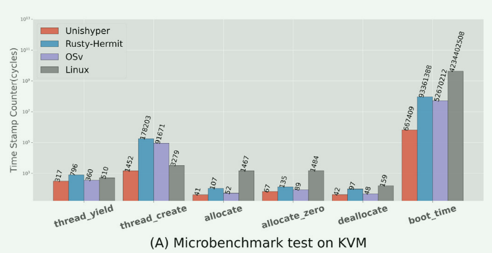

### 网络性能

使用 rust-tcp-io-perf 进行网络延迟和带宽基准测试

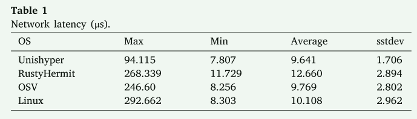

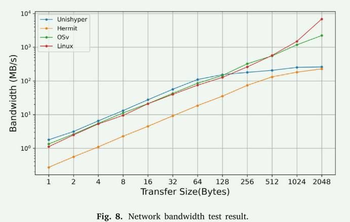

- 网络延迟表现优秀
- 网络带宽在较小的传输数据下达到与Linux相同的水平，虽然较大的传输数据导致性能瓶颈，但是鉴于嵌入式环境中的传输数据都较小，仍然适用于嵌入式环境中


### 可靠性评估

测试Zone机制对线程内存隔离的有效性以及进行故障处理评估。

团队用Rust编写了测试用例，来模拟unikernel中不同线程之间访问栈内存、堆内存、全局内存等可能威胁内存隔离的各种攻击场景。

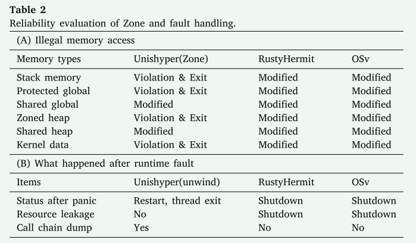

### Unilib 评估

评估将文件系统通过unilib转移到linux前后的os镜像大小的差异

评估性能开销

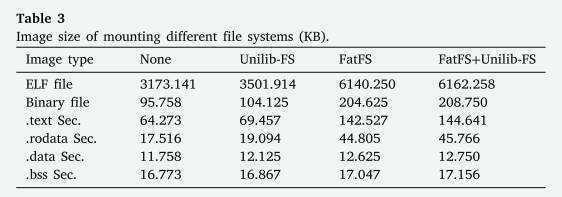

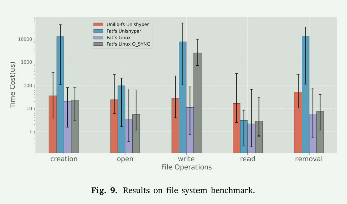

## 案例研究

HTTP服务器和加密测试

- 对比RustyHermit, 使用Linux的网络测试工具ab进行web server性能测试
- 对加密库进行攻击，基于Zone的隔离机制可以阻止这种攻击 **基于语言机制进行隔离的方法应该如何进行这种测试呢？**
