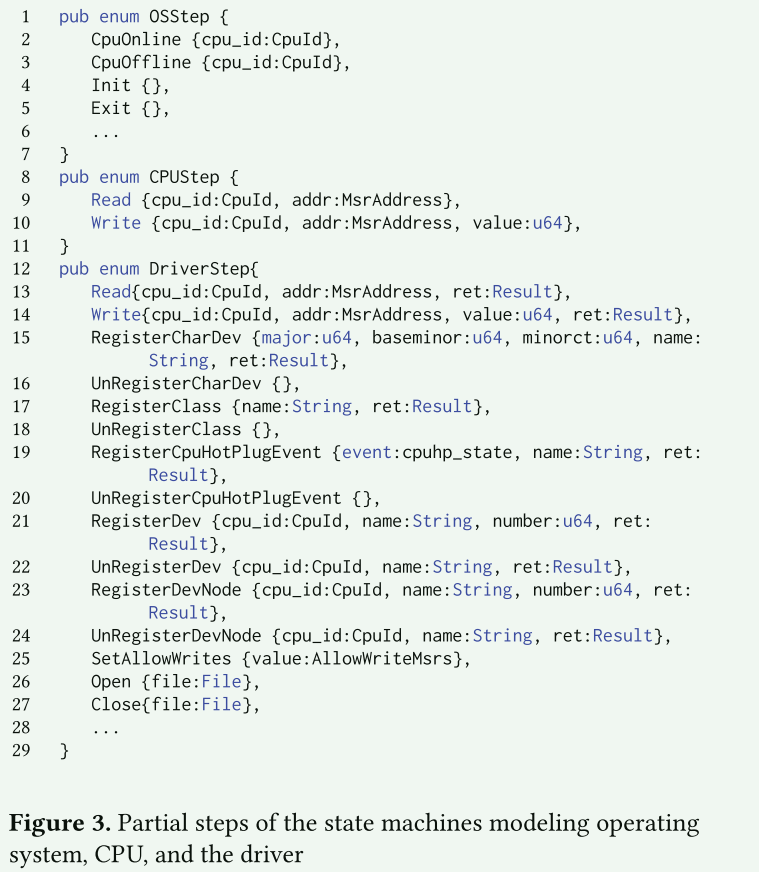
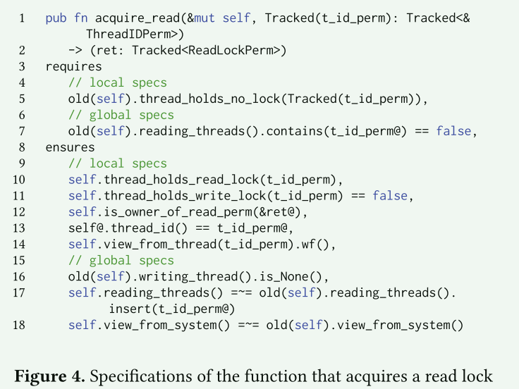

# Veld: Verified Linux Drivers

过去，驱动程序执行环境及其内部逻辑的复杂性使它们超出了形式验证的范围。 然而，我们认为，系统编程语言和自动验证的最新进展在实现经过验证的内核代码的实际开发方面取得了飞跃。

## 序言

设备驱动程序长期以来一直被认为是内核缺陷和漏洞的主要来源之一 [11, 28]。Chou 等人对 Linux 内核中的故障进行了实证研究，发现 2001 年设备驱动程序包含的故障是其他子系统的七倍[11]。在过去的二十年里，自动化测试、模糊测试[12, 15, 9, 29, 33, 30, 26, 34, 38, 37, 26]和静态分析[6, 3, 4, 5, 32]的改进极大地改善了设备驱动程序的缺陷密度。尽管如此，设备驱动程序仍是内核中缺陷密度最高的三个子系统之一，其他两个子系统分别是架构层（./arch）和文件系统（./fs）[28]。

一直以来，驱动程序代码的复杂性使得设备驱动程序无法进行形式验证[1]。驱动程序在并发和重入环境中执行，暴露异步通信接口，需要执行复杂的对象生命周期（结合引用计数和手动内存管理），执行并发动态拔插和重插协议，并采用一系列底层优化来实现最佳性能。虽然有几个项目尝试验证驱动程序代码[31, 17, 10, 2, 36, 27]，但这在很大程度上仍然是不切实际的。

然而，我们认为，自动形式推理的最新进展大大减轻了验证底层系统代码的负担，从而为实际开发验证设备驱动程序创造了机会。具体来说，最近的验证器结合了线性类型的特性和基于可满足性模态理论（SMT）的自动验证[20, 24, 19]。由于严格的指针别名规范，线性类型大大减轻了堆推理的负担。此外，Verus[20, 19]等验证器原生支持对 Rust（一种专为系统开发设计的编程语言）的验证，因此可以对驱动程序代码进行实际验证，然后在裸机上编译和执行。

我们的工作利用了 Verus [20, 19]，这是一种基于 SMT 的新版本。用于探索在 Linux 内核中开发经过验证的设备驱动程序的可能性。 Verus 将 Rust 代码转换为 SMT 公式，然后由 Z3 求解器进行检查 [13]。 与之前基于 SMT 的验证器 [8,21,35] 类似，Verus 提供了高水平的证明自动化和验证速度 - 在许多情况下，SMT 求解器可以自动证明验证条件，但在某些情况下需要以下形式的提示： 断言和归纳证明函数。

Verus 提供的高水平自动化使我们能够避开传统的验证负担，转而专注于与驱动程序代码验证相关的挑战。 首先，我们开发将 Verus 与 Linux 内核集成的技术。 设备驱动程序通过交换使用许多低级编程习惯的数据结构集合来与内核进行通信：通过引用共享分层数据结构、通过 void* 和联合类型利用多态性、依赖于嵌套数据结构的不安全类型转换以及 container_of，通过引用计数管理生命周期，并维护有关每个数据结构的语义属性的无尽低级不变量。 大多数内核驱动程序接口都是不安全的，必须向 Verus 进行解释，这仅限于推理 Rust 的安全子集。 我们开发了通过一系列安全 Rust 包装器和 Verus 规范来表达对原始 C 类型的低级访问的安全性和正确性的技术

其次，我们探讨了驱动程序执行环境的建模方法及其与操作系统和硬件的异步和并发调用和更新的交互。 设备驱动程序在内核的并发和可重入环境中执行。 注册后，只要内核驱动程序接口的协议允许，操作系统就可以随时从多个线程并发调用驱动程序接口的任何函数。 用户线程通过系统调用接口访问设备驱动程序。 内核线程调用设备驱动程序来实现中断处理和一系列周期性任务。 此外，硬件可以在驱动程序执行的同时改变其状态。 为了推断驱动程序的正确性，我们开发了一个执行环境模型，用于捕获内核和硬件的并发执行。

最后，为了支持并发驱动程序代码的开发，我们探索了读写锁的 Verus 抽象，它使我们能够推理对跨多个线程共享的驱动程序状态的正确访问，并避免死锁。 我们的工作提出了设备驱动程序框架的早期原型，Veld（经过验证的 Linux 驱动程序），旨在为 Linux 验证设备驱动程序的开发提供环境。 我们开发了经过验证的模型特定寄存器 (MSR) 驱动程序的部分实现。 具体来说，我们用 Rust 构建所有代码并证明其功能正确性，即使用 Verus 细化高级规范。 我们的初步经验表明，开发经过验证的设备驱动程序是可行的。

## 背景

1. 描述内核模块以及内核模块的常见使用范式
2. 描述使用的Verus自动验证工具

## Veld Arch

经过验证的代码可以在裸机上（或者在我们的例子中在内核环境中）编译和执行。 此外，可以将 Verus 与内核构建系统集成以确保本机内核开发：我们以与传统驱动程序开发相同的方式在内核树中实现经过验证的设备驱动程序（即验证、编译和安装它）.

**kernel interface** Verus 只能对安全的 Rust 类型进行推理。因此，它需要一个中间 Rust 层来访问内核接口使用的不安全 C 语言类型。具体来说，内核接口必须以安全 Rust 封装类型、规范（前置和后置条件）和线性许可指针的组合形式向 Verus 解释，使 Verus 能够在证明层面确定不安全指针操作的正确性。

**From RFL to VFL** 首先，为了暴露安全的 Rust 接口，RFL 依赖于一系列运行时检查和关于代码安全性的人类自然语言论证，例如引用计数器、同步原语、迭代器等的正确性。这种方法要求经过验证的代码信任 RFL，而 RFL 有时需要对安全性和逻辑正确性保证进行复杂的推理。在 Veld 中，我们使用 RFL 封装类型作为最小的薄抽象，允许访问 C 内核接口，但通过证明来确定此类访问的安全性和正确性。

其次，我们对 RFL 类型进行了简化，并使用描述每种类型预期行为的 Verus 规范对 RFL 类型进行了扩展。

**Standard library and memory management**  Verus 支持通过一系列与未经验证的标准库类型的可信绑定来使用标准库。虽然使用标准库的核心类型是一种实用的选择（例如，最近基于 Verus 的验证项目（如 Verismo [39]）选择信任标准库），但我们在 Veld 中避免了这种信任，而是使用我们验证过的类型集合开发驱动程序。不过，我们选择信任内核内存分配器。

**Synchronization and concurrency** 为了支持并发和重入驱动程序代码的验证，即可以从多个 CPU 上的多个执行线程并发访问并被中断抢占的驱动程序，我们利用了 Verus 对跟踪权限的支持。具体来说，每个线程在进入驱动程序之前都会获得一个唯一的、不可伪造的跟踪线程标识符权限。然后，我们使用读写锁保护对共享驱动程序状态的访问，读写锁会返回与锁绑定的线程本地读/写权限。线程必须在访问共享驱动程序状态前提供锁权限。

## 验证

### 规范

我们使用规范来捕捉驱动程序环境的可能行为（即硬件的并发变化、内核对驱动程序的并发调用）和驱动程序本身的正确行为。我们将驱动程序的环境（操作系统和硬件）建模为状态机的集合，每个状态机都可以采取任意步骤，如改变硬件状态、改变内核状态、调用设备驱动程序的函数等。为了模拟驱动程序的预期行为，我们开发了一个驱动程序的抽象状态模型，并定义了它在每个状态转换时的演变方式，即通过调用其方法来反映内核、硬件或驱动程序的变化。

为了定义系统的抽象模型，我们使用了 Verus ghost 变量（即 Set<Driver>）来表示具体系统状态的抽象模型，即内核中已注册设备驱动程序的集合。然后，我们将系统的高级行为定义为一系列规范函数，这些函数描述了在每次状态转换（即调用驱动程序、硬件更新等）时如何更新该抽象状态。

为了确定驱动程序的功能正确性，我们证明了细化定理，即驱动程序的实现细化了其抽象状态。也就是说，调用驱动程序后，驱动程序的状态等同于高层规范中的变化。具体来说，为了证明细化，我们要在系统的抽象状态和具体状态之间建立等价关系，并证明等价关系在每个状态转换时都成立。

### 操作系统

1. 我们的模型捕捉了操作系统与驱动程序相关的高级行为。
2. 我们的模型捕捉了注册、热插拔和文件打开协议。
3. 我们还使用内核的抽象状态来正确定义驱动程序的行为

### 硬件

硬件的运行与驱动程序的执行是异步和并发的。在 MSR 驱动程序的情况下，特定模型寄存器的值可以在两次读取之间发生变化，只要该变化符合硬件的预期行为即可。

我们为一小部分 MSR 开发了部分模型。这样，我们就能开发出避免非法硬件访问导致硬件异常的驱动程序

### 同步原语

为了支持验证同步访问共享状态的并发代码，我们开发了读写锁的抽象。与典型的 Rust 互斥器返回的保护不同，我们的锁返回的是访问锁保护对象的读或写权限。要获取锁，线程需要提供一个线程标识符权限，该权限是唯一且不可伪造的（由 TCB 为特定线程生成）。通过该权限，我们可以区分不同线程的操作步骤。为了区分不同的锁，每个锁都有一个唯一的标识符（这样我们就可以证明，从一个锁获得的访问权限不能代替另一个锁使用）。此外，锁的权限不能在线程之间传递。

我们将同步原语的规范分为两类：全局和局部。例如，从全局来看，我们知道除非某个线程持有写锁，允许它更改变量，否则变量不会发生变化。局部规范确保一个线程正确使用锁，例如，线程不能获取两次锁，必须释放所有锁等。但需要注意的是，当线程释放锁时，它不能对锁保护的变量状态做出假设，因为这些变量可能会被其他线程更改。全局规范允许我们推理系统的全局状态，例如哪些线程可以读取和更新哪些变量、它们的状态等。

### 驱动

在我们的模型中，驱动程序的调用不是原子性的（即硬件可以异步改变其状态，操作系统可以从另一个线程更新驱动程序的共享状态等）。因此，我们将驱动程序调用建模为状态机的多个步骤。这样，我们就可以将操作系统、硬件和驱动程序的所有可能执行行为建模为最小的步骤，并将驱动程序视为一个状态机，可以对当前状态采取任何有效步骤。

> **将驱动程序调用建模为状态机的多个步骤**

## Reference

[^1]: