# XRP: In-Kernel Storage Functions with eBPF

## introduction

XRP: 一个框架，允许应用程序执行用户定义的存储功能，如索引查找或聚合，从NVMe驱动程序中的eBPF钩子，安全地绕过大部分内核的存储堆栈

新的NVMe存储设备现在可以实现高达7gb /s的带宽和低至3µs的延迟 -> 内核存储堆栈成为阻碍应用程序观察到的延迟和IOPS开销的主要来源

解决这个问题的现有方法往往是激进的，需要侵入性的应用程序级更改或新的硬件:

- SPDK等库完全绕过内核，允许应用程序直接访问底层设备，但这些库也迫使应用程序实现自己的文件系统，放弃隔离和安全性，并在I/O利用率低时轮询I/O完成,这会浪费CPU周期
- 当可调度线程数超过可用cpu core时，使用SPDK的应用程序会遭受较高的平均和尾延迟，并严重降低吞吐量

出发点： 一种易于部署的机制，它可以提供对新兴快速存储设备的快速访问，不需要专门的硬件，也不需要对应用程序进行重大更改，同时使用现有的内核和文件系统

eBPF：

- 与内核旁路类似，通过将应用程序逻辑嵌入内核堆栈深处，BPF可以消除与内核用户交叉和相关上下文切换相关的开销
- 与内核旁路不同，BPF是一种操作系统支持的机制，可以确保隔离，不会因为等待繁忙而导致利用率降低，并且允许大量线程或进程共享同一个内核，从而提高总体利用率

使用 BPF 加速存储会带来一些独特的挑战：

存储 BPF 功能可能需要与其他并发应用级操作同步，或者需要多次调用函数才能遍历大型磁盘数据结构，我们将这种工作负载模式称为 I/O 的 **resubmission**。遗憾的是，**resubmission**所需的状态（如访问控制信息或关于单个存储块如何适应其所属的大型数据结构的元数据）在低层无法获得

方法：为了最大限度地提高性能，XRP 在 NVMe 驱动程序的中断处理程序中使用了一个钩子，从而绕过了内核的块、文件系统和系统调用层。这样，XRP 就能在每次 I/O 完成时直接从 NVMe 驱动程序触发 BPF 功能，从而快速重新提交穿越存储设备上其他区块的 I/O

**XRP 面临的主要挑战：底层 NVMe 驱动程序缺乏高层提供的上下文**

> - 谁拥有一个数据块（文件系统层）
> - 如何解释数据块的数据以及如何遍历磁盘上的数据结构（应用层）

见解: 现实世界数据库中的许多存储优化数据结构通常是在一小部分大文件上实现的，它们的更新频率比读取频率低很多， 将 XRP 专注于包含在一个文件中的操作以及在磁盘上有固定布局的数据结构

- NVMe 驱动程序只需要极少量的文件系统映射状态（我们称之为元数据摘要）
- 这些信息非常小，可以从文件系统传递给 NVMe 驱动程序，以便其安全地执行 I/O 重新提交

文章使用 XRP 增强了两个键值存储：BPF-KV 和 WiredTiger 的日志结构合并树，前者是为支持 BPF 功能而定制设计的基于 B+ 树的键值存储，后者被用作 MongoDB 的存储引擎之一 


贡献：

1. 新数据路径。XRP 是第一个能够使用 BPF 向内核卸载存储功能的数据路径。
2. 性能与普通系统调用相比，XRP 将 B 树查找的吞吐量提高了 2.5 倍。
3. 利用率。XRP 提供的延迟接近于内核旁路，但与内核旁路不同的是，它允许相同线程和进程高效共享内核。
4. 可扩展性。XRP 支持不同的存储用例，包括不同的数据结构和存储操作（如索引遍历、范围查询、聚合）。


## 背景

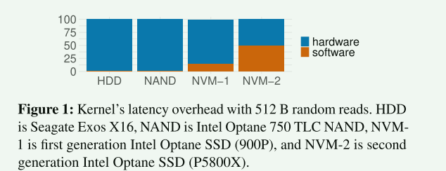

- 随着存储设备的速度越来越快，内核的相对开销只会越来越大。

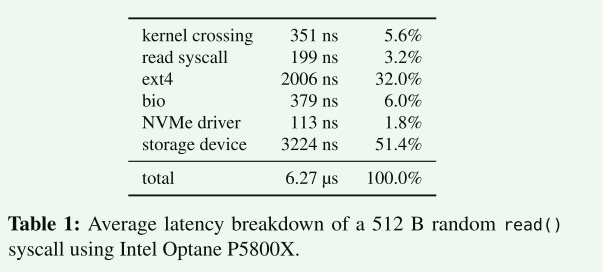

- 最昂贵的层是文件系统（ext4），其次是块层（bio）和内核交叉层，软件总开销占平均延迟的 48.6%。


### BPF

BPF可以成为一种避免在内核和用户空间之间进行数据移动的机制。例如，要遍历b树索引，每个级别上的查找遍历内核的整个存储堆栈，只有当应用程序获得指向树中下一个子节点的指针时才会将其丢弃。每个中间指针查找都可以由BPF函数执行，而不是来自用户空间的一系列系统调用，该函数将解析b树节点以查找指向相关子节点的指针。然后内核将提交I/O以获取下一个节点。将这样的BPF函数序列链接起来可以避免遍历内核层和将数据移动到用户空间的开销。

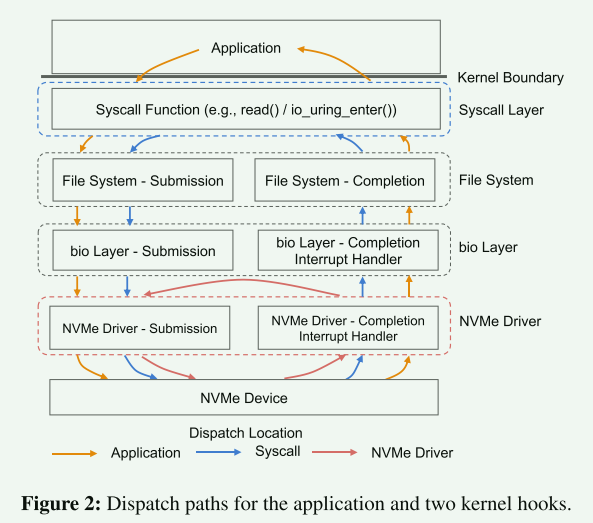

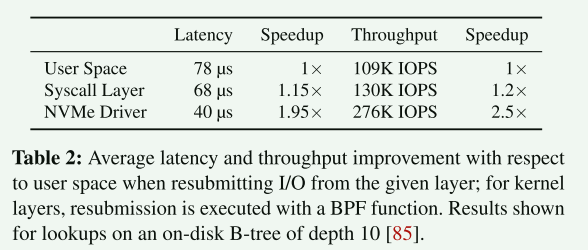

- 在内核的任何地方放置eBPF钩子可以提高吞吐量1.2 - 2.5倍。但是，将I/O调度推到尽可能靠近存储设备的位置可以显著提高遍历的性能


## 设计挑战和准则

I/O重新提交必须尽可能靠近设备，以便获得最大的好处。在NVMe软件栈中，这是NVMe中断处理程序。然而，在NVMe中断处理程序中执行重新提交(缺乏文件系统层的上下文)会带来两个主要挑战：

1. 地址翻译和安全：
   1. NVMe驱动程序无法访问文件系统元数据，比如找不到物理块的偏移量
   2. BPF函数也可以访问设备上的任何块，包括属于用户没有访问权限的文件的块
2. 并发性和缓存
   1. 从文件系统发出的写操作将只反映在页缓存中，这对XRP是不可见的。
   2. 此外，任何修改数据结构布局的写操作(例如，修改指向下一个块的指针)都可能导致XRP意外地获取错误的数据。
   3. 这两个问题都可以通过锁来解决，但是从NVMe中断处理程序内部访问锁可能会很昂贵

对现实应用程序的观察：

1. 许多存储引擎（如 LSM 树和 B 树）的文件相对稳定。有些数据结构根本不会就地修改磁盘存储结构。 访问这些不可变的磁盘存储结构所需的同步工作较少
2. 尽管某些磁盘上的 B 树索引实现支持就地更新，但它们的文件扩展在很长一段时间内都保持稳定。这使得在 NVMe 驱动程序中缓存文件系统元数据成为可能，而无需频繁更新
3. 在所有这些存储引擎中，索引都存储在少量大文件中，每个索引不会跨越多个文件


设计准则：

1. 一次只能提交一个文件：限制 XRP 只能对单个文件进行链式重新提交。这大大简化了地址转换和访问控制，并将我们需要向下推送到 NVMe 驱动程序的元数据（元数据摘要）降到最低
2. 稳定的数据结构。XRP 的目标数据结构，其布局（即指针）在很长时间内保持不变
3. 用户管理缓存。XRP 与页面缓存没有接口，因此如果数据块在内核页面缓存中缓冲，则无法安全地同时运行 XRP 函数。这种限制是可以接受的，因为流行的存储引擎通常会实施自己的用户空间缓存
4. 慢速路径回退。XRP 是尽力而为的；如果遍历因某种原因失败，应用程序必须重试或退回到使用用户空间系统调用来分派 I/O 请求


## XRP

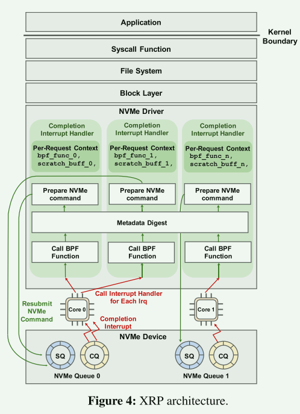

步骤：

1. 当一个 NVMe 请求完成时，设备会产生一个中断，导致内核上下文切换到中断处理程序
2. 对于在中断上下文中完成的每个 NVMe 请求，XRP 都会调用其相关的 BPF 函数（图 4 中的 bpf_func_0），该函数的指针存储在内核 I/O 请求结构（即 struct bio）的一个字段中
3. 用 BPF 函数后，XRP 会调用元数据摘要，这通常是文件系统状态的摘要，使 XRP 能够转换下一次重新提交的逻辑地址
4. 最后，XRP 通过设置 NVMe 请求中的相应字段来准备下一次 NVMe 命令重新提交，并将请求附加到该内核的 NVMe 提交队列 (SQ)

对于一个特定的 NVMe 请求，根据与 NVMe 请求一起注册的特定 BPF 函数的决定，重新提交逻辑会根据后续完成情况的需要被调用多次。例如，在遍历树状数据结构时，BPF 函数将为分支节点重新提交 I/O 请求，并在找到叶节点时结束重新提交


### BPF Hook

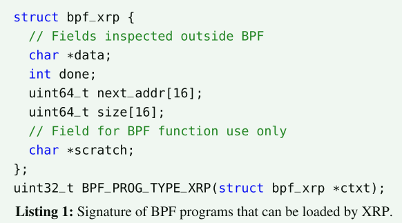

- BPF_PROG_TYPE_XRP 程序需要一个包含五个字段的上下文，分为 BPF 调用者检查或修改的字段（中断处理程序中的重新提交逻辑）和 BPF 函数私有的字段。从外部访问的字段包括 data，用于缓冲从磁盘读取的数据
- 为了支持具有扇出的数据结构，可以提供多个 next_addr 值。默认情况下，我们将扇出限制为 16；磁盘上的数据结构将其组件对齐到设备页面的小倍数，因此我们没有遇到每次完成都需要更高的扇出
- scratch 是用户和 BPF 函数专用的 scratch 空间。它可用于将用户参数传递给 BPF 函数。此外，BPF 函数还可以用它来存储 I/O 重新提交之间的中间数据，并将数据返回给用户


### metadata digest

在传统的存储堆栈中，磁盘数据结构中的逻辑块偏移由文件系统进行转换，以确定要读取的下一个物理块。这一转换步骤还能加强访问控制和安全性，防止读取未映射到打开文件的区域。在 XRP 中，用于查找的下一个逻辑地址由 BPF 调用后的 next_addr 字段给出。但是，将该逻辑地址转换为物理地址具有挑战性，因为中断处理程序没有文件的概念，也不执行物理地址转换。

```c
void update_mapping(struct inode *inode);
void lookup_mapping(struct inode *inode,off_t offset, size_t len, struct mapping *result);
```


**元数据摘要：它是文件系统和中断处理程序之间的一个精简接口，可让文件系统与中断处理程序共享逻辑到物理块的映射，从而实现基于 eBPF 的安全磁盘重新提交**

- 查找函数在中断处理程序中调用；它返回给定偏移和长度的映射。查找函数还通过防止 BPF 函数请求重新提交打开文件之外的数据块来执行访问控制
- 这两个功能是每个文件系统所特有的，甚至对于一个特定的文件系统，可能有多种方法来实现元数据摘要，从而在实现的难易程度和性能之间做出权衡

### Resubmitting NVMe Requests

查找物理块偏移后，XRP 就会准备下一个 NVMe 请求。由于这一逻辑发生在中断处理程序中，为了避免准备 NVMe 请求所需的 kmalloc 调用（速度慢），XRP 重新使用了刚刚完成请求的现有 NVMe 请求结构


## Case studies

```c
int bpf_prog_load(const char *file,enum bpf_prog_type type,struct bpf_object **pobj, int *prog_fd);
int read_xrp(int fd, void *buf, size_t count, off_t offset, int bpf_fd, void *scratch);
```


### BPF-KV

我们建立了一个简单的键值存储，名为 BPF-KV，我们可以用它来评估 XRP 与其他基线的比较：Linux 的同步和异步系统调用以及内核旁路（SPDK [82]）。BPF-KV 设计用于存储大量小型对象，即使在统一访问模式下也能提供良好的读取性能。BPF-KV 使用 B+ 树索引来查找对象的位置，而对象本身则存储在未排序的日志中。为简单起见，BPF-KV 使用固定大小的键（8 B）和值（64 B）。索引和日志都存储在一个大文件中。索引节点使用简单的页格式，先是页眉，然后是键和值。叶节点包含指向下一个叶节点的文件偏移量，从而可以高效地遍历索引，进行范围查询和聚合。对象大小是固定的，因此更新会在未排序的日志中就地进行。新插入的项目会添加到日志中；其索引最初存储在内存中的哈希表中。一旦哈希表填满，BPF-KV 就会将其与磁盘上的 B+ 树文件合并。

### WiredTiger 


## 评估

- 使用 BPF 进行存储有哪些开销？
- XRP 如何扩展到多个线程？
- XRP可以支持哪些类型的操作？
- XRP 能否加速现实世界中的键值存储

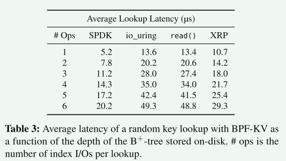

- XRP 比 read() 改善了延迟，因为 XRP 在遍历索引或从索引移动到日志时会节省一次或多次存储层遍历
- 每增加一次 I/O 操作，XRP 的延迟就会增加约 3.5-3.9 µs，这与设备的延迟接近.这意味着 XRP 对重新提交的请求实现了接近最佳的延迟
- SPDK 的延迟比 XRP 更好，因为 XRP 必须通过一次内核存储栈才能启动索引遍历，而 SPDK 则完全绕过了内核，当 B+ 树的深度增加时，XRP 的边际增加延迟接近 SPDK（2.6 µs3.4 µs）
  - XRP 无需轮询即可实现这一目标

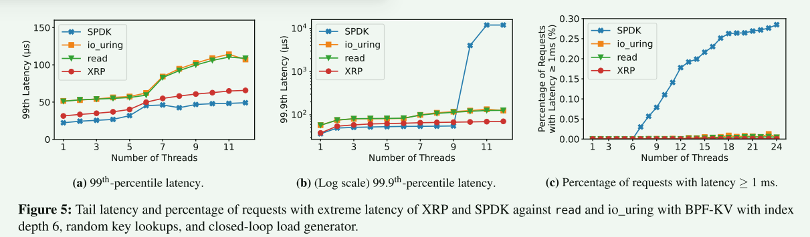

- 当使用单线程运行时，与平均延迟结果类似，与 read() 和 io_uring 相比，XRP 可将第 99 个百分位数延迟和第 99.9 个百分位数延迟减少多达 30%
- 当线程数超过内核数（6）3 个以上时，SPDK 的 99.9 百分位数延迟会显著增加。这是由于 SPDK 的所有线程都在忙于轮询，无法与其他线程有效共享同一内核

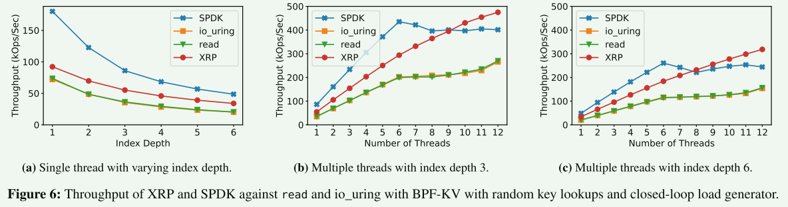

- 随着索引深度的增加，XRP 的速度比标准系统调用更快

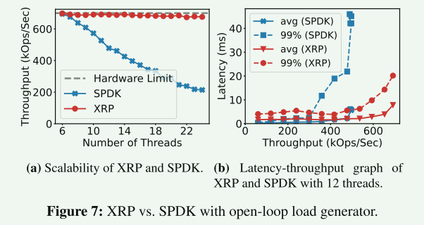

- 当使用 6 个工作线程（机器上的 CPU 内核数）时，SPDK 和 XRP 的吞吐量都能接近硬件极限
- 一旦线程数超过 CPU 内核数，SPDK 的吞吐量就会稳步下降，而 XRP 仍能提供稳定的吞吐量
- 当线程数多于 CPU 内核数时，SPDK 的平均延迟和尾部延迟都会显著增加，因为每个线程等待调度的时间都比 XRP 长

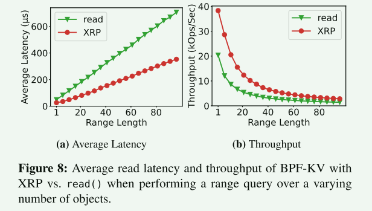

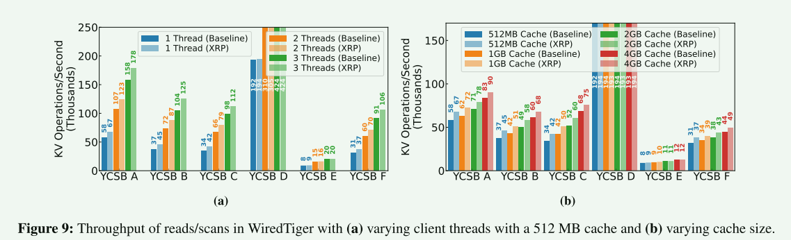

- 结果表明，XRP 可将大多数工作负载的速度持续提高 1.25 倍

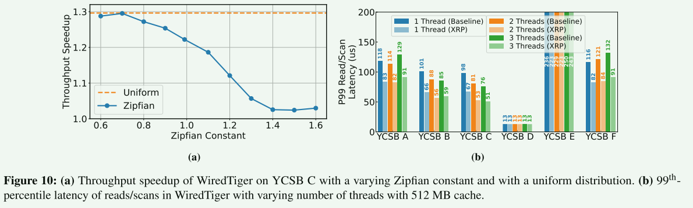