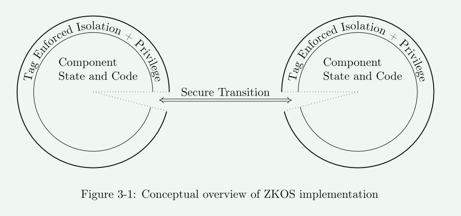
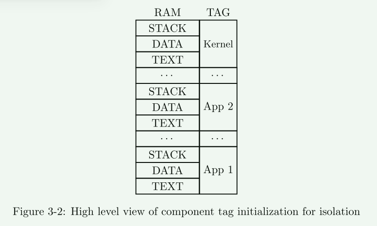
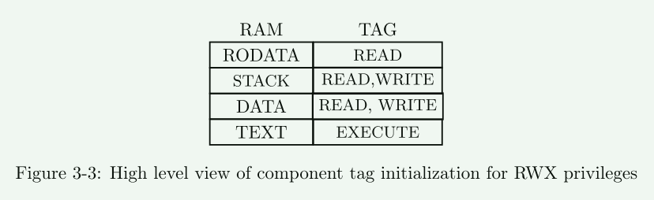
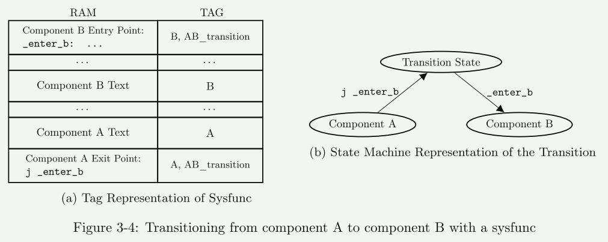

# A Zero Kernel Operating System

**Rethinking Microkernel Design by Leveraging Tagged Architectures and Memory-Safe Languages**

ZKOS强调标记架构上的分区和最小特权高级思想。

**tagged architecture**： 内存标记技术

tagged architecture这个架构下不依赖特权级和分页机制进行隔离，因为这些技术限制了特权和隔离的粒度，其**提供内存字级别的隔离，能提供真正不相交的特权划分**。

为此，ZKOS 根据功能将内核空间和用户空间分割成细粒度的组件。 然后，ZKOS定义组件之间的特定入口和出口点，并制定策略来限制组件转换和权限。 这提高了隔离和特权的精度。

## 背景

1. C语言是低级语言，不提供内存安全，这导致许多内存相关的错误
2. 商用系统通常采用特权级划分和基于内存分页机制进行隔离

### 本文的贡献

1. 通过使用内存安全语言消除了大部分内存错误，
2. 并利用标记架构以较低的性能开销提供细粒度的隔离和非分层特权方案

ZKOS 与微内核的内存安全实现有一些相似之处。 然而，微内核的可信代码库仍然可以执行 Ring 0 中的任何指令。相反，**ZKOS 的中心思想是重新思考 Ring 模型的思想，以非分层方式强制执行最小权限。 我们不再使用环，而是将内核划分为模块化组件，每个组件都有一组自定义权限。 我们将这些组件与标记架构结合起来以强制执行这些自定义权限，从而减少每个组件的权限**。 例如，我们只允许陷阱处理组件执行 mret 指令以返回用户空间。 然后，我们使用有限状态自动机 (FSM) 对系统进行建模，并使用标签在组件之间强制执行明确定义的控制流。 我们不使用分页和虚拟内存，而是使用标记架构将隔离粒度从页级扩展到字级。

## 设计和实现

- 在内存字级别提供实施策略可以允许去掉特权级和内存分页的必要
- 内核空间和用户空间的程序都被分隔为具有不同能力的组件
- 组件之间不需要特权级切换，而是函数调用
  - 因为组件的能力是不同的，需要确保进入和离开组件时的能力保存和恢复

ZKOS 提供细粒度的内存隔离，从而允许每个组件访问特定数量的可变大小的内存块。 此外，ZKOS 为每个组件提供了一组细粒度的权限； 每个组件只能执行执行所需的指令。

-  在编译时就为每一个组件使用的内存范围打上了标记
- 对组件之间共享和传输数据没有考虑：
  - 第一种方法是在编译时将数据标记为两个组件所拥有
  - 第二种方法是在运行时包含一个微策略，允许系统调用组件，并能够通过执行将相关组件的标签添加到每个单词的指令来在组件之间共享

- 在更细粒度层面，提供对每一种内存范围的更强的控制策略
- 虽然 ZKOS 仅实现 RWX 权限，但可以将此范例扩展到更详细的数据视图，以显示允许组件对内存中的字执行的读取、写入或执行的确切次数

ZKOS 使用标签实现这些 sysfunc 转换。 假设在执行过程中，ZKOS 需要从组件 A 转移到组件 B。ZKOS 通过在编译时用相同的唯一标记标记第一个组件的退出点（跳转指令）和第二个组件的入口点来进行转换。 然后，ZKOS 包含一个策略，规定在组件 A 内部执行时，如果遇到包含此唯一标记的跳转指令，则转移到由 PC 上的唯一标记标识的特殊转换状态。 下一条执行的指令也必须包含这个唯一的标记，然后完成组件之间的转换，包括切换隔离上下文和特权级别，并允许在第二个组件下恢复执行