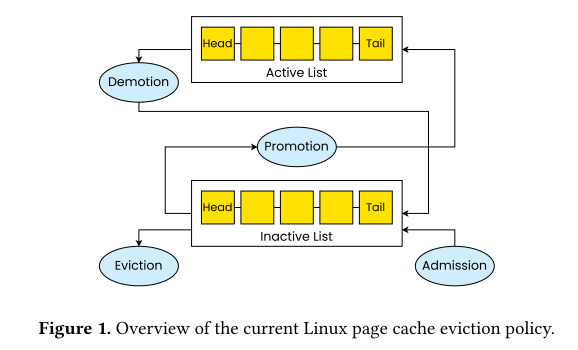
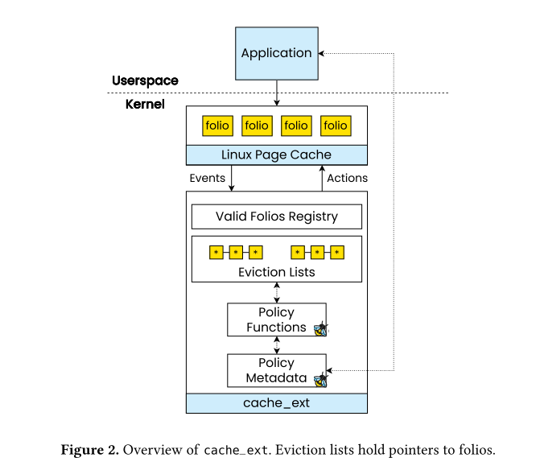
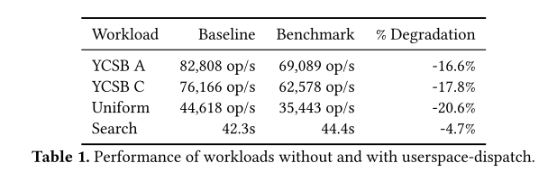
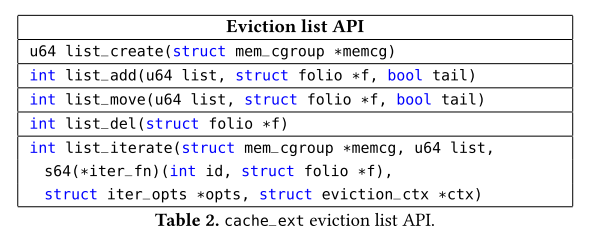
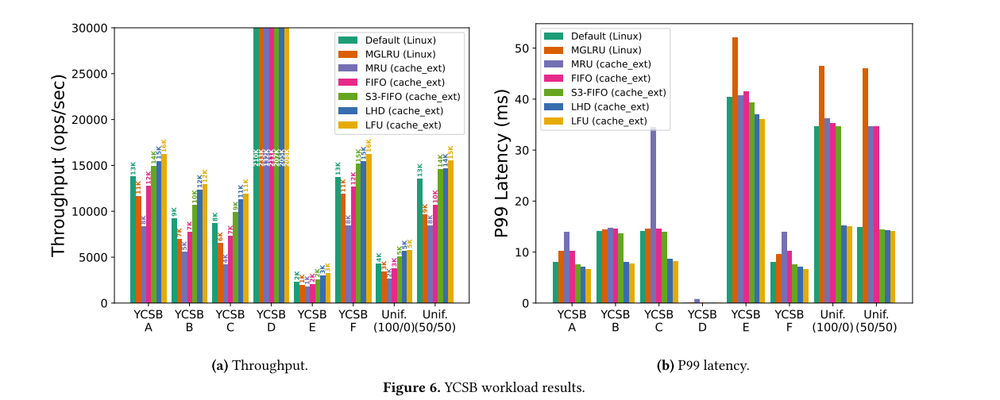
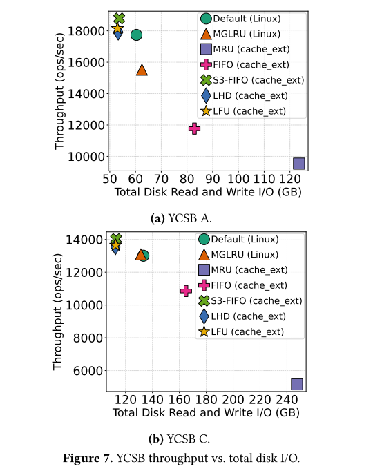
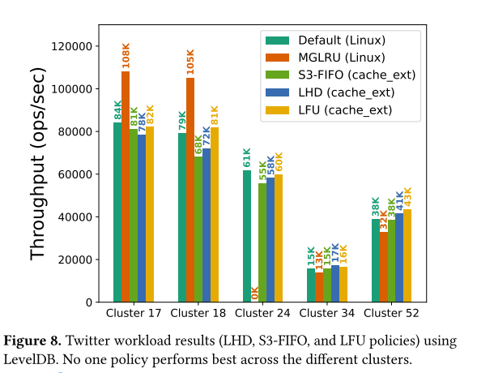
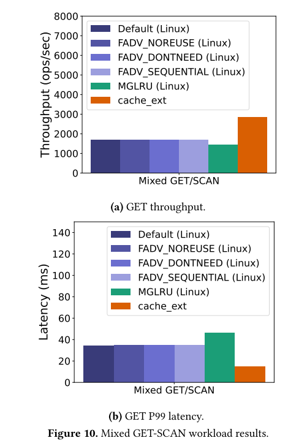
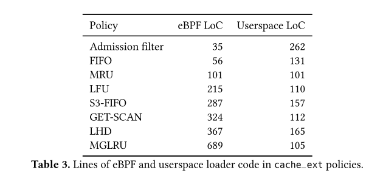
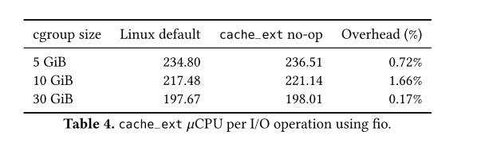

# cache_ext: Customizing the Page Cache with eBPF

## 总结

操作系统（OS）页缓存通过减少对存储设备的过度访问，成为许多应用性能的核心组件。然而，其通用型置换策略在多数工作负载中表现欠佳。尽管系统社区已在非操作系统环境（如键值存储、内容分发网络）中尝试了大量新型**自适应置换策略**，但由于修改内核代码的复杂性，此类策略难以在页缓存中实现。为应对这些缺陷，我们设计了一个基于eBPF的灵活框架**cache_ext**，使开发者无需修改内核即可定制Linux页缓存。该框架具有以下特性：

1. **按需定制**：允许应用程序根据特定需求定制页缓存策略；
2. **策略隔离**：确保不同应用的策略互不干扰；
3. **内存共享**：保留页缓存跨进程共享内存的能力

通过实现八种不同策略（包括复杂置换算法），我们验证了**cache_ext**接口的灵活性。评估结果表明：根据工作负载特性定制页缓存能带来显著收益，可实现最高70%的吞吐量提升和58%的尾延迟降低。


## 现有工作的不足

- **P2Cache**：提出了允许应用程序定制Linux页缓存的方案，但存在显著局限性：应用程序仅能通过单个LRU（或MRU）队列实现策略，这意味着P2Cache无法支持大量非LRU队列依赖或多队列需求的淘汰策略（例如LFU、LHD、MGLRU、ARC、S3-FIFO）
- **PageFlex**：允许将页缓存策略卸载到用户空间，但其聚焦于交换与预取而非淘汰机制，且未跟踪基于文件的页访问
- **FetchBPF**：支持定制Linux预取策略，但未涉及历史上需要更复杂数据结构的页缓存淘汰机制。
- Linux内核自身也尝试通过两种方式应对该问题：为LRU策略添加定制选项（如fadvise()），以及采用新型MGLRU策略替代旧方案。但这些改进往往无法为应用性能带来实质性提升。


## Pagecache定制的困难

应用程序被Linux僵化的页面淘汰策略所"束缚"的原因主要有两点：

1. 首先，修改Linux页面缓存是一项艰巨任务，需要深厚的系统内核知识；
2. 其次，对页面缓存的改动难以被上游采纳，因为这些修改必须兼容Linux系统上运行的各种应用程序。例如，Google提出的多代LRU（MGLRU）策略花费数年才被上游接受，但即便经过多年推广，该策略仍未在所有Linux发行版或上游代码中默认启用


`cache_ext`的设计基于四个关键洞察：

1. 现代存储设备支持数百万IOPS且延迟极低，因此自定义页面缓存策略必须以低开销运行。为此，我们将`cache_ext`的eBPF策略部署在内核中运行，避免了内核与用户空间之间昂贵且频繁的同步
2. 缓存算法高度多样化且可能涉及复杂数据结构。为解决这一挑战，`cache_ext`提供简洁而灵活的接口：允许应用程序定义一个或多个可变大小的页面列表，以及操作这些列表的策略函数（如准入、淘汰），该接口可表达广泛的淘汰策略
3. 为使cache_ext适用于多租户场景，它应允许各应用使用独立策略且互不干扰。我们选择cgroup作为天然隔离边界，因此cache_ext支持每个cgroup实现专属淘汰策略而不影响其他cgroup。
4. 自定义策略决定淘汰哪些页面并将页面引用返回内核，但这些引用可能失效并引发内核崩溃或安全漏洞。为此，`cache_ext`维护有效页面引用注册表，用于验证用户定义策略返回的引用有效性


**实验洞察：**

总体而言，我们发现不存在一种能提升所有工作负载的通用策略——必须通过定制化才能实现性能最大化。具体而言，cache_ext采用"通用"策略时可将应用吞吐量最高提升38%；而采用应用感知策略时，吞吐量最高可达1.70倍，且P99延迟降低58%


## 背景

1. 为避免性能受损，部分应用会自行实现基于用户空间的缓存方案(尤其是数据库领域)：

   1. 实现需要投入大量开发成本

   1. 通常需要预先指定缓存容量，但应用可用内存量可能随时间动态变化（例如多应用共享物理服务器时）

   1. 由于安全性与兼容性问题，应用专用缓存难以跨进程共享

2. 定制页面缓存并非易事——它与内存管理及文件系统中其他关乎性能与正确性的关键代码路径深度耦合。尽管页面缓存的现代化改造工作仍在进行，但迄今尚未达成这一目标




### eBPF

近年来，Linux的 eBPF运行时改进显著扩展了 eBPF程序的潜在功能。例如，struct_ops向用户空间暴露了一个函数指针回调接口，这些回调由 eBPF程序实现，并可由内核子系统调用[51]。该基础设施通过最小化验证器的复杂变更，极大简化了引入用户自定义策略的过程

eBPF程序通过kfuncs与内核交互：这些专门暴露给eBPF的内核函数不一定具备稳定接口。验证器会强制执行kfuncs参数和返回值的属性，从而提供一定的正确性保证。近年来，内核中新增了许多实现复杂操作或修改内核状态的kfuncs。值得注意的是，eBPF程序也通过辅助函数（helper functions）与内核交互，这类接口被认为是稳定的。但kfuncs的实现更简单且灵活性更高


## Cache_ext设计



cache_ext允许用户运行自定义淘汰策略函数，这些函数以内核中的eBPF函数形式实现。策略函数由特定事件（如folio淘汰、访问、准入）触发，并操作用户指定数量的可变大小淘汰链表——这些链表存储着由策略管理的folio指针。策略函数基于存储在eBPF映射中的元数据（例如访问频率、最近访问时间、访问folio的线程），决定将哪些folio加入链表或从链表中淘汰。当发生淘汰时，cache_ext会运行用户定义的淘汰函数，向内核提交一组候选淘汰项


### Policies in Kernel or Userspace?



> 此类用户态卸载架构的"最佳情况"开销：将eBPF程序挂载到内核现有跟踪点（folio插入、访问与换出），这些程序通过无锁环形缓冲区向用户态发送事件通知。由于实际未执行任何用户态逻辑处理，该测量结果反映了该架构的理论最优开销。

回答了为什么选择在内核中实现定制策略-> 性能->eBPF


### Interface

```c
// Policy function hooks
struct cache_ext_ops {
    s32 (*policy_init)(struct mem_cgroup *memcg);
    // Propose folios to evict
    void (*evict_folios)(struct eviction_ctx *ctx,
    struct mem_cgroup *memcg);
    void (*folio_added)(struct folio *folio);
    void (*folio_accessed)(struct folio *folio);
    // Folio was removed: clean up metadata
    void (*folio_removed)(struct folio *folio);
    char name[CACHE_EXT_OPS_NAME_LEN];
};
struct eviction_ctx {
    u64 nr_candidates_requested; /* Input */
    u64 nr_candidates_proposed; /* Output */
    struct folio *candidates[32];
};
```


cache_ext允许应用程序通过策略函数定义自定义的驱逐策略，这些策略函数是一组追踪缓存事件并决定从页缓存中驱逐哪些内存页（folio）的 eBPF程序。策略函数由五类事件触发，策略函数通过 eBPF的 struct_ops内核接口实现：

1. 策略初始化
2. 驱逐请求
3. 内存页准入
4. 内存页访问
5. 内存页移除


**驱逐请求和folio移除请求存在差异**：前者是内核要求策略提出待驱逐的folio，而后者是内核通知策略某个folio已被实际驱逐。这种区分基于以下原因：若folio所属文件被删除等情况，folio可能绕过"正常"驱逐路径被强制移除；反之，极少数情况下，被提议驱逐的folio并不保证最终会被移除（例如该folio正被内核占用）


#### Eviction Lists(驱逐列表)



为了提供一个足够灵活的接口以支持所有这些策略，`cache_ext`围绕驱逐列表API构建，这是一个简单的接口，供策略用于构建和操作一组可变大小的链表。链表中的每个节点对应一个单独的`folio`，并存储指向该`folio`的指针，而非`folio`本身。重要的是，实际的`folio`仍由默认内核页缓存实现进行存储和维护，以最小化对内核的修改

#### Eviction Candidate Interface

驱逐候选接口。策略函数通过遍历其驱逐列表来确定需要驱逐的folio。需要注意的是，**策略并不直接执行folio驱逐——而是向内核提交驱逐候选，由内核检查这些folio是否确实符合驱逐条件（例如未被固定或未被内核使用），若符合条件则执行驱逐**。驱逐候选以每批最多32个folio的形式提交给内核。cache_ext对核心页缓存代码的大部分修改都是为了支持这种批量驱逐流程


当前eBPF并未提供直接遍历淘汰链表的方法，因此cache_ext引入了一个新的迭代内核函数（kfunc），允许策略函数遍历淘汰链表并为每个节点制定决策。具体而言，`list_iterate()`接收四个参数：待遍历的链表、`iter_opts`结构体、淘汰上下文以及回调函数。该函数维护迭代计数器，并对每个节点调用回调函数。回调函数（同样是一个eBPF程序）随后决定保留或淘汰传入的folio页。被选中淘汰的folio页会被添加到`eviction_ctx`结构体的候选数组（candidates array）中。`iter_opts`结构体则指定接口应如何处理已评估的folio页，例如保持原位、移至链表尾部或转移到其他链表。这一机制支持实现需要多链表协同与动态平衡的策略，例如S3-FIFO或ARC算法


### 策略隔离

控制组（cgroup）内部实施策略可以有效应对这一挑战，因为同一cgroup内的进程采用相同的自定义淘汰策略，而不同cgroup可以各自使用独立的策略。此外，按cgroup部署策略符合通过容器化部署现代应用的通用模式——容器会将每个应用隔离在其专属的内存cgroup中


### 安全性

**内存有效性**

cache_ext必须保证eBPF程序仅返回有效指针（例如在淘汰候选接口中）。否则，恶意eBPF程序可能返回无效值，导致内存损坏或内核崩溃。值得注意的是，sched_ext通过使用PID作为进程标识符部分解决了该问题。然而，folio缺乏类似易获取的唯一标识符，因此我们转而使用指针作为解决方案

为验证这些指针的有效性，我们在内核中实现了"有效folios"注册表。当folio被插入时，会将其加入注册表；当folio被驱逐时，则从注册表中移除。当cache_ext提出folio驱逐候选时，内核会先通过注册表验证每个候选确实是有效folio，再执行驱逐操作。该注册表采用带桶锁的哈希表实现，同时存储folio的链表节点，实现从folio指针到链表节点的映射。经评估表明，该设计产生的开销极小。未来eBPF的技术发展可能简化"可信"指针的追踪机制，有望移除此项检查以进一步降低开销。


**驱逐回退机制**。我们通过提供驱逐操作的备用方案来防范对抗行为。例如，若内核要求故障策略驱逐10个folios，但该策略仅提出5个候选对象，内核将回退至默认策略并驱逐额外的folios。


### 复杂性

 `cache_ext`功能需要在内核中新增约2000行代码


## 策略实施

### S3-FIFO

一种专为键值缓存设计的新型缓存策略，采用三个先进先出（FIFO）队列快速剔除"一次性访问键"（仅被访问一次的键）。研究表明该策略可为内存键值缓存提供高吞吐量。S3-FIFO通过主 FIFO队列和小型 FIFO队列分别承载约90%和10%的对象，新对象首先加入小型队列。小型队列负责过滤短期存活对象，而频繁访问的对象会被提升至主队列。系统还采用第三个幽灵队列追踪近期被驱逐的对象，以便在重新载入时将其提升至主队列。

### LHD（最近命中密度）

一种基于条件概率预测未来对象访问的复杂淘汰策略[5]。该策略采用命中密度指标决定淘汰对象，并结合动态排序机制实现策略的自适应调整。我们使用单一淘汰链表，其中内存页按其最近访问时间和存活时长划分为不同类别。每个类别统计不同存活时长内存页的数据（如命中次数、淘汰次数、命中密度等）。内存页根据实时状态匹配最接近的类别，并采用对应类别的元数据。元数据（如最后访问时间）通过eBPF映射结构维护。LHD遍历链表时，选择命中密度最低的内存页作为淘汰候选。为保持命中密度准确性，LHD需定期通过指数加权移动平均（EWMA）方法"重构"统计信息，确保概率分布随时间推移保持精确且时效性合理。

### MGLRU（多代最近最少使用）

一种复杂的页面置换策略，近期被引入Linux内核[18]。该策略将folios（内存页容器）按访问新近度分组为多个代（generation），每代内的folios具有相似的访问时间特征。每代以链表形式组织，并进一步划分为多个层级（tier），层级作为基于访问频率的对数分桶。内核最多维护四代结构，每代包含四个层级。

置换操作从最老的代开始，通过PID控制器根据置换统计和回弹（refault）统计计算出层级阈值。高于阈值的页面会被提升至下一代，其余页面则被置换

### LFU, MRU and FIFO

### Application-Informed Eviction (GET-SCAN)

通过`cache_ext`，可以构建能够识别不同请求类型的应用感知策略

通过SCAN访问的folio不应与通过GET访问的folio具有相同的优先级。为实现优先级划分，该策略采用两个淘汰列表：一个用于存放GET操作插入的folio，另一个用于存放SCAN操作插入的folio。加载策略时，应用程序会初始化一个包含SCAN线程PID的eBPF映射。当插入folio时，策略会检查当前任务的PID是否存在于该映射中，从而决定将folio添加到哪个淘汰列表。每个淘汰列表独立维护一个近似LFU（最近最少使用）策略。当内核请求淘汰候选页时，策略会优先从SCAN列表中淘汰folio


### Application-Informed Admission Filter

cache_ext进行了扩展以支持准入过滤钩子。当请求的folios尚未存在于页缓存时，该过滤器将决定是允许folios进入页缓存，还是以类似直接I/O请求的方式处理

这种钩子机制可有效防止工作负载中的抖动现象——适用于那些可能需要一次性读取大量页面（但因性能或一致性原因无法使用直接I/O）的场景。例如，LSM-tree键值存储采用压缩过程定期读取可能与请求处理无关的大文件，导致"相关"文件产生抖动

该策略通过阻止后台压缩操作淘汰LSM-tree键值存储系统（RocksDB）关键路径中读请求所需的folio页。具体实现中，当RocksDB启动压缩线程时，我们将线程TID存入eBPF映射表。当有folio页申请加入页缓存时，策略会检查发起线程是否存在于TID映射表中的压缩线程：若是，则禁止其加入页缓存；否则，该folio页将通过"常规路径"加入页缓存。


## 评估

1. 缓存扩展策略能否以较低的开发成本提升应用性能？
2. 不同应用能否在不相互干扰的情况下采用差异化策略？
3. cache_ext的系统开销是多少？




- 除仅使用最新键值对且完全缓存在内存中的YCSB D工作负载外，cache_ext的LFU策略在所有评估工作负载中表现最佳，其性能均优于默认策略和MGLRU策略。这一结果符合预期：由于YCSB默认采用固定的Zipfian分布来描述键的访问模式，基于访问频率的LFU策略理应成为YCSB的理想选择。cache_ext的LFU策略相比Linux默认策略实现了最高37%的吞吐量提升，值得注意的是，其性能优势较MGLRU更为显著

- 在P99读取延迟指标上，cache_ext较默认策略最高可降低55%。需说明的是，由于YCSB D工作负载不涉及磁盘访问，其尾部延迟数据未在图中显著呈现。




- 做出优质缓存决策的策略（如LFU、LHD）通过减少磁盘交互提升吞吐量，而决策欠佳的策略（如FIFO、MRU）则会引入额外的磁盘开销。







- 如图10所示，采用应用感知策略的cache_ext使GET操作吞吐量提升70%、P99延迟降低57%，但SCAN操作的吞吐量下降18%。此外，`fadvise()`选项收效甚微，这表明现有内核页缓存接口相比cache_ext存在不足。MGLRU策略表现甚至逊于默认LRU策略。




实现复杂度。表3展示了实现上述各策略所需的eBPF代码和用户空间加载器代码行数。所有策略的实现均不超过数百行代码，远少于在内核（或用户空间）中实现所需的代码量。我们发现，cache_ext通过其列表和策略函数抽象机制，显著降低了新策略开发的复杂度。此外，由于eBPF能够避免内核崩溃和多种类型错误，开发者的工作体验和效率得到极大提升，使其能专注于策略逻辑本身。实践表明，使用cache_ext进行策略实验时无需担心破坏内核稳定性，这使得策略调试变得更为简便。



- cache_ext注册表的内存开销占策略cgroup内存的0.4%-1.2%。该开销可通过近期eBPF内核对象处理机制的优化进一步降低
- 与默认Linux策略进行对比。表4显示，无操作`cache_ext`的CPU开销最高仅为1.7%