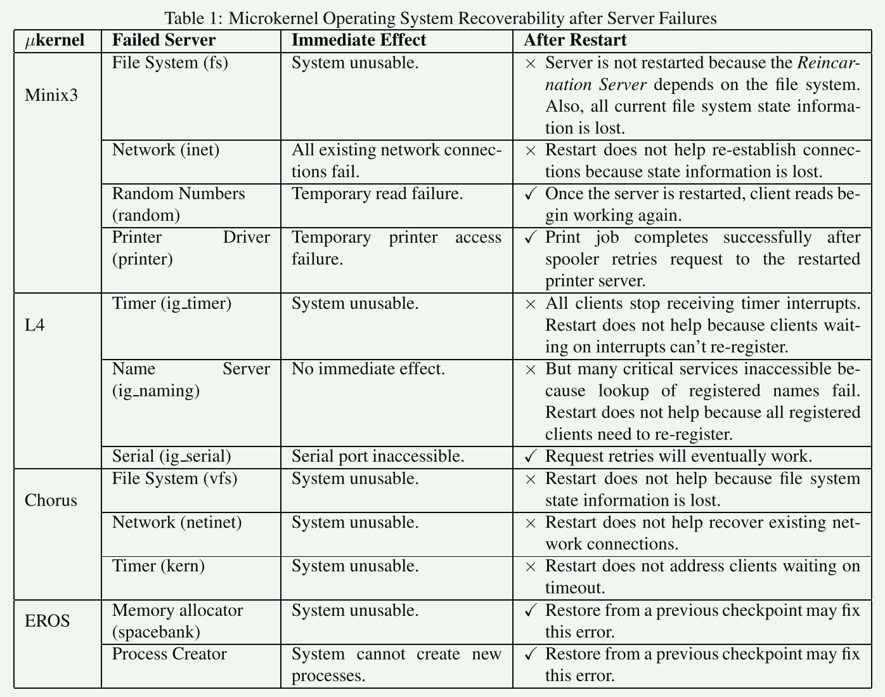
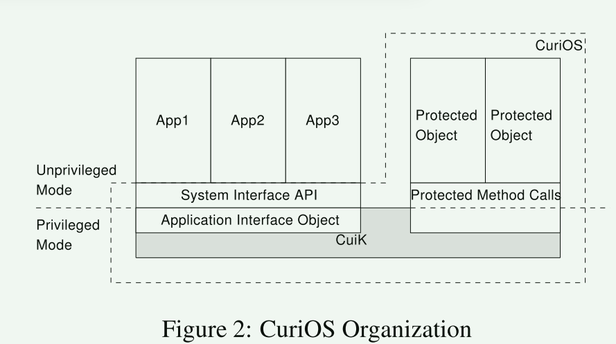
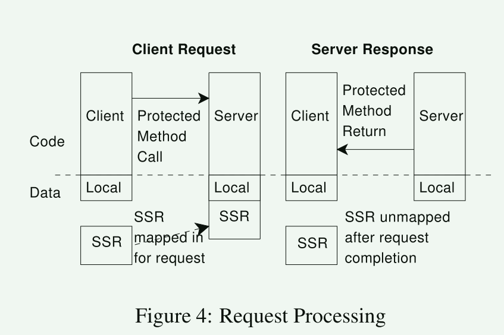
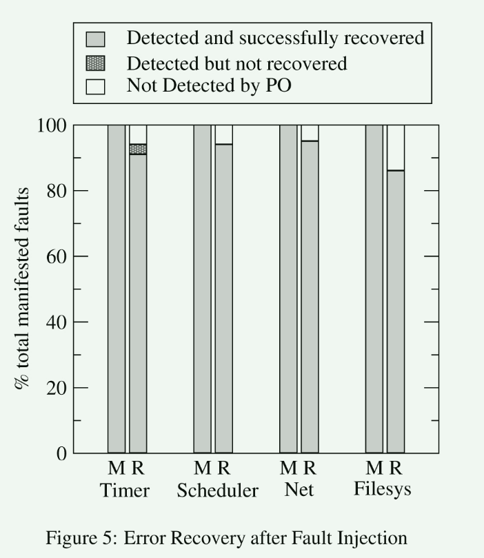
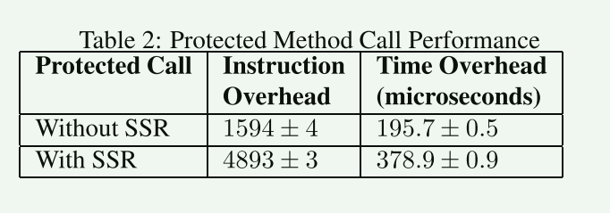

# CuriOS Improving Reliability through Operating System Structure

微内核操作系统服务中发生的错误可能会导致状态损坏和服务失败。 简单地重新启动失败的服务并不总是保证可靠性的最佳解决方案。 盲目地重新启动维护与客户端相关的状态（例如会话信息）的服务会导致该状态丢失并影响正在使用该服务的所有客户端。

操作系统的可靠性已经被研究了几十年，但今天仍然是一个主要问题。 操作系统错误可能是由硬件和软件故障引起的。 硬件故障可能由多种因素引起，其中一些因素是老化、温度以及存储器和寄存器中辐射引起的位翻转（单事件翻转）。 软件故障（bug）在大型复杂操作系统中也很常见。

## 背景

通常通过重新启动微内核服务器故障来尝试恢复。 **这种方法背后的直觉是，通过重新启动服务器从头开始重新初始化数据结构通常可以修复暂时性故障**。 不幸的是，这种恢复方法并不总是有效。 许多操作系统服务维护与客户端相关的状态。 在这种情况下，服务器重新启动会导致此状态信息丢失，并影响依赖于该服务器的所有客户端。

例如，Minix3 中文件系统服务器的故障会影响使用该文件系统的所有客户端。 仅重新启动文件系统服务器并不能防止这些现有客户端中发生错误。 无法完成对现有打开文件的读取和写入，因为重新启动的服务器无法识别提供给它的文件句柄。 

**因此，虽然可以重新启动无状态服务器（例如某些设备驱动程序）来恢复系统，但此技术不适用于管理客户端相关状态的许多重要操作系统服务**

可能的解决方案：

1. 编写客户端以考虑操作系统服务重新启动和状态丢失： 这需要客户端订阅服务器故障通知，并可能导致代码复杂性增加
2. 为服务器的客户端相关状态信息提供某种形式的持久性： 这允许重新启动的服务器继续处理来自现有客户端的请求

尝试通过简单地在重新启动时保留服务器状态来解决状态丢失问题，并不能解决由于错误传播而导致的状态可能损坏的问题。 仍然没有解决服务器内部的错误 。为了减轻错误传播的影响而对OS服务状态进行检查点并不是一个可行的解决方案，因为**回滚到一致的系统状态还需要对客户端状态进行检查点**。 此外，可能**必须维护多个检查点以避免回滚到不正确的状态**。 这在内存和性能方面可能会很昂贵。

贡献：

1. 比较和分析内存错误对几种流行微内核架构操作系统服务的影响，其中一些微内核架构是为了可靠性而设计的
2. 详细描述了 CuriOS 中的状态管理框架实现，可减少组件内错误传播并实现透明的操作系统服务恢复
3. 使用在多个操作系统服务上执行的故障注入实验来评估 CuriOS 设计

## 案例分析

- Minix3 中的可靠性支持由 Reincarnation Server 提供，它能够重新启动失败的服务和设备驱动程序。 服务器重新启动仅适用于设备驱动程序
- chorus使用的是持久化内存，但系统并未利用这个机制
- eros使用的是检查点机制： 对大型系统进行检查点机制开销昂贵，容易丢失最后一次检查点后的数据

### 观察

**Transparency of addressing: 寻址的透明性**

重启后，客户端应该能够使用相同的地址来访问操作系统服务。

名称服务器可以通过在服务器重新启动时保持一致的名称来改善此问题。在微内核中，一个服务器通过名称服务器来请求服务。

**Suspension of clients for duration of recovery：在恢复期间暂停客户端**

在恢复阶段，客户端不应超时或发起新请求。

**Persistence of client-related state: 客户端相关状态持久化**

当服务重新启动时，来自客户端的请求不得因为服务器丢失客户端相关状态而失败。 必须保留客户端相关状态并使其可供重新启动的服务器使用

**Isolation of client-related state: 客户端状态的隔离**

现有微内核操作系统的设计提供对服务器内与客户端相关的状态的不受限制的访问。 服务器中发生的错误可能会破坏与所有客户端相关的状态。 这种组件内错误传播问题存在于大量重要的微内核操作系统服务中

## 设计

- CuriOS 的结构是代表各种组件和服务的交互对象的集合。 可以将对象限制在隔离的内存保护域中，以减少错误传播。 我们将此类对象称为受保护对象 (PO)。 受保护对象上的所有方法都以降低的权限执行，并在硬件强制内存保护的情况下运行。 依然是特权级的划分
- CuriOS 中的受保护对象类似于传统微内核系统中的 服务器(server)
- CuiK 使用 `protected method calls `调用来调用受保护对象上的操作
  - 每个受保护的对象都分配有一个私有堆
  - 每个访问受保护对象的线程保留一个私有堆栈
    - 堆栈是在第一次调用受保护方法时分配的
    - 私有堆栈和堆被映射为具有读写权限，其余部分为只读权限
  - 受保护的方法调用会导致切换到权限降低的执行模式并限制对内存的访问权限
  - **受保护方法调用实现使用一个包装对象，该对象拦截对受保护对象的方法调用并管理内存访问控制、处理器模式切换和恢复** 后期的很多工作仍然沿用这个思想

当在受保护对象中执行代码时检测到错误时，会引发异常。对象内未处理的异常将在尝试销毁并重新创建受保护对象的包装器处拦截。 **包装器维护构造函数参数（如果有）的副本，以便重新创建受保护的对象**。这类似于 Minix3 中的微重启或服务器重启，可用于修复暂时的硬件或软件故障。 **受保护的对象在内存中就地重新创建，确保对其的外部引用保持有效**。 这提供了寻址的透明度。 立即在新构造的受保护对象上重试该方法调用。 **多次重试失败会导致异常返回给调用者**。 所有正常的系统活动都将暂停，直到恢复完成。 因此，在恢复期间客户端将被暂停。

- 受保护对象的重建需要原始参数
- 对象是就地创建的，保持对外的外部引用，我们的方法不会就地创建，因为外部对象并不直接接触真正的对象。
- 改方法需要暂停所有客户端的活动

### 状态管理器

需要维护客户端状态信息的服务器使用 CuiK 提供的状态管理功能来分发、隔离和保留客户端相关状态。 完全无状态的服务器可以轻松重新启动，并且不需要此功能。

服务器状态区域 (SSR) 是一个对象，表示分配用于存储 OS 服务器的客户端相关信息的内存区域。

- 当客户端与服务器建立连接时，就会创建 SSR
- SSR 受到服务器和客户端的保护。 客户端永远不会被授予访问其 SSR 的权限
-  服务器仅在处理来自客户端的请求时才被授予对客户端 SSR 的写访问权限
- SSR 作为参数传递给服务器的受保护方法调用。 然后，服务器可以使用 SSR 来存储客户端相关信息。 它可以完全控制 SSR 内的内存管理。 当受保护的方法调用返回时，对 SSR 的写权限将被撤销

CuriOS 中的所有 SSR 均由名为 SSRManager 的单例对象管理:

- SSRManager 提供用于注册新服务器、将客户端绑定到服务器（从而创建 SSR）、撤消客户端-服务器绑定（删除关联的 SSR）以及枚举与服务器关联的所有 SSR 的功能 
-  每个使用 SSR 的服务器都需要提供一个恢复例程，该恢复例程在发生故障时重新创建服务器对象后立即调用。 此例程可以查询 SSRManager 以获取所有关联的 SSR，以便重新创建重新启动的服务器的内部状态。

## OS services

- Timer Management
- Scheduling:  客户端 SSR 包括指向相应 Process 对象的指针和特定于调度策略的信息（例如优先级）。 如果调度程序在失败后重新启动，它将查询 SSRManager 的所有客户端并重新创建其内部列表
- Networking: 

## 评估

