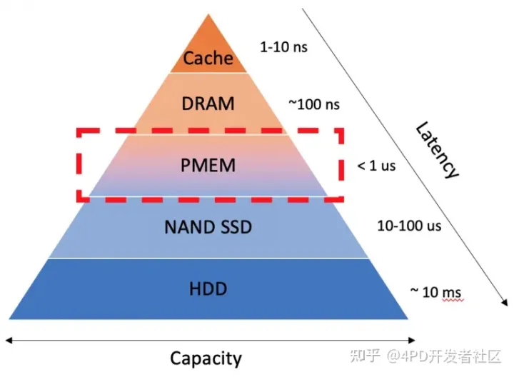
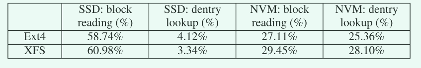
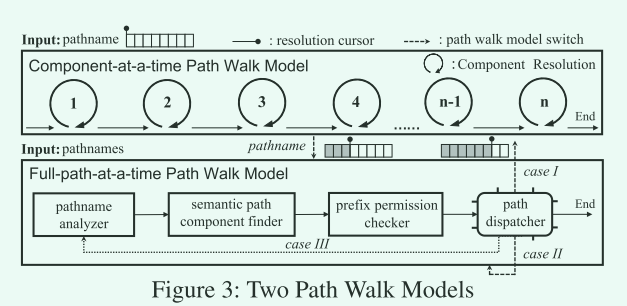
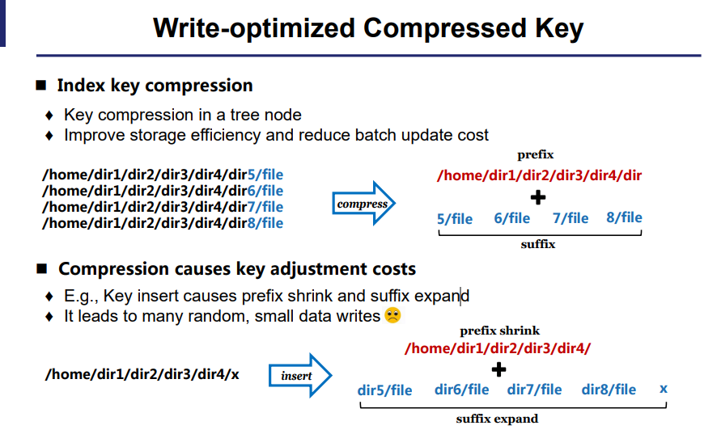
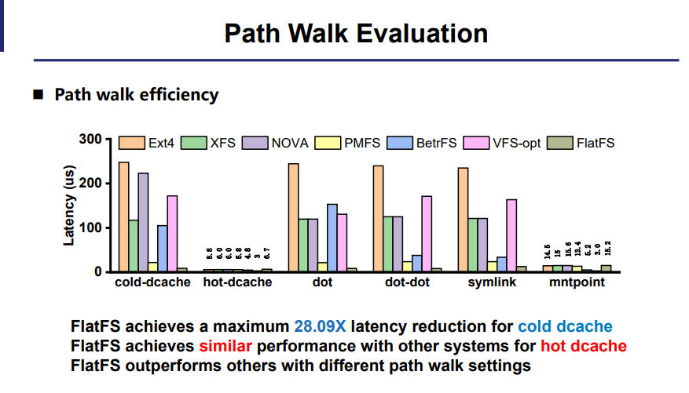
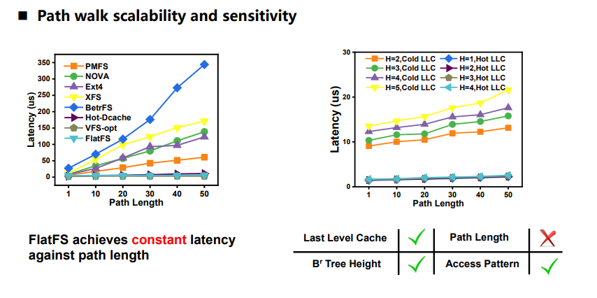
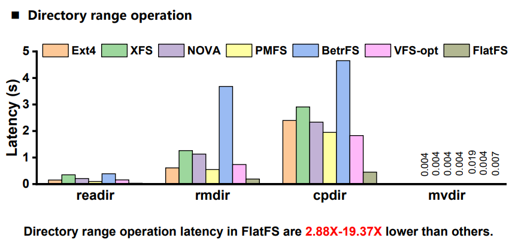
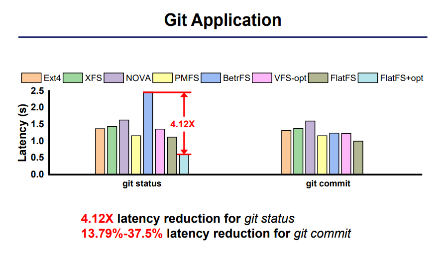

# FlatFS

持久性内存:

内存特性：

- 大
- 速度快，介于DRAM与PMEM之间，可以当作内存用
- 持久性：通俗来说，就是持久内存有跟硬盘一样的特性，断电以后重启，内存中的数据依然存在

## 摘要

现状：

1. 一些应用程序被传统的层次文件系统带来很多开销
2. 硬件的发展将I/O的传输瓶颈转移到了软件层面，而当前的这些文件系统都是为慢速设备设计，没有充分利用新的硬件优势。

原因:

1. 递归地遍历命名空间树对于分层命名空间结构来说代价很高。不同目录的条目物理上分散在存储设备上。在树遍历期间，它会导致较差的数据访问局部性和间接内存寻址。

### 论文工作

本文重新讨论了超快、可字节寻址的nvm的名称空间结构，并提出了一种名为FlatFS的新文件系统。FlatFS展示了一个扁平的名称空间体系结构，但仍然提供了一个兼容的分层名称空间视图。文件元数据直接根据其独特的层次路径建立索引。

三种核心技术:

- 在全局统一的VFS命名空间中，提出了一个协调路径遍历来协调两个不同的路径遍历模型
- 设计了一个范围优化的nvm友好的Br树来管理可变大小的索引键。Br树在对数时间内提供了高效的数据结构级范围操作(如范围插入)。它有效地弥补了平面命名空间的目录移动缺点，也便于设计其他快速的目录范围操作
- 通过利用NVM的字节寻址能力，提出了写优化压缩(WoC)索引键设计，以提高可变大小的键存储效率，同时减少NVM系统上键管理中昂贵的小内存写和数据持久化开销。

FlatFS为扁平命名空间实现了低成本的元数据崩溃一致性。

## 背景和动机

linux的vfs存在的问题

1. 昂贵的路径组件解析

   对几个有关文件元数据的系统调用进行分析，在六层的路径条件下，如果处于热路径，14-67%的时间用来解析路径信息，平均31%的时间是底层的文件操作。如果处于冷路径，有69%的时间用来进行分析查找。

   在与SSD/NVM设备进行reading and dentry lookup的比较时，

   慢速的SSD设备block read的时间占比要比NVM快速设备的占比大得多，这表明性能瓶颈从I/O转到了路径游走的软件设计层。

2. 路径游走的不可伸缩

   使用stat系统调用进行试验，随着路径长度的增加，对路径进行解析花费的时间也会线性增加。而真正的完成功能的函数占比却很小。

3. 分层目录会破坏局部一致性，随机访问也会导致性能下降

## 设计目标

- 快速路径解析
- 优化范围操作
- 降低持久化成本，将写优化技术用于索引键的布局设计
- 崩溃一致性

## 设计和实现

### 协调路径遍历

兼容传统的路径遍历与本文设计的路径遍历。

- 路径名分析器

  路径名分析器通过在文件路径上执行词法处理，生成没有任何点和冗余斜杠的规范路径名

- 语义路径组件查找器

  路径名分析器只能处理非语义路径组件。语义组件(即符号链接和挂载点)由语义路径组件查找器使用关键索引方法识别

- 前缀权限检查器

- 路径调度程序

​	处理命名空间切换

- 协调

  处理不同路径解析模型

### 范围优化的索引树

两个基本操作:

- Tree join

- Tree split

组合语义:

- 切片
- 插入
- 删除

叶节点缓存机制

### Directory Range System Call

基于范围优化的索引树，可以比较简单实现一些传统的批次操作

Directory read：ls -R 递归读取所有文件

Directory remove：一次性删除一个目录的文件和子目录

Directory copy:  递归复制目录

Directory move:  目录移动

### Write-optimized Compressed Key

### Namespace Crash Consistency

## 评估

