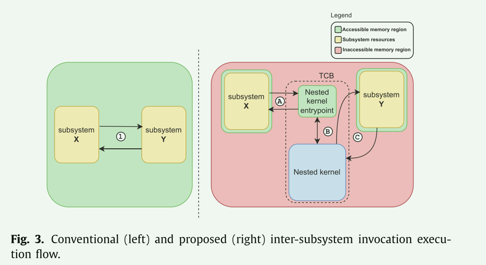
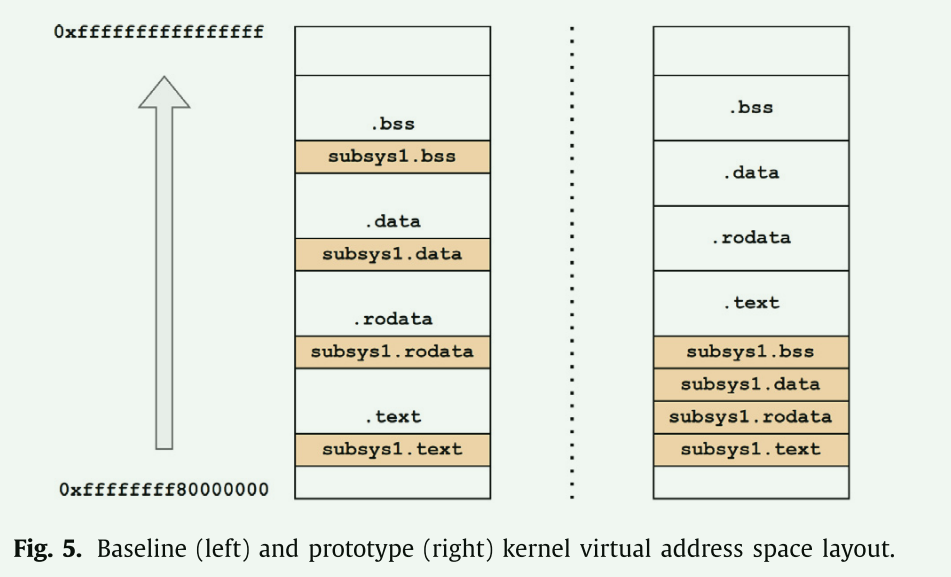
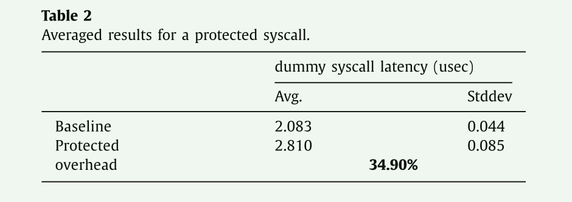
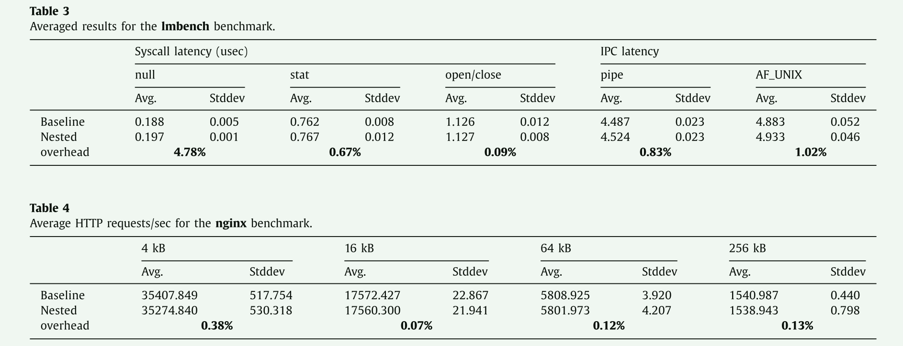
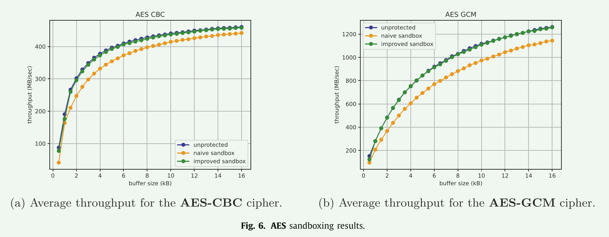

# Improving monolithic kernel security and robustness through intra-kernel sandboxing

本篇文章的研究背景是关于改进单体内核的安全性和健壮性。尽管底层硬件和安全风险发生了根本性的变化，但商品操作系统内核的结构仍然基本保持不变。现有的研究通过使用各种防御机制（如内核控制流完整性）和利用系统调用模糊测试等主动漏洞发现技术，成功提高了整体单体内核的安全性。然而，这些缓解机制通常只关注一类漏洞，而未解决加剧这些问题影响的更广泛的底层架构问题。因此，**本文提出了一种新的架构方法，旨在通过严格的分解和运行时分离来增加单体操作系统内核的健壮性和安全性。该方法通过在单体内核子系统之间实现分离策略，提出了一种新颖的、支持SMP的嵌套内核架构，并结合特殊的编译器传递和领域特定语言，提供了一种方便直观的方式来指定分离策略并自动集成它们**。研究人员还基于FreeBSD操作系统和Clang/LLVM编译器实现了一个原型系统，并运行了一系列强度测试来评估他们的模型和分离机制。

## 本文的贡献

1. 新颖的单体内核架构：本研究提出了一种新的单体内核架构，鼓励内核子系统的分解，并在保持对现有内核源代码的最小影响的同时，实现严格的运行时分离。这种架构通过减少可信计算基（TCB）中的代码数量，降低了潜在的安全漏洞。

2. 面向多处理器的嵌套内核架构：本研究设计了一种适用于单体内核的面向多处理器的嵌套内核架构。这种架构可以实现内核子系统的隔离，并支持对多处理器系统的高效利用。

3. 内核分离策略框架：本研究提出了一种内核分离策略框架，可以实现内核子系统的无缝集成。这个框架可以自动化地将内核分离策略与现有的内核源代码结合起来，从而提高内核的安全性.

## 相关的工作总结

- Non-monolithic kernel architectures
  - microkernel 最小特权和故障遏制
  - exokernel  进一步最小化内核，除了公开和安全地复用物理资源之外，操作系统内核不再提供任何功能
  - unikernel 降低攻击面

- Enhanced monolithic kernel architectures
  - LCD 硬件辅助虚拟化
  - LXD 硬件辅助虚拟化
  - LXFI 使用代码检测将内核模块与内核其余部分隔离的系统
  - HAKC ARM 特定的硬件功能：指针身份验证 (PA) 和内存标记扩展 (MTE)。

## 核心方法

每个内核子系统的资源和交互都是通过分离策略定义的：这是 一组包含特殊领域特定语言 (DSL) 代码的文件，用于描述子系统的资源、与其他子系统的交互等。这些分离策略由开发人员指定，并转换为子系统执行上下文，这是一组在编译期间集成到内核中的元数据。嵌套内核在运行时使用此元数据来强制执行分离策略中指定的约束。

### 约束

- The kernel address space can only be changed by the nested kernel
- Direct interactions with restricted routines are forbidden 禁止与嵌套内核直接交互
- The underlying separation mechanism can only be applied by the nested kernel
- The nested kernel operates at a higher level of privilege than the rest of the kernel
- The underlying separation mechanism must operate at a page-sized granularity or finer
- **Each CPU core maintains a separate view of the kernel page table**
- The nested kernel must be as small and simple as possible

- 每个子系统的内容被放置在一段区间中。

## 评估

- 单个syscall 的影响很大

- 通用的基于分页的分离机制会产生显着的开销。如果系统使用更轻量级、特定于平台的分离机制（例如英特尔 MPK），性能损失将显着降低

