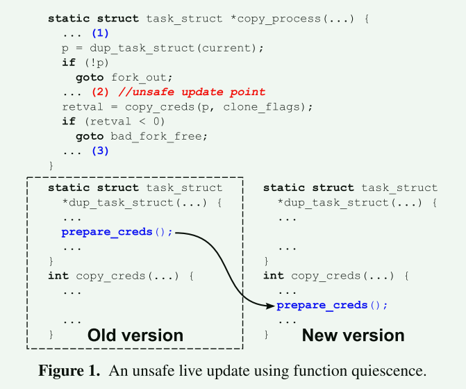
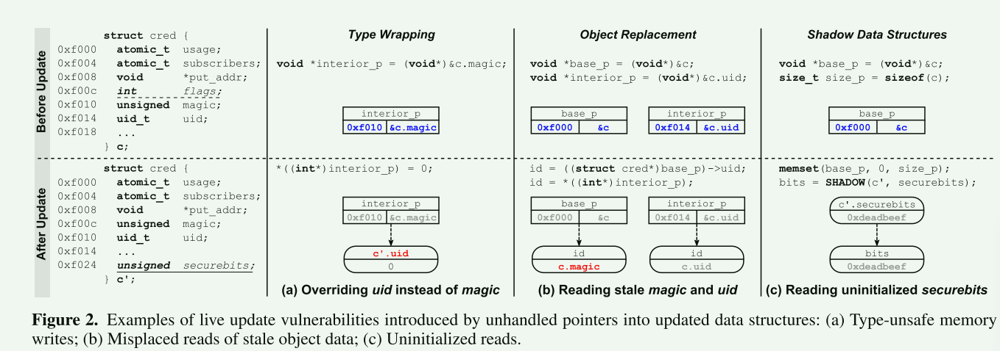
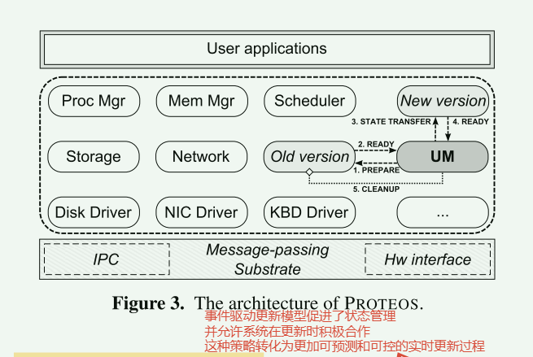
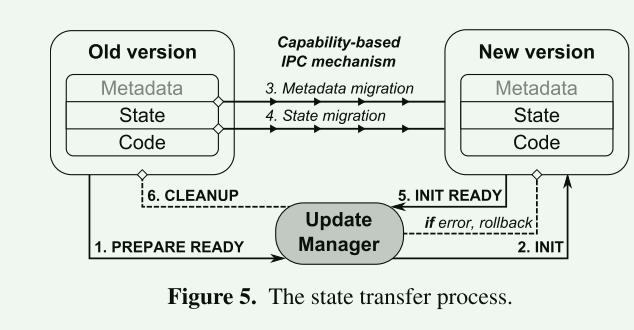
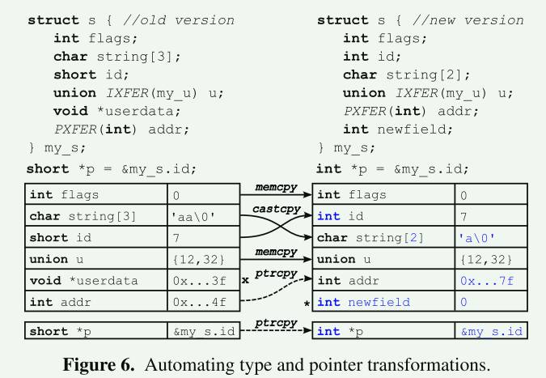
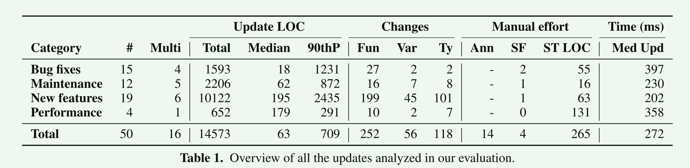
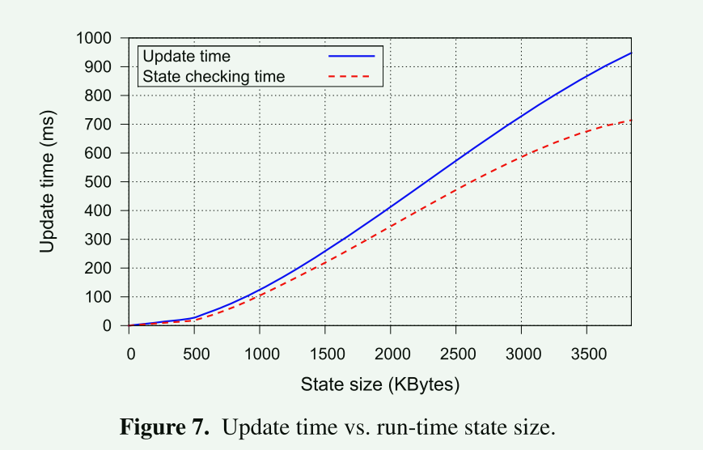
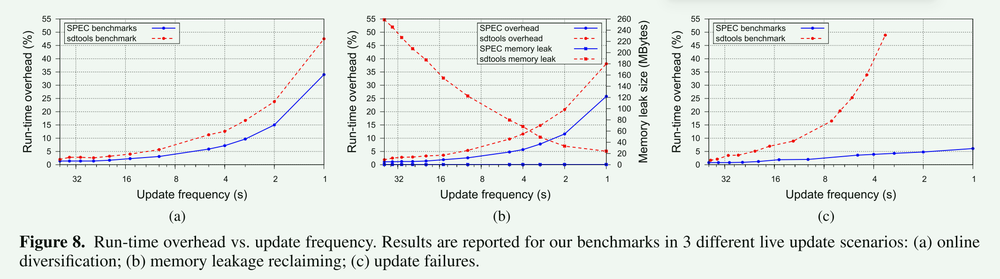

# Safe and Automatic Live Update for Operating Systems

实时更新（有时也称为热更新或动态更新）能够在不中断服务的情况下动态升级正在运行的系统。

## 背景

已有方案的措施：

1. 允许新旧版本的代码共存：产生不可预测的更新过程

2. 不允许更新活动代码：依赖函数（对象）静止的一般概念，只允许更新不在活动线程调用栈上的函数



为了解决这个问题，实时更新解决方案已经提出了**预先注释的事务**、**更新点**或静态分析。<font color = red>这些策略不容易扩展到复杂的操作系统更新，并且总是使程序员在所有可能的系统状态下手动验证更新正确性的大量工作 </font>

已有方案的缺陷：

- 现有的实时更新解决方案都没有提供对转换指针和重新分配动态对象的自动支持

- 在更新大小、复杂性、更新数量上扩展性差




**目标：安全、自动地支持多种类型的实时更新**

- 安全性和可靠性：更新仅在可预测的系统状态下安装，并且更新过程不会出现错误和不安全情况
- 大更新面：对系统的大小、复杂性和更新数量没有限制
- 少的手动工作：状态过滤器最大限度地减少代码检查工作以确保安全；自动状态传输最大限度地减少了更新的编程工作量；流程级更新使部署实时更新就像安装新版本一样自然，无需专门的工具链或复杂的补丁分析工具。

### 贡献

1. 确定了现有的实时更新解决方案的主要限制，并提出了可靠性和安全性问题的实际例子
2. 引入了一个新的更新模型
3. 介绍了事务性的进程级更新
4. 引入了一个新的可靠和安全的状态转移框架，自动化状态转移，状态检查和污染状态管理


## 设计和实现

### 状态静止 VS. (函数静止 or 对象静止)

这允许程序员提供**状态过滤器**指定对更新状态的约束。关键的直觉是操作系统可以快速地转换具有不同属性的许多状。


### process-level live updates

PROTEOS 采用事务进程级实时更新，可以可靠地替换整个进程，而不是单个对象或功能。为了增加更新面并支持复杂的更新，我们在设计中探索了这一想法，**所有核心操作系统子系统都作为独立的事件驱动进程运行在以内核模式运行的最小消息传递基底之上**。使用进程作为可更新单元可确保稳定的更新过程，并且无需复杂的补丁分析和准备工具。此外，PROTEOS使用硬件隔离的进程来沙箱新进程版本中的状态传输执行，并**支持在出现运行时错误时热回滚**。


### 编译器插桩

ROTEOS依赖于编译器生成的插装来自动化状态转移（在进程之间迁移状态）、状态检查（检查状态的一致性）和污染状态管理（从损坏的状态恢复），运行时开销最小。我们的状态转换框架被设计为自动处理常见的结构状态更改（例如，将NewField添加到结构）并从特定的污染状态恢复（即，内存泄漏），同时支持方便的扩展编程模型。例如，**程序员可以注册自己的回调来处理损坏的指针，或者覆盖特定类型的状态对象的默认传输策略**


### 系统结构

为了实现这些目标，我们的设计采用了一个架构简单的操作系统，其中只有一个薄薄的内核管理硬件并提供基本的进程间通信功能。**所有核心操作系统子系统都被隔离在硬件隔离的进程中，包括驱动程序、调度、进程管理、内存管理、存储和网络栈**。操作系统进程通过消息传递进行通信，并遵循明确定义的事件驱动模型。

这种设计有几个优点：

- 它引入了清晰的模块边界和接口，简化了更新的可行性和安全性推理。
- 其次，通过替换整个进程来安装实时更新，新的代码和数据表示与全新安装的系统版本没有任何区别。这种策略满足了稳定性要求，并简化了实时更新的部署。
- 第三，基于MMU的隔离将整个状态转移代码的执行隔离在新版本中，简化了运行时错误的检测和隔离，并允许安全的热回滚和无内存泄漏。
- 最后，我们的事件驱动更新模型促进了状态管理，并允许系统在更新时主动合作，这种策略可以实现更可预测和可控的实时更新过程。




### 事件循环模型

```c
static int my_init() {
    ... //initialization code
    return 0;
}
int main() {
    event_eh_t my_ehs = {init : my_init};
    sys_startup(&my_ehs);
    while(1) { // event loop
    msg_t m;
    sys_receive(&m);
    process_msg(&m);
    }
    return 0;
}
```


### 关键概念

**虚拟IPC端点**：虚拟端点是分配给操作系统process《子系统》的唯一活动实例的唯一版本无关IPC标识符。在更新时，内核原子地将所有虚拟端点重新绑定到新实例。在准备阶段结束时执行的重定向，透明地将所有IPC调用重定向到新版

**状态过滤器**：PROTEOS依赖于状态静止来检测安全更新状态。此属性允许仅在系统的全局状态满足特定约束时才安装更新。状态过滤器可以在每次更新的基础上指定这些约束。

1. 在准备阶段开始时，每个要更新的OS进程《子系统》都会收到一个包含状态过滤器的字符串，该过滤器将在每个后续事件循环迭代结束时安装并透明地进行评估

2. 当进程转换到所需的状态时，表达式的计算结果为true，导致进程向更新管理器报告，并在事件循环的顶部阻塞
3. 默认状态筛选器强制进程立即阻塞

**接口过滤器**：系统由事件循环驱动，尽量保持这些事件处理处于较短的路径，但是短路径事件循环设计不足以保证收敛到更新状态

为了给予更强的收敛保证，PROTEOS支持（可选）接口过滤器，用于每个待更新的操作系统进程《子系统》。在准备阶段开始时，每个过滤器都被透明地安装到内核中。它的目标是**监视传入的IPC流量，并暂时阻止消息的传递**，这样就可以使得子系统更快到达更新状态

**多组件更新**：按序地使得每个组件到达更新状态

**热回滚**：意外错误的情况下，热回滚使更新管理器能够中止更新过程，并安全地允许旧版本恢复执行

**自动状态检查**： 确保指针指向正确的内容


## 更新过程



1. 编译时嵌入所有需要自省的数据的重定位和类型信息
2. 更新过程的配对阶段，可以注册扩展以更改配对规则，
3. 默认情况下，所有配对的对象都计划进行传输，也可以注册扩展指示框架避免传输特定对象
4. 在数据迁移阶段，框架遍历所有计划传输的旧状态对象（及其内部指针），并将数据有序地迁移到新版本中的对应对象

默认传输策略可自动执行许多常见结构更改的状态传输，例如：

- 原始类型转换

- 数组截断/扩展

- 结构字段的添加/删除/重新排序

为了支持许多可能的触发事件，程序员可以注册

1. 对象/元素配对回调（以覆盖框架采用的默认基于名称的配对策略）
2. 对象/元素传输回调（以覆盖默认传输策略或选择性地调度单个对象进行传输）
3. 指针传输回调（以覆盖默认的指针传输策略）


## 评估



- 不同的组件更新会涉及到多个其它组件也被更新 [Multi]  -> 多组件更新是必要的
- 组件更新会带来函数/变量/类型的改变 [changes]
- 手工工作通常很少 -> [Manual]
- 更新时间看起来还算合理 《替换所有组件花费3550ms》


### 性能评估

- 虚拟端点仅仅引入更新时间成本
- 特殊系统事件的透明拦截在每次事件循环引入很小的开销



- 更新事件随着组件大小而线性增加
- 更新时间主要由状态传输和状态检查主导
- 相比其它更新技术时间更长，因为这是对一个组件进行升级
- 相比其重启，这个时间短几个数量级，对大多数系统来说是可行的


### 服务中断



- 更新的频率越高，开销就会增加
- 更新间隔越小，状态传输框架可以更快地修复内存泄露问题
- 更新失败导致的开销可以承受


### 内存占用

内存开销较大