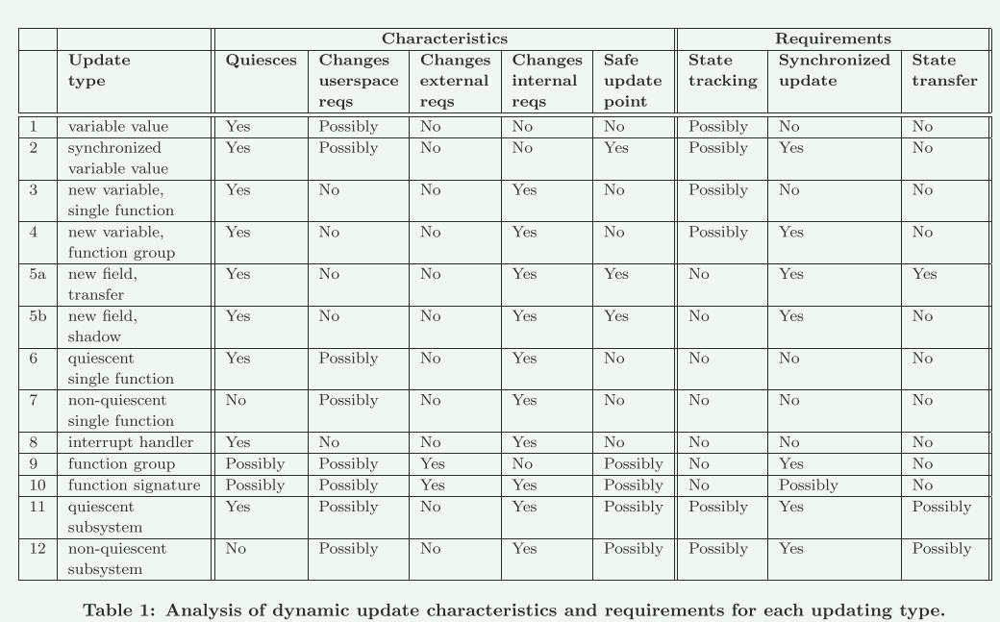
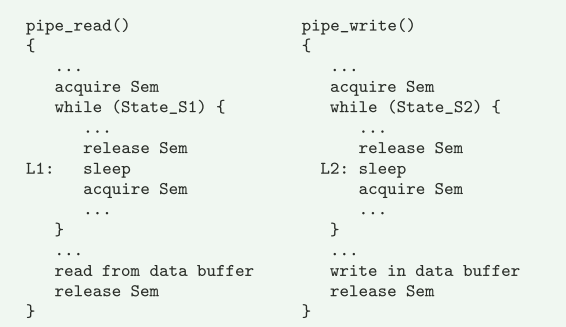

# Live Update

## ConceptOS: A Micro-Kernel Approach to Firmware Updates of Always-On Resource-Constrained Hubris-Based IoT Systems

出发点： 嵌入式设备在运行期间需要修改设备功能或者纠正安全漏洞

途径：

1. 设备上有足够的空间来存储两个设备镜像，从而允许下载新镜像并从中启动
2. 增量传输使用二进制补丁重建新的镜像来最大限度减少传统的数据传输
3. 原地更新的方法需要对闪存进行字节级别的访问，这会变得很困难，同时这难以支持状态传输和避免重现启动

Contiki-OS [13] 引入了可加载组件和系统核心之间的区别。 然后，它使用动态链接器和间接表来替换运行时的可加载组件。这个想法也出现在 Elon [11] 中，它允许在不重新启动硬件的情况下更新可加载组件，同时将它们存储在 RAM 内存中。

## 更新闪存的问题

由于两个原因，更新存储在闪存中的组件会出现问题。

- 现代微控制器的闪存（即基于 NAND 类型的单元）只能以特定的粒度进行读/写：如果程序想要覆盖闪存中的单个字节数据，则必须首先擦除 该字节所在的整个页，然后将更新后的页写回内存。 鉴于写入闪存时的主要问题之一是其磨损前的次数有限，因此必须最大限度地减少闪存上的字节级操作。

- 更新需要连续的闪存地址。 因此，分配的页面必须是连续的，并且可以采用压缩或伙伴系统等技术来最大化可用空间，以减少外部碎片。 压缩是一种用于移动内存块以减少碎片的技术，并且出于之前对内存磨损的考虑，应该避免

## Dynamic and Adaptive Updates of Non-Quiescent Subsystems in Commodity Operating System Kernels

持续运行的系统需要在不停机的情况下对其进行内核软件更新。 在许多环境中，促进快速重新启动或延迟更新可能不是合适的解决方案，特别是在按使用付费的高性能计算集群和任务关键型系统中.

技术：一种新颖且高效的动态代码检测技术，称为自适应函数克隆

#### 贡献

1. 非静态子系统的更新
2. 数据类型更新。 提出了一种更新紧凑数据类型定义的技术。 使用包含字段的影子数据结构支持在数据类型中添加新字段
3. 安全可逆性。 我们提出了一种静态检测方法。 可以删除更新的函数，并保证它们不被任何进程的堆栈或程序计数器使用。
4. 适应性。 执行可以在多个（可能同时运行）功能版本之间自适应地切换
5. **同步更新。 提出了一种用于替换完整内核子系统的多阶段更新算法。 值得注意的是，更新的及时性取决于多个内核路径的同步的情况**

### 动态更新

#### 内核更新的特征

1. Quiescence(静止状态)：内核中的某些函数可能永远不会退出,永远处于非静止状态

2. Safe update points(安全更新点):  可以安全地应用更新的时间点

   1. 安全更新点不意味着Quiescence

      > inux 中的页面交换器内核线程 kswapd 永远不会停顿（它永远不会退出）。 但有一个安全点可以更新，那就是线程进入睡眠状态的时候。 这是资源暂时不活动并且可以安全更新的点。

3. Userspace, external, and internal requirements：某些更新可能会更改内核和用户空间之间的协议
   1. 修改系统调用的行为或应用安全修复程序可能会破坏依赖旧行为和存在缺陷的现有应用程序。 因此，一些修改可能会改变用户空间的要求
   2. 其他更新可能会更改内核子系统向需要其服务的其他内核子系统发布的 API。 例如，更改内核函数签名或更新所提供参数的数据类型。 此类修改将改变内核子系统的外部要求
   3. 某些更新可能会更改内核子系统的内部实现，而不会影响该子系统服务的其他客户

#### 安全更新的要求

内核更新可能需要也可能不需要应用安全更新的两个重要功能：

1. State tracking and state transfer： 状态跟踪和状态转移
2. Synchronized updates：同步更新
   1. 源代码中存在安全更新点并不能保证如果以原子方式应用更新，更新就是安全的。

- 在近一半的分析案例中，同步更新并未被强制执行：
  - 函数可以运行期间更新，当不需要同步更新时，无需保证更新已经生效
- 近一半的情况不需要安全更新点
  - 需要状态转移 (5a, 11, 12) 的更新，尤其是没有安全更新点 (11, 12) 的更新，是最具挑战性的应用。

#### 开启动态更新需要的技术

1. Dynamic execution flow redirection：动态执行流重定向

   1. 采用基于经过充分研究的动态代码检测技术的函数间接寻址。 无需重新编译内核或重新启动即可应用它

2. Quiescence detection： 静止检测

   1. 执行流重定向机制通过引入使用计数器来检测静态函数， 对于将更新的所有函数，将监视该函数的进入和退出以检测静止状态
   2. 永不返回的函数末尾缺少 ret 指令。 对于这些函数，应用一种检查堆栈的新方法

3. Adaptive updates: 自适应更新

   1. 自适应函数克隆技术使执行能够在多个函数版本之间动态切换

4. Synchronized updates： 同步更新

   1. 以pipefs为例：

   

   - 某些函数可能永远一直处于活动状态，无法自动更新
   - **尝试获取同步信号量或锁是组中某些函数可能无限期阻塞的原因**，非静态函数组可以通过其对同步原语的利用来识别。
   - 文章一种算法来允许非静态子系统中的同步更新。 进入睡眠状态执行原始版本函数的进程现在可以醒来执行新版本
   - 