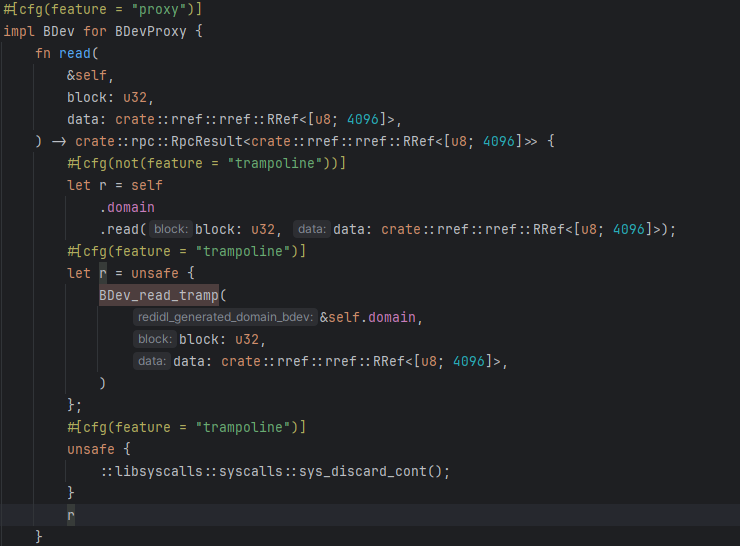
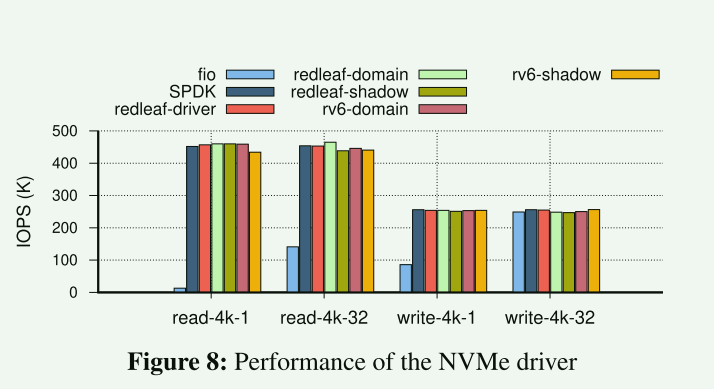

# Domain

域是一些功能独立的模块/子系统。

域之间的通信通过正常的rust函数调用完成。

线程调用域的功能，会在这些域之间进行移动，但是线程的栈还是相同的。这可以把域想象成一个封闭的函数。

域的定义应该由==域的入口== 和 ==域的接口==  组成。 

域之间进行调用时通过一个可信代理对象完成转发。


Each domain starts with a reference to a microkernel system-call interface as one of its arguments. This interface allows every domain to create threads of exe-cution, allocate memory, create synchronization objects, etc.

隔离手段：

- 私有堆

- 公共堆


采用两级内存管理，各个域从内核中申请较大的页去做自己的私有堆，然后内部的分配都在私有堆上。因为这些堆是私有的，当一个域奔溃时，内核可以直接将这个域分配的页全部回收而不影响其它的域。


域之间通信需要传递参数，这些参数则可以从共享堆上分配。并被转换为一个可交换类型`RRef<T>`. 这个类型的构成规则：

1. `RRef<T>`本身
2. rust的一些基本类型u32/u64
3. 由`RRef<T>`构成的结构体、数组、enum等
4. references to traits with methods that receive exchangeable types (trait引用，这些trait的接口参数只能时上面的可交换类型)


对于`RRef<T>`可交换类型来说，实现了一套Ownership Trackingj机制。这保证可以安全地回收那些cash的域从共享堆分配的`RRef<T>`

`RRef`记录了所属的域（owner）和不可变引用计数。

1. 初始时，域的owner就是创建它的域
2. 在跨域通信(调用)时，如果`RRef`被移动，则域的owner更新
3. 如果`RRef`只是被不可变借用，那么只增加不可变引用计数


因为可以`RRef`的构成规则，在系统中，一个`RRef`可能形成一个递归的结构。


这里的X:`RRef<D>` 而D:`RRef<T>`。对于这种情况，在跨域通信的时候，为了避免递归地移动所有`RRef<T>`， 只争对==root== `RRef`进行更新。

This requires a special scheme for deallocating RRef<T>s in case of a crash: we scan the entire RRef<T> registry to clean up resources owned by a crashing domain.

这需要一些特殊的机制来完成资源回收。

系统有一个全局的结构来记录所有分配的`RRef<T>`.


跨域调用需要依靠代理对象来完成，这个对象对于用户来说是透明的。为了保证隔离和安全性，代理对象做了这些事情:

1. 在进行调用转发时检查目标域是否有效，如果有效，它会对线程进行标记，以记录线程在域之间移动的事实。这可以在域发生崩溃时unwind 线程。==隔离性不仅体现在域之间，在域之间移动的线程同样也有隔离性。当线程调用域内功能发生crash时线程并非就直接crash。==
2. 创建一个lightweight continuation：For each invocation, the proxy creates a lightweight continuation that captures the state of the thread right before the cross-domain invocation。这个轻量级的连续应该称作线程现场更合适。有点类似于系统调用上下文保存，就是保存了线程此时的寄存器现场。用于unwind 线程。==当域发生错误，直接恢复这个现场，然后通过返回一个错误值表示这次调用失败==
3. 对作为参数的`RRef`更新
4. the proxy wraps all trait references passed as arguments：the proxy creates a new proxy for each trait and passes the reference to the trait implemented by that proxy ==？？==

 


**域接口的验证**

使用一个IDL编译器来检查和生成域接口以及代理对象。

每个域都定义了一个被标记`crate`的`trait`，这个`trait`定义了这个域入口函数的类型，以及可以用来创建这个域的方法。

这个编译器会检查函数参数以及返回值的类型是否满足要求，这些值的类型必须是基本类型或者`RRef`类型，对于返回值则必须是`RpcResult<T>`


**零拷贝**

零拷贝通过上面提到的机制完成。


## Implementation

**动态域加载**

- 每个域被==独立编译==
- 每个域被==动态加载==

动态扩展的安全性依赖以下不变式

- 跨越域边界的所有数据结构的类型，包括入口点函数类型，以及通过入口函数可到达的任何接口传递的所有类型，在整个系统中都是相同的，即具有相同的含义和实现。

Redleaf为了确保这个不变式，依赖一个可信的编译环境，这个环境会做以下的事情：

1. 检查域是否根据相同版本的IDL接口、相同的编译器版本和标志进行编译
2. 在编译域的时候，进行签名
3. 加载域时验证域的完整性
4. 域只能使用safe rust，并且只能链接到一组特定的crate


抽象来说，可以将每个域看作一个`trait` 对象，如何与域交互就是根据`trait`定义的接口进行调用。

每个域都需要做初始化，因为这些域可能需要分配一些资源或者请求内核的功能。比如对于共享堆的分配。因此每个域都有一个入口函数，来负责这个域的初始化，这个入口是被IDL编译器生成的，这些入口都被声明为一个函数。

```
#[no_mangle]
pub fn trusted_entry()?
```

并返回一个`trait`对象，这个对象现在就代表了这个域。

在`interface`目录下，定义了所有的域，用户自定义域也需要在这个目录下添加。

所有的域入口用`domain_create`来进行标记


而代表域的trait用`interface`标记


IDL编译器就是根据这两个标记生成代码。


## 代码分析

### 域的初始化


在内核入口代码中，对于域加载的代码路径如下所示:

```
rust_main
->rust_main_ap
 ->start_init_thread
```

```rust
fn start_init_thread() {
    crate::thread::create_thread("init", init_user);
}
extern "C" fn init_user() {
    // die() enables interrupts as it thinks it is
    // starting a user thead, lets disable them
    disable_irq();
    generated_domain_create::create_domain_init();
    enable_irq();
}
```

由此可知在主核上内核新建了一个线程来加载所有的域。

在`create_domain_init`中：

```rust
let name = "init";
extern "C" {
    fn _binary_domains_build_redleaf_init_start();
    fn _binary_domains_build_redleaf_init_end();
}
let binary_range = (
    _binary_domains_build_redleaf_init_start as *const u8,
    _binary_domains_build_redleaf_init_end as *const u8,
);
...
let (dom, entry) = unsafe { crate::domain::load_domain(name, binary_range) };
```

内核先去加载了init这个域，在`load_domain`函数中，主要的运行流如下：

```
ElfBinary::new   构造ELF文件，可以看出这些域应该是一个可执行文件或者库
trusted_binary::verify(binary)	验证域的正确性，对应上文提到的域动态加载
domain_elf.load()  加载域到地址空间中 
```

加载完`init` 域后，内核获取了其入口函数，在`domains/sys/init`目录下，我们找到了init域的入口定义:

```rust
#[no_mangle]
pub fn trusted_entry(
    s: Box<dyn syscalls::Syscall + Send + Sync>,
    heap: Box<dyn syscalls::Heap + Send + Sync>,
    ints: Box<dyn syscalls::Interrupt + Send + Sync>,
    create_proxy: Arc<dyn interface::domain_create::CreateProxy>,
    create_pci: Arc<dyn interface::domain_create::CreatePCI>,
    create_membdev: Arc<dyn interface::domain_create::CreateMemBDev>,
    create_bdev_shadow: Arc<dyn interface::domain_create::CreateBDevShadow>,
    create_ixgbe: Arc<dyn interface::domain_create::CreateIxgbe>,
    create_virtio_net: Arc<dyn interface::domain_create::CreateVirtioNet>,
    create_virtio_block: Arc<dyn interface::domain_create::CreateVirtioBlock>,
    create_net_shadow: Arc<dyn interface::domain_create::CreateNetShadow>,
    create_nvme_shadow: Arc<dyn interface::domain_create::CreateNvmeShadow>,
    create_nvme: Arc<dyn interface::domain_create::CreateNvme>,
    create_xv6fs: Arc<dyn interface::domain_create::CreateRv6FS>,
    create_xv6net: Arc<dyn interface::domain_create::CreateRv6Net>,
    create_xv6net_shadow: Arc<dyn interface::domain_create::CreateRv6NetShadow>,
    create_xv6usr: Arc<dyn interface::domain_create::CreateRv6Usr>,
    create_xv6: Arc<dyn interface::domain_create::CreateRv6>,
    create_dom_c: Arc<dyn interface::domain_create::CreateDomC>,
    create_dom_d: Arc<dyn interface::domain_create::CreateDomD>,
    create_shadow: Arc<dyn interface::domain_create::CreateShadow>,
    create_benchnvme: Arc<dyn interface::domain_create::CreateBenchnvme>,
    create_tpm: Arc<dyn interface::domain_create::CreateTpm>,
) {}
```

对于每个域来说，其入口一般都会初始化几个必须的域：

Init域


PCI域


稍后init域调用


创建代理域。这个代理域负责创建剩余的域。

在内核中，其它域的载入与init域类似。都是通过声明域的二进制范围，并加载到内核空间完成的。

代理也是作为一个域来实现的，其实现如下


代理域对象保存了其它域的创建函数，并实现了代理域的`trait`.

代理域返回了代理域对象并被init域用来继续初始化其它域。


需要注意的是，代理域对象在初始化其它域的时候，返回的已经不是原来各个域中那个实现域`trait`的对象了，IDL为每个这样的对象定义了一个包装：


这个就是每个域的代理对象对象，在内部，这个代理对象实现原来的对象的相同功能(通过实现域trait完成)。

代理域创建其它域的时候，返回的就是代理域。

对于代理域，其可以包含==错误恢复==的功能：




注意这里的`BDev_read_tramp`函数，这是一个会保存上下文的函数。

由于没有看到具体的定义，因此无法具体了解实现，但是可以肯定的是，其内部应该就是保存上下文，并且如果域出错就会恢复上下文并返回一个错误值。

在`unwind`库中，看到了`trampoline`定义


思路与叙述大致相同。

在开启`#[cfg(feature = "trampoline")]`时，代理对象都会将原来的调用转发为带`_tramp`的调用。在出错时汇编代码中会跳转到带`__err`的函数执行。


### 资源回收

对于资源回收，暂时没有看到代码实现==？？==


这里有一个回收域的函数，这应该是当域崩溃时回收域内资源的实现。但是没有其它函数会调用这个函数，不知道是被修改过还是其它原因。


### 设备驱动恢复

论文中说其实现了影子驱动 We develop shadow drivers as normal unprivileged RedLeaf domains 来测试域的恢复功能。但从代码来看，一些带着`shadow`下缀的域内部其实并没有实现恢复功能。只有一个`MemBdev`域有这么一个功能


可以看到，对于域恢复的测试，实际上就是允许该域有一个`recreate`的实现。从而在域发生错误时重新初始化该域。


During normal operation, the shadow passes all calls to the real device driver. However, it saves all information required for the recovery
of the driver (e.g., references to PCI trait, and other parts of the device initialization protocol).

==实现与论文描述不太一致==


## 案例

此时我们可以看看一个域是如何与另一个域进行交互的？这里我们以`rv6kernel`和`rv6fs`来做一个分析

`rv6kernel` 作为一个域存在，其`trait`定义为一系列系统调用集合。这些系统调用包含了文件系统相关的部分，而这一部分则通过`rv6fs`来完成。

在kernel入口处：

kernel首先初始化了rv6fs域，而在rv6fs入口：


其注册了一个全局的设备号和设备(另一个域)。

之后在init域中会调用kernel的接口创建一些任务


这些任务调用kernel的功能时，比如调用文件相关的功能，


这里以read为例，这会通过之前初始化完的rv6fs进行调用，而到其内部，


Rv6FS将会完成调用：


在内部，其最终将读写转换到刚开始初始化的设备当中去。


## 测试

### 跨域调用带来的开销


### 网络驱动


此时这个驱动在redleaf中有几种配置方案

1. 驱动与内核直接链接，即内核直接调用驱动接口进行数据接收和发送
2. 测试程序放在一个域，驱动位于另一个域
3. 测试还是一个域，但需要先加入rv6kernel域，rv6kernl域在加入驱动域
4. 与第二种情况类似，但是现在有一个驱动域包含了影子驱动实现？
5. 与第四中情况类似和第三种

### NVMe



### 应用程序


### 影子驱动的影响


评估影子驱动在重启域时带来的开销。