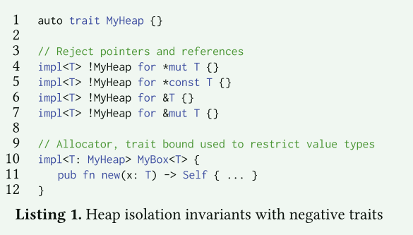
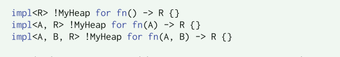

# RedLeaf

这个项目包含了一系列工作，也产生了一系列论文。该项目有两条主线：

1. 利用语言安全性来探索其对操作系统组织的影响
   1. [Inter-Process Communication in a Safe Kernel](https://ics.uci.edu/~aburtsev/doc/appel-bs-thesis.pdf) 2020
   2. [RedLeaf: Isolation and Communication in a Safe Operating System](https://www.usenix.org/conference/osdi20/presentation/narayanan-vikram) 2020
   3. [ Isolation in Rust: What is missing? ](https://dl.acm.org/doi/abs/10.1145/3477113.3487272) 2021
   4. [Understanding the Overheads of Hardware and Language-Based IPC Mechanisms](https://dl.acm.org/doi/10.1145/3477113.3487275) 2021

2. 利用编程语言rust的线性类型的属性进行验证
   1. [RedLeaf: Towards An Operating System for Safe and Verified Firmware](https://dl.acm.org/doi/abs/10.1145/3317550.3321449) -2019

其中比较重要的两篇是1-2和2-1,分别讨论了rust在操作系统隔离性和形式化验证的优势。

## 形式化验证

现在运行在高特权级的系统，比如操作系统其实底下往往还有几层运行在更高特权级的固件。比如Intel平台上，一些管理引擎(ME)、BMC(主板控制器)以及其它一系列固件。这些固件使用基于硬件的内存隔离和专用微控制器域系统软件隔离运行。这些固件的特权级很高，意味着他们可以任意地访问系统的资源、控制机器，甚至通过网络来对系统进行访问。

这种可以访问任意资源的固件很容易遭受==漏洞攻击==，因为一个简单的漏洞就可以让你控制数量庞大的机器。

现代机器的固件很多都还是基于低级汇编和C语言实现，而这些语言天然地就会带来一些不安全的性质。而且这些固件代码有的甚至构成了一个小型操作系统（具备多个设备驱动支持、文件系统、网络支持)，因此固件的漏洞其实和操作系统的漏洞已经出现了一定的联系。

1. 固件的要求越来愈高
2. 一些固件被要求开放(网络交换机)

很多攻击手段都是通过一些自动化工具来发现系统的漏洞，因此想要避免这些攻击，可以使用==严格的证明方法==来保证。

### Readleaf的目标: 端到端的安全执行环境

1. 验证需要覆盖机器上执行的所有代码，从内核和平台特定的设备驱动程序到实现固件特定功能的应用程序
2. 证明需要与高级规范等价
3. 经过验证的代码不会损失性能

这里的第二条与第三条感觉和sel4类似。


### 前提条件：

1. rust的线性类型系统（语言安全性）
2. 基于SMT的推理和由线性类型强制的指针规则的结合提供了一种自动化和简化内核验证的方法


### rust的优势


讨论了rust的线性类型系统如何简化了验证过程。

### 怎么做


MIR既去掉了一些不必要的信息，又保留了最基本的语言原语和完整的类型信息，可以更容易地翻译到Boogie。


### 验证了哪些东西？

- Specifications 高级描述规范
- unsafe rust（RustBelt项目提供了一个指南，用于确保不安全的代码封装在安全的接口）
- Memory Allocation （adapt the memb from Contiki）
- Threads and Context Switching （McSema）


## IPC in a Safe Kernel

文章标题是在安全内核中的进程间通信，但内容实质上是介绍Redleaf中的几个主要数据结构，当然这些数据用于redleaf中的进程间通信。

传统的操作系统遵循单片设计，在共享地址空间中执行所有内核子系统，从而以隔离和安全为代价实现良好的性能。微内核改进了这种设计，将操作系统组件分离到单独的地址空间中，但是由于交换地址空间的高成本，性能一直很差。RedLeaf依赖于Rust编程语言的安全性，而不是硬件隔离机制。RedLeaf在相同的硬件地址空间中运行所有的操作系统内核子系统，并结合语言安全和特殊的通信原语来实现隔离。这些内核子系统被组织成独立的域(Domain)。

虽然Rust在每个域的基础上实施内存安全，但它不足以确保跨域通信期间的完全隔离。当域出现故障时，内核将其从内存中卸载，以释放资源。如果这种情况发生在跨域调用的中间，就会违反Rust的内存安全保证，因为任何进入死域的外部指针现在都是悬空的。为了实现完全的域隔离，引入了两个重要的规范：

1. 每个域不公开各自堆中的指针
2. 对于跨域通信，通过交换来自全局共享堆的引用完成。

对于第二点，redleaf引入了`RRef`这个数据结构。其允许域以零拷贝的方式创建和交换共享堆对象，同时在域崩溃时保持安全性。


### 几个重要的概念

域(domain):

微内核执行调度和域加载，并提供一个分配共享内存和处理中断的接口。设备驱动程序、文件系统和所有其他程序都被实现为运行在内核之上的用户级域

虚拟内存：

redleaf在不受信任的域中强制实施安全rust，安全的Rust程序不能从头创建一个指针。域不能访问外部内存。

进程间通信：

两个域之间的通信

共享堆：

共享堆是内存的一个特殊区域，用于跟踪所有权。当域从共享堆请求内存时，它将自己标记为指针的所有者。当域与另一个域共享这个指针时，指针的所有者发生了变化，这由共享堆记录下来

代理：

为了处理故障和跟踪RRef域所有权，我们引入了代理。代理是在每对域之间进行通信的透明域。对于每个跨域调用，代理记录RRef所有权和调用堆栈信息。如果在IPC调用中间出现域故障，执行将使用调用堆栈信息返回到代理，从而隔离故障


### 实现


`RRef`可以看作是共享堆分配的内存的包装。但指定了类型。


为了保证更强的安全性，规定`RRef`只能包含`copy`类型或者共享堆上内存的引用

```
RRef<usize>, RRef<[1,2,3]>, and RRef<RRef<usize>>
```


为什么IPC不支持可变引用：

当一个域发生错误时，如果是可变引用，那么其对参数造成的修改会影响到原来域的执行，因为原来的域并不知道其调用的域出现了错误。

只允许移动所有权和不可变引用可以让域发生错误时进行隔离和恢复成为可能。


## 基于语言机制的隔离

思想来源：

- Singularity  单一所有权
- j-kernel  代理
- Kaffeos 私有域、共享对象

早期的操作系统设计将隔离内核子系统的能力确定为提高整个系统的可靠性和安全性的关键机制。不幸的是，尽管许多人尝试向内核引入细粒度隔离，但现代系统仍然是单一的。有很多基于硬件实现细粒度、低开销的隔离的探索，但是这些硬件都是昂贵的。而基于安全语言的隔离之前也是因为语言开销（垃圾收集）的原因导致不能引用在操作系统这种低级代码上。

总而言之，现代单体内核缺乏隔离及其优点：

1. 干净的模块化
2. 信息隐藏
3. 故障隔离
4. 透明子系统恢复和细粒度访问控制

Rust的出现让基于语言实现隔离带来了曙光，因为其没有垃圾回收运行时，性能高。

**存在的一些困难：**

基于内置的语言机制不足以实现一个可以隔离相互不信任的计算的系统。为了保护整个系统的执行，内核需要一种隔离故障的机制，也就是说，提供一种方法来终止故障或行为不当的计算，从而使系统处于干净的状态。具体来说，在子系统结束后，隔离机制应该提供一种方式：

1. 释放所有被子系统使用的资源
2. 保留由子系统分配但随后通过通信通道传递给其他子系统的对象
3. 确保以后对被终止子系统公开的接口的所有调用不会违反安全或阻塞调用者，而是返回一个错误

这句话应该可以理解为语言机制可以隔离，但是却不能知道隔离的东西出现了错误如何解决。

在面对基于语言的系统所鼓励的语义丰富的接口时，故障隔离是一个挑战——频繁的引用交换常常意味着单个组件的崩溃会使整个系统处于损坏状态。

语义丰富的接口，应该理解为与Linux内核系统调用接口对比，基于语言的系统可以直接传递类似于智能指针或者更复杂的数据结构，但是linux系统调用一般只能传递指针和数据。

**基本准则**：

- Heap isolation （私有域-私有堆）
- Exchangeable types （共享堆-`RRef`）
- Ownership tracking 
- Interface validation (用IDL描述并自动生成)
- Cross-domain call proxying (代理域是透明的，由于进行对象传递和崩溃恢复)


## Isolation in Rust: What is Missing?

这篇文章探讨了Rust语言在实现隔离机制时缺乏的属性。通过对几个基于rust实现的系统进行分析，文章给出了几个需要rust添加的属性。

### 堆隔离





rust中缺乏对函数和闭包进行限制的能力。因为这两种类型没有一些共同的Trait来进行限定。

可能的解决方案：

One possible solution would be to add a non-generic trait (e.g., FptrTrait), that is implemented by all function pointers. This would allow restricting function pointers as:

```rust
impl<T: FptrTrait> !MyHeap for T {}
```


> Language: Support trait bounds on functions and closures with any number of arguments.


### 代码生成

在跨域调用时因为隔离的需要可能需要做出一些特定的策略，这就需要一层可信代码来对每个交互进行特定的检查。

在Redleaf中，这层代码由ILD编译器检查并生成。

虽然rust提供了过程宏的支持，但是这不足以完成系统需要的功能。

提供在过程宏中暴露类型信息可以解决这个问题。

> Language: Expose type information in procedural macros.


### RTTI

文中说共享堆分配的对象必须有执行环境手动清除，而这需要为被清理的对象调用析构函数，这需要知道对象的类型信息。

rust提供了RTTI，但是这个类型信息是由类型的AST和上下文进行散列得到的。

攻击者可能构造这种类型来触发不安全的释放。


解决方法是rust提供无冲突、唯一的类型标识符

> Language: Support a collision-free, unique type iden-tifier.


### 线程展开

一个孤立子系统内部的死机需要将子系统内部运行的所有线程的执行展开到它们的入口点。一般来说，展开的几种实现方式是可行的。

- 可以在每次跨子系统调用时保存所有通用寄存器的状态，然后将执行线程展开到入口点。==保存和恢复寄存器是昂贵的==

- 语言支持，rust的unwind机制实现在std环境下，通过二进制文件中的DWARF调试信息。


> Library: Support extendable, no_std unwind library.


### 加载不安全代码

安全加载不安全的代码与传统系统创建用户进程的方式类似，功能齐全的隔离解决方案要求动态加载不受信任的第三方Rust代码。

动态代码加载需要一种机制，允许程序为加载的代码建立安全保证。

一个理想的解决方案是增加对验证携带代码(PCC)[49]或类型化汇编语言(TAL)[47]的支持，它们允许在加载时由小型验证器验证给定二进制文件的安全性。


>Research: Support typed assembly language for Rust.
>Ecosystem: Support trusted build environments.


### 堆栈安全

在每个堆栈的末尾，Rust通过一个专用的保护页来防止堆栈溢出。这个实现需要支持一个内存管理单元，它可以写保护内存区域。这个需求阻碍了基于语言的系统无法在不支持MMU的系统中运行。

理想情况下，Rust语言应该提供定制探测函数的支持，该函数可以检查剩余的堆栈空间，也可以分配一个新的堆栈。

在过去，Rust提供了对分段堆栈的支持，这种机制允许通过分配堆栈区域(也称为stacklets[52])来增长堆栈。由于可能的性能问题，分段堆栈的支持已被弃用。


> Runtime: Provide software-only stack guard with extensible probing interface.


### Safe serialization

序列化和反序列化在一些应用场景中很常见。但是安全的Rust实现可能性能不是很好。

> Library: Develop zero-copy serialization of “plain-old” data structures.