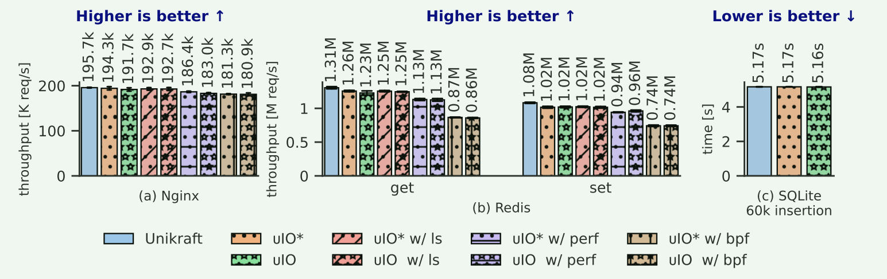

# uIO: Lightweight and Extensible Unikernels

https://github.com/TUM-DSE/uio

## Introduction

Unikernels是针对特定应用程序的专用操作系统。通过在编译时与应用程序一起优化内核代码，unikernels可以实现高性能、小映像大小、快速启动时间、最小的状态迁移开销以及低可信和可靠性计算基础。

> [!WARNING]
>
> 然而，与此同时，unikernel被认为是不实用的，因为它们缺乏运行时的可扩展性，这是生产云环境的主要问题之一。

多数实际的云部署需要支持以“随需应变”的方式生成辅助任务，例如，系统监控、日志记录、配置更新、系统管理、调试、状态备份。

- 单地址空间性质，大多数unikernels不支持多处理
- 用标准工具(如ssh)连接unikernels并像使用传统操作系统那样运行命令是具有挑战性的

已有的解决方案：

1. 在单内核和支持shell中添加正常的进程抽象 -> 牺牲unikernels的好处，因为这需要unikernels中包含许多不常用的机制，从而使操作系统专门化效率低下并增加系统映像
2. 一些工作试图提高unikernel中的可调试性和可观察性 -> 但这些都是特定于分析或特定于一个应用程序，并且没有提供用户可以按需加载和执行程序的通用机制

文章的解决方法：

**uIO**，它实现了一个 overlay (覆盖) 接口，可以在运行时扩展单内核，同时保持它们的轻量化。**uIO通过通用和简约的接口公开覆盖，同时提供外部文件系统和可用于unikernels的控制台访问。因此，用户可以使用uIO在unikernel中发送和运行命令**。这个接口允许用户在相同的上下文中与unikernels进行交互，同时使其图像大小尽可能小。uIO仅在需要时才从文件系统加载额外的组件，即按需扩展

两个关键挑战：通用性和安全性

通用性：为了解决这个问题，文章设计了一个简约但通用的接口，使用标准化的VirtIO文件系统协议。接口采用加载-调用执行模型，动态加载组件并在同一上下文中调用它们。因此，这种方法不会损害unikernel的性能优势

安全性：提供了两个轻量级安全隔离执行环境:(a)硬件辅助的轻量级内存保护机制(MPK)，以及(b)通过限制功能和提前验证代码或通过动态检查(eBPF)来实现基于语言运行时的安全保证

**贡献**：

1. unikernel overlays :为轻量级和可扩展的unikernel 引入了overlay抽象。overlay为在生产环境中部署的unikernel提供了“随需应变的可扩展性“
2. 可扩展文件系统接口: 基于虚拟化环境中的标准化VirtIO协议，为unikernels提供了一个可扩展的文件系统接口，以及一个可加载的程序执行环境
3. 轻量级安全性:我们提出了两种轻量级隔离机制来强化覆盖层的安全属性，即硬件辅助的内存隔离和基于语言的隔离

## 背景和动机

nikernel的特性在生产环境中可能会产生问题。例如，在典型的云服务环境中，如果应用程序出现问题，用户可以通过网络登录虚拟机，调试错误日志，更改配置，甚至运行管理任务。不幸的是，在unikernel中不可能支持这样的辅助功能和管理任务和工具。

因为unikernels的目标是运行单个应用程序，所以用fork启动进程的传统shell抽象是不合适的。事实上，由于unikernels的特性，一个可以处理任何工作负载的通用进程环境是不必要的。相反，单内核可以根据需要处理与主应用程序相关的处理

> [!NOTE]
>
> 需要一个覆盖抽象，它提供一个公共接口来连接unikernels和主应用程序的按需命令执行机制，同时保持unikernels的优势

UIO的工作建立在两个观察上：

1. 大多数单内核已经支持(不是多进程，而是)多线程，它可以用来支持辅助的随需应变功能
2. VirtIO正在成为虚拟化环境的事实上的标准，可以利用它为部署在生产中的unikernel定义通用的运行时通信接口

使用overlay抽象, 管理人员和开发人员可以进行一系列任务：

**调试**： uIO可以提供交互式调试覆盖，用户可以在其中检查应用程序状态。例如，uIO可以提供访问ramfs的接口，允许用户检查只存在于内存中的应用程序的内部日志

**交互式管理** : uIO可以提供交互式管理覆盖层，用户可以在其中重新配置应用程序

> 许多应用程序支持动态重新配置，例如，Nginx支持在运行时[48]重新加载配置文件。然而，这些配置机制在unikernel中通常是不可用的

**运行辅助任务**： 许多应用程序都有辅助任务，例如性能监视、故障检测和资源管理。uIO可以提供一个覆盖接口来按需调用这些任务

**性能监控**： 性能监视对于维护应用程序的运行状况和识别瓶颈至关重要。uIO可以提供性能监视覆盖，例如访问性能计数器

## 设计

uIO有两个主要组成部分:

- 第一个是主机端uIO进程(橙色部分)，它管理一个文件系统(uIO-fs)和一个控制台(uIO-console)。uIO-fs为覆盖层提供存储服务，而uIO-console为用户提供控制台访问

- 另一个组件是在安全覆盖层中运行的unikernel内的uIO上下文。uIO上下文是可调度的，并与主应用程序共享地址空间，覆盖层提供轻量级隔离，以确保安全执行

#### 基于virtio的通信层

uIO通信层管理uIO-console和uIO-fs的I/o。该层应该是轻量级的，以保持unikernels的优点，并且足够通用，以支持多个主机和unikernel.

- VirtIO是为在虚拟环境中使用而设计的虚拟设备，支持各种设备类型，包括控制台、文件系统、网络和块设备。如今，VirtIO被广泛应用于虚拟化环境中，包括轻量级管理程序和unikernel
- uIO使用VirtIO-console作为控制台，使用基于virtio的文件系统(即VirtIO-9P或VirtIO-fs)作为文件系统

#### uIO FS

VirtIO为文件系统定义了两个设备:VirtIO-fs和VirtIO-9p。VirtIO-fs使用FUSE协议，而VirtIO-9p在VirtIO上使用9p协议。在这两种情况下，实际的文件操作都发生在主机端;因此，uIO可以支持主机上可用文件系统的范围，而不会使unikernel膨胀.

#### uIO程序

为了实现最大的灵活性，uIO允许uIO程序访问任何数据并调用内核导出的任何函数。导出函数和数据的标准方法是共享库。然而，由于unikernels在编译时链接所有内容，共享库不是进行符号导出的合适抽象。因此，uIO上下文直接将加载的程序链接到unkernel应用程序，如Linux内核模块

**uIO context从uIO-fs加载uIO程序，并将其放入由内存API分配的可执行内存区域。当加载uIO程序时，uIO上下文执行符号重定位，以确保程序能够正确访问和调用unikernel的函数**

**表现力**：uIO程序的表现力是由uIO api和主要的unikernel函数定义的

#### uIO上下文

uIO上下文是unikernel的独立的uIO执行环境。它与主应用程序共享相同的地址空间，可以访问主应用程序的数据，并可以调用主应用程序的函数。此外，uIO上下文是一个可调度的实体，可以与主应用程序并发地工作。它还可以加载外部程序来访问主应用程序的数据并调用其函数。**从概念上讲，uIO上下文类似于传统的OS线程，但是在它自己和主应用程序之间提供了一个内存隔离机制**

#### uIO隔离

硬件辅助内存隔离：采用MPK硬件辅助的应用内部保护机制，允许共享地址空间，但每个域具有不同的读写权限，以实现uIO上下文与主应用程序之间的隔离

限制：这种隔离机制优先考虑安全性，并采用故障停止方法。这有助于防止潜在的有害状态传播，并避免不一致的系统状态。MPK是页面粒度。因此，它不能阻止页内的外边界内存访问。此外，MPK不能防止同步函数的误用导致死锁，也不能保证uio程序的终止

基于语言运行时的隔离。除了基于内存域的uIO上下文隔离之外，uIO还提供了一种基于eBPF执行环境的基于语言运行时的限制性隔离机制。

**eBPF程序不能直接调用unikernel的函数，但是执行环境定义了几个可以从eBPF程序调用的辅助函数。解释器动态检查一些安全属性，比如内存安全，并通过限制要执行的指令的数量来保证有限的执行时间**

uIO在主机上使用进程组资源隔离机制(Linux中为cgroups)，保证uIO进程与虚拟机共享资源总量，不会占用超出分配给虚拟机的资源。这也限制了uIO可以访问的资源，使攻击者难以利用uIO进程来获得对VM的控制

## 实现

### uIO interface 和 uIO扩展程序

将uio程序实现为与位置无关的可重定位ELF对象。在执行请求时，uIO上下文从uIO-fs加载一个ELF文件。在加载期间，uIO解析ELF节中的任何重定位项，在uio_symbol_get()的帮助下，它告诉加载器在内存中放置某些数据或代码的位置。我们通过查询符号地址信息来实现uio_symbol_get()。我们通过从调试二进制构建中提取符号信息来创建符号文件。当前的实现假设unikernel保留了ui程序所需的必要符号

### eBPF扩展程序支持

example：使用eBPF进行跟踪，类似ftrace

## 评估

****

- uIO的平均延迟为18.6µs
- uIO-console通过协作调度器实现了实际的响应

- uIO的加载时间为79.1µs，而缓存版本的加载时间减少了61%。隔离造成的开销可以忽略不计

- 没有MPK隔离的uIO*和uIO结果，我们观察到不到1.9%的性能差异
- 在Nginx和Redis的实验中，我们观察到2.1 (Nginx)-6.2 (Redis get) %的性能开销在集成uIO时(不做任何事情)
- 假定这个开销来自线程调度。Nginx和Redis在做I/ o之后尝试切换上下文，即使当时uIO上下文处于休眠状态，也会增加额外的处理时间
- 运行ls命令会带来很少的开销，而与不运行任何uIO相比，运行perf uIO程序会带来4.2到8.2%的性能开销。在Redis中跟踪processCommand()函数时，我们观察到高达31%的性能开销

> (1)uIO即使在网络负载很重的情况下也能实现实际的响应。
>
> (2) ui程序缓存有效地减少了加载时间，从而提高了响应速度。
>
> (3) uIO的资源成本在内核中是几百KB的内存，在主机中高达1.6MB。符号文件占用几百KB。
>
> (4)即使我们以适度的开销加载应用程序，uIO也能很好地工作。
>
> (5)基于文件的I/O (9pfs)的性能低于基于块的存储，但uIO使用它是为了更简单

### 用例

- 交互式调试：uIO通过uIO-console提供对ramfs的访问，可以通过执行cat命令查看内存中文件的内容
- 在线重新配置：Nginx通过发送SIGHUP信号来支持按需重新加载配置。虽然Unikraft支持基本的信号机制[26]，但是发送信号的机制是不可用的。uIO中添加了内置的kill命令，允许我们向主应用程序发送信号，允许按需重新加载配置
- SQLite在线备份：uIO对于调用应用程序的辅助任务也很有用。例如，SQLite支持将内存中的数据库保存到文件中。但是，如果没有uIO，就没有按需调用该函数的接口
- 性能监控：
- 使用eBPF安全检查和跟踪应用程序