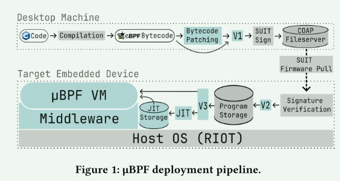
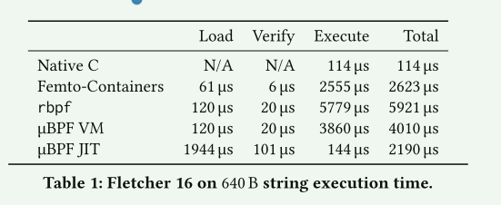
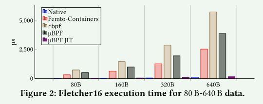
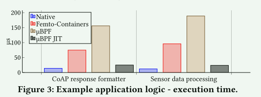
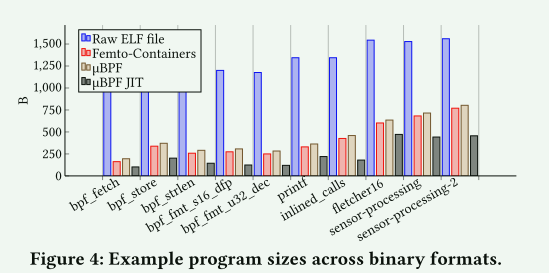
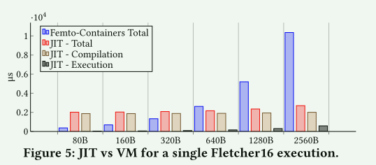

# μBPF: Using eBPF for Microcontroller Compartmentalization

## Introduction

eBPF也是一种隔离的手段，在联网嵌入式设备数量迅速增加的背景下，这种分隔机制正变得越来越重要。随着这些设备的连接越来越多，攻击面也越来越大。由于**硬件资源有限**，**微控制器使用的指令集架构（ISA）多种多样**，而且在许多情况下**缺乏虚拟内存**，因此要解决这个问题具有挑战性。

eBPF 尤其适合资源有限的硬件，因为它的 ISA 非常简单，而且支持验证。

- ISA 的简单性意味着 eBPF 虚拟机所需的 RAM 和 ROM 比其他方案小得多。
- 支持验证可确保直接在目标设备上执行的程序是安全的。

已有工作的局限性：

1.  执行时间开销高。现有解决方案使用 eBPF 字节码解释器。eBPF ISA 是一个 64 位固定大小的指令集。这意味着大多数指令都有未使用的字段（总是设置为 0），从而导致字节码相对于其他代码更大
2. 不支持所有有效的 eBPF 程序。例如，不支持包含数据重定位 或只读数据 的程序
3. 现有的 eBPF 虚拟机实现所使用的验证器很简单，不支持限制对 eBPF 辅助函数的访问

文章的贡献：

1. 我们实现了与运行 ARM Cortex M CPU 的设备兼容的 eBPF-to-ARMv7 JIT 编译器
2. 我们设计了一种机制，用于限制 eBPF 程序访问主机操作系统提供的辅助函数
3. 我们为运行 RIOT 的微控制器构建了一个用于编译和部署 eBPF 程序的工具包。

## 设计

1. 部署阶段
   1. 编译
      1. 为了与 Femto-Containers 向后兼容，还需要进行字节码修补。µBPF 支持 4 种不同的 eBPF 二进制格式
   2. 验证
      1. 它检查指令和跳转偏移的有效性，并验证只调用允许的辅助函数。虚拟机在运行时验证所有内存访问
   3. 加载
2. 执行阶段
   1. 部署阶段完成后，客户端就可以开始发送请求，开始执行加载的程序。客户端可以选择使用虚拟机解释器执行程序，或使用 JIT 编译器执行程序，然后执行输出的本地代码。给定程序经过 JIT 编译后，其字节码会存储在一个额外的 JIT 程序存储区中

## 实现

- 为 RIOT 实现了一个中间件层，允许与 Femto-Containers 完全兼容
- µBPF 提供的中间件允许对特定程序允许调用的辅助函数集进行细粒度控制。这是通过在执行前将辅助函数动态附加到 µBPF 虚拟机的给定实例来实现的。不过，这种灵活性是有代价的，因为它是通过在 BTreeMap 中存储辅助函数指针来实现的，其查找时间复杂度为 O（log 𝑛）
- 扩展了rbpf的功能，支持重定位/只读数据，兼容Femto-Containers 的格式
- 实现JIT

## 评估

- 使用 JIT 编译器时，验证时间略长。这是因为编译器是在原始对象文件上运行的，与其他虚拟机使用的自定义简化格式相比，编译器需要更长的时间来解析这些文件的头文件元数据
- 虽然与其他方法相比，JIT 加载时间较长，但仍是可以接受的，而且与虚拟机解释器相比，总时间较短

-  µBPF 比基准 rbpf 快约 33%，这是在优化了 rbpf 执行的指令解析和运行时内存访问检查后实现的
- FemtoContainers VM 仍比 µBPF 快约 33%。这是因为 µBPF 在程序二进制格式和允许的辅助函数方面提供了额外的可配置性，从而产生了开销

上述程序主要包括辅助函数调用，因为它们与设备（传感器、存储设备）的全局状态交互。µBPF VM 中的辅助函数是动态配置的，因此需要在 BTreeMap 中进行维护，这比 Femto-Containers 使用的开关语句要慢（因为在这种情况下，所有辅助函数都是在编译过程中指定的）。此外，与 Femto-Containers 相比，µBPF VM 的初始化开销更高，因为配置选项（如指定二进制格式）更多。由于程序相对较短，初始化时间会影响该基准的性能

- JIT程序大小最多减少了 57%
- 对于主要由只读数据组成的程序，转译后的程序需要包含一份数据副本。因此，在这种情况下，程序的大小缩减较小

- 单次执行的情况下，较小的计算量更适合使用VM

## Discussion

- 从文章的讨论和实现来看，在嵌入式系统中引入eBPF并不是像Linux中那么简单，比如在文章中的重定位以及只读数据的处理在linux系统上通常是由用户态库来完成的，这些用户态库会修改eBPF程序，而这里需要和eBPF虚拟机直接耦合了。
- 嵌入式系统只是将eBPF视为一种隔离的工具，并没有讨论它对系统扩展性、可观测性的影响